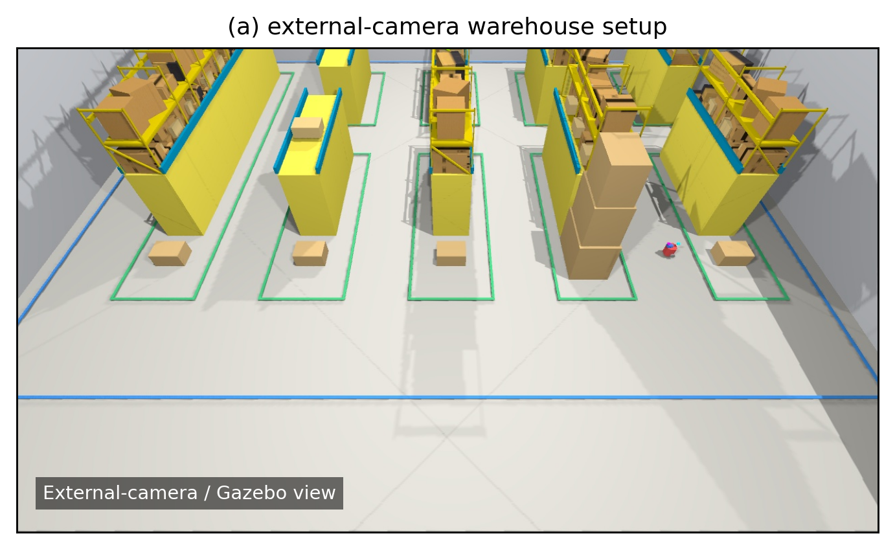
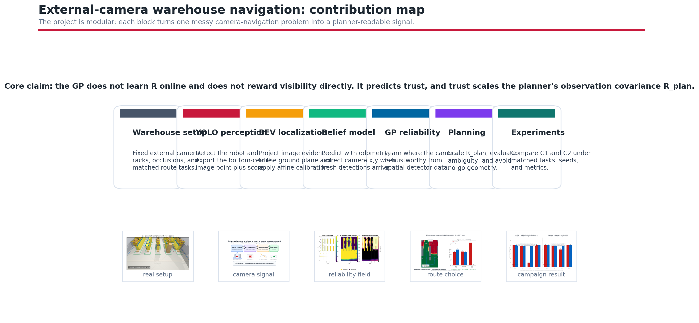
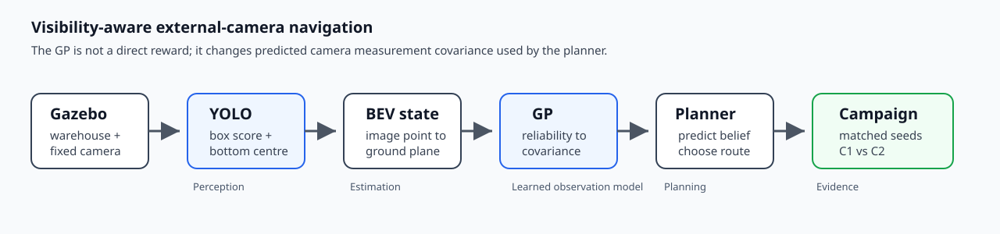
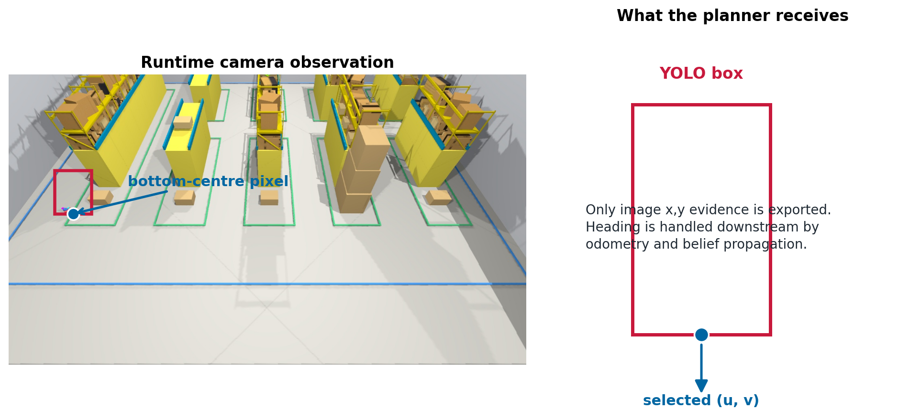
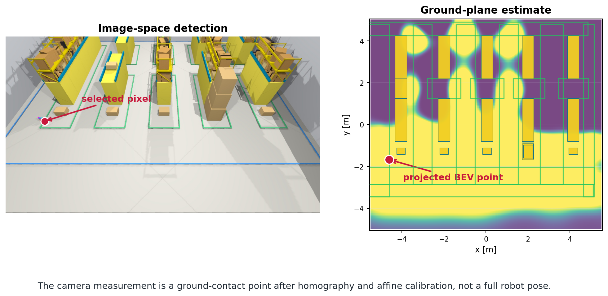
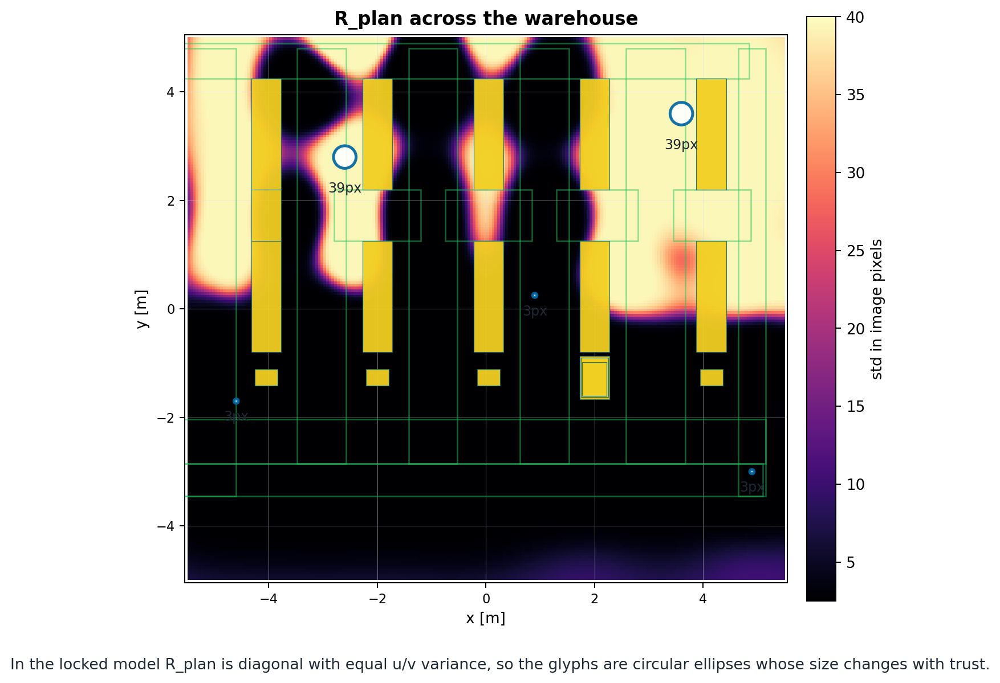
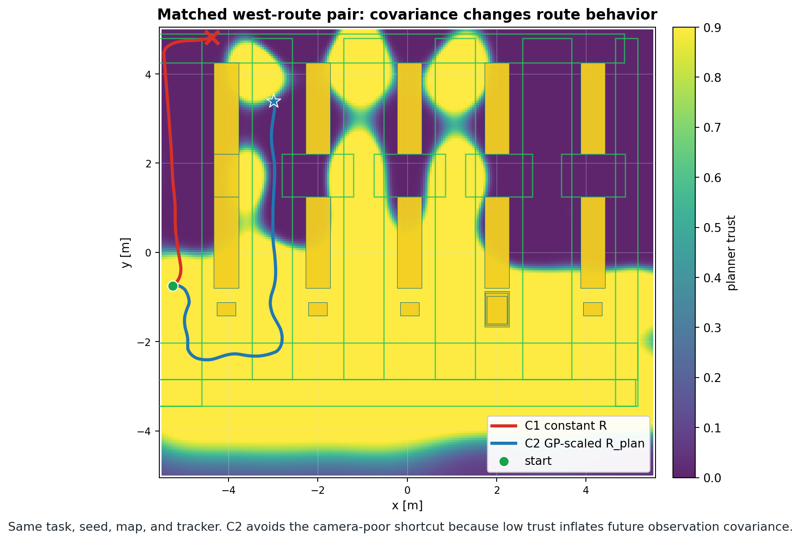
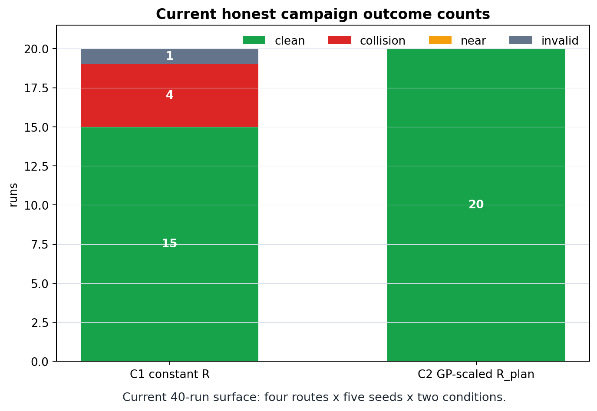

# Unembodied Navigation

Research code and demonstration pages for visibility-aware robot navigation
from a fixed external camera. The project asks how a mobile robot can plan in a
warehouse when camera localization is reliable in some aisles and brittle in
others. The system detects the robot, projects the image evidence to the floor,
learns a spatial camera-reliability model, converts that reliability into
planner-facing observation covariance, and evaluates the behavior in matched
warehouse route-choice experiments.

> **Current configuration (2026-07-01 honest re-run).** The locked runtime values
> are checked in [`docs/current_runtime_contract.yaml`](docs/current_runtime_contract.yaml)
> and differ from the original paper — see [`docs/paper_vs_current/README.md`](docs/paper_vs_current/README.md)
> for the full diff. Detector `warehouse_yolo_detector_v1` (trained at imgsz 960,
> inference at 640, conf 0.05); NIS innovation gate active at χ²(2, 0.99) = 9.21 with
> self-heal disabled; ground-truth-based metrics; global EFE horizon 75 × 0.4 s = 30 s look-ahead.



## Contribution Story



The central contribution is the modular chain from camera observation to
planning behavior. The GP does not learn the observation matrix `R` online and
does not act as a direct visibility reward. It predicts spatial detector trust,
and that trust scales the planner's observation covariance `R_plan`.

Regenerate the README figures with:

```bash
python3 scripts/paper_figures/make_readme_visuals.py
```

## System Architecture



Planned overview video: `docs/media/videos/system_overview.mp4`. This should be
a 20-30 second montage using the warehouse still, detector overlay, GP map,
C1/C2 route contrast, and the final campaign counts once those clips exist.

## Contribution Walkthrough

| Module | Contribution | Visual |
| --- | --- | --- |
| [YOLO perception](yolo/) | Detect the robot in the fixed warehouse camera image and export the selected bottom-centre pixel plus raw score. |  |
| [State estimation](estimation/) | Turn image-space evidence into a calibrated ground-plane point and keep the belief/noise story explicit. |  |
| [GP covariance model](gp/) | Learn a spatial detector-trust field and convert it into planner-facing camera covariance. |  |
| [Route planning](planning/) | Compare constant `R` against GP-scaled `R_plan` under the same map, tasks, seeds, and no-go geometry. |  |
| [Experiments](experiments/) | Package the current honest campaign surface, result counts, paired figures, and reproduction commands. |  |

Each module folder is a mini landing page with visuals, inputs/outputs,
reproduction commands, implementation links, limitations, and planned media
slots.

## Research Story

A single overhead or wall-mounted camera does not see a robot equally well
everywhere. Racks, distance, camera angle, and occlusion make some parts of the
warehouse reliable and others brittle. This project asks:

> Can the robot plan through places where it expects to stay localizable, before
> localization failure becomes a recovery problem?

System flow:

```text
Gazebo warehouse
-> YOLO external-camera detector
-> image-space bottom-centre observation
-> BEV state estimate
-> GP reliability query
-> predictive camera covariance
-> EFE route planner
-> seeded campaign metrics
```

## Current Honest-Campaign Benchmark

The canonical benchmark uses four warehouse tasks and five seeds per condition.
The current runtime surface is defined by
[`docs/current_runtime_contract.yaml`](docs/current_runtime_contract.yaml) and
[`scripts/visibility_comparison/warehouse_visibility_campaign.yaml`](scripts/visibility_comparison/warehouse_visibility_campaign.yaml).
The current packaged result surface lives under
[`docs/paper_vs_current/current/`](docs/paper_vs_current/current/): C1 reaches
15/20 clean goals and C2 reaches 20/20.

The known obstacle geometry, driveable region, route seeds, detector checkpoint,
GP artifact, and execution plumbing are pinned in the campaign config so C1/C2
comparisons differ only in the planner-facing camera covariance model.

## Code And Artifact Map

The demonstration folders do not move runtime code. They link to the working
ROS and script layout:

| Path | Role |
| --- | --- |
| [`src/sim`](src/sim/README.md) | Gazebo world, external camera, TurtleBot3 robot description, actuation and encoder noise nodes. |
| [`src/perception`](src/perception/README.md) | Runtime YOLO detector node and detector-to-pixel-observation interface. |
| [`src/state`](src/state/README.md) | Pixel-to-BEV projection and heading/odometry conventions. |
| [`src/planning`](src/planning/README.md) | EFE planner, GP reliability loading, state-dependent covariance, rollout and no-go costs. |
| [`src/experiments`](src/experiments/README.md) | Task definitions, launch wiring, run manifests, and campaign logging. |
| [`scripts`](scripts/README.md) | Offline dataset capture, YOLO training, GP fitting, metrics, and figure generation. |
| [`paper_artifacts`](paper_artifacts/README.md) | Curated figures, detector metadata, GP metadata, and archived historical metrics. |
| [`docs`](docs/README.md) | Active runtime contract, evidence registry, historical paper snapshot, dataflow notes, and deeper method caveats. |

The trained YOLO checkpoint is intentionally local and not tracked in git. To
run the Gazebo campaign, place it at:

```text
logs/perception_models/warehouse_yolo_detector_v1/model.pt
```

## Run The Current Campaign

```bash
colcon build
source install/setup.bash
```

```bash
python3 scripts/visibility_comparison/run_visibility_campaign.py \
  --config scripts/visibility_comparison/warehouse_visibility_campaign.yaml \
  --log-root logs/visibility_comparison/warehouse_visibility_campaign_v1
```

```bash
python3 scripts/visibility_comparison/compute_paper_metrics.py \
  --campaign-log logs/visibility_comparison/warehouse_visibility_campaign_v1/campaign_log.json \
  --gp-artifact paper_artifacts/gp/warehouse_visibility_gp_v1/yolo_score_raw_gp.npz \
  --out logs/visibility_comparison/warehouse_visibility_campaign_v1/paper_metrics.csv \
  --summary-out logs/visibility_comparison/warehouse_visibility_campaign_v1/paper_summary.txt
```

## Evidence Discipline

Public claims should trace through the evidence chain in
[`docs/experiment_registry.md`](docs/experiment_registry.md): world, detector,
visibility samples, GP, config, logs, metrics, figures, and paper wording.
Current release gaps before an archival public release are license, citation
metadata, artifact/data availability, and externally hosted raw data or videos
if those are needed beyond the curated artifact bundle.
