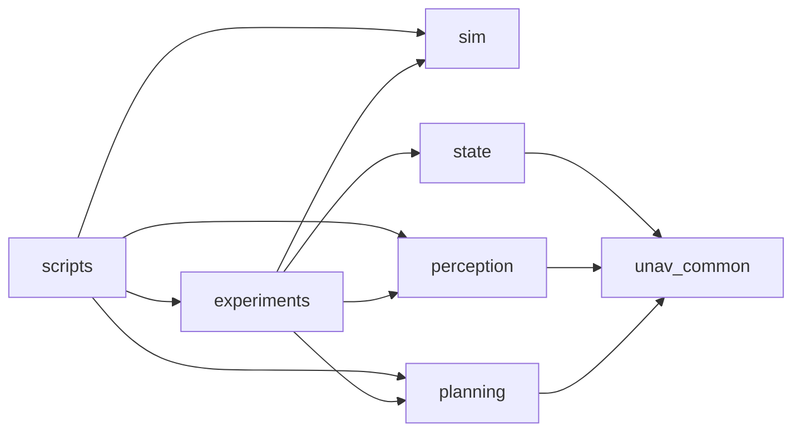

# Architecture Overview

This document explains how the active thesis repository is partitioned and which files are central to the current milestone.

Use this figure as the mental anchor while reading the package map below: the packages exist to produce this loop, not to provide a generic framework.

## Repository-Level Architecture

Caption: `experiments` is the orchestration layer. `planning`, `perception`, `state`, and `sim` define the active runtime system. `scripts` sits beside the runtime for offline fitting, summary generation, and plotting.

## Active Packages

| Package | Conceptual role | Main inputs | Main outputs | Central files |
| --- | --- | --- | --- | --- |
| `experiments` | defines the experiment surface | world/task config, planner choice | runtime launch, run logs | `launch/warehouse_primary_comparison.launch.py`, `config/world_profiles.yaml`, `config/tasks.yaml`, `experiments/nodes/experiment_logger.py` |
| `planning` | implements the planner and visibility-aware objective | `/state/bev`, `/goal_bev`, visibility artifact | `/cmd_vel`, planner belief, diagnostics | `planning/nodes/unicycle_planner_node.py`, `planning/planners/base_planner.py`, `planning/core/casadi_efe.py`, `planning/core/visibility_gp_map.py` |
| `perception` | turns camera images into robot observations | `/external_camera/image_raw` | `/perception/pixel_pose`, diagnostics | `perception/nodes/yolo_robot_detector_node.py` |
| `state` | converts image-space observations into BEV state | pixel pose, diagnostics, odom | `/state/bev` | `state/nodes/pixel_to_bev_state_node.py` |
| `sim` | provides the plant and simulator plumbing | world profile, spawn, camera pose | Gazebo world, `/odom`, camera stream | `launch/bringup_sim.launch.py`, `gazebo_worlds/worlds/*.world.sdf` |
| `unav_common` | shared camera and geometry helpers | camera/world geometry inputs | reusable geometry calculations | `unav_common/camera_model.py`, `unav_common/occlusion_geometry.py` |

## Minimum Reading Path

If a supervisor wants the shortest honest route through the code, use this order:

1. [`../src/experiments/launch/warehouse_primary_comparison.launch.py`](../src/experiments/launch/warehouse_primary_comparison.launch.py)
2. [`../src/experiments/config/world_profiles.yaml`](../src/experiments/config/world_profiles.yaml)
3. [`../src/experiments/config/tasks.yaml`](../src/experiments/config/tasks.yaml)
4. [`../src/perception/perception/nodes/yolo_robot_detector_node.py`](../src/perception/perception/nodes/yolo_robot_detector_node.py)
5. [`../src/state/state/nodes/pixel_to_bev_state_node.py`](../src/state/state/nodes/pixel_to_bev_state_node.py)
6. [`../src/planning/planning/nodes/unicycle_planner_node.py`](../src/planning/planning/nodes/unicycle_planner_node.py)
7. [`../src/planning/planning/planners/base_planner.py`](../src/planning/planning/planners/base_planner.py)
8. [`../src/planning/planning/core/casadi_efe.py`](../src/planning/planning/core/casadi_efe.py)
9. [`../src/planning/planning/core/visibility_gp_map.py`](../src/planning/planning/core/visibility_gp_map.py)
10. [`../src/experiments/experiments/nodes/experiment_logger.py`](../src/experiments/experiments/nodes/experiment_logger.py)

## Central Versus Peripheral Files

### Central to the main comparison

- `src/experiments/launch/warehouse_primary_comparison.launch.py`
- `src/experiments/config/world_profiles.yaml`
- `src/experiments/config/tasks.yaml`
- `src/perception/perception/nodes/yolo_robot_detector_node.py`
- `src/state/state/nodes/pixel_to_bev_state_node.py`
- `src/planning/planning/nodes/unicycle_planner_node.py`
- `src/planning/planning/planners/base_planner.py`
- `src/planning/planning/core/casadi_efe.py`
- `src/planning/planning/core/visibility_gp_map.py`
- `scripts/visibility_comparison/capture_visibility_samples.py`
- `scripts/visibility_comparison/build_gp_targets.py`
- `scripts/visibility_comparison/fit_visibility_gps.py`
- `scripts/visibility_comparison/plot_gp_and_ambiguity_maps.py`
- `scripts/evaluate_occlusion_comparison.py`
- `scripts/visibility_comparison/plot_planned_paths.py`

### Support or peripheral

- `src/experiments/launch/warehouse_visibility_agent.launch.py`
- `src/experiments/launch/warehouse_visibility_capture.launch.py`
- `src/experiments/experiments/nodes/visibility_sweep_controller_node.py`
- `src/perception/perception/nodes/image_marker_detector_node.py`
- `src/perception/perception/nodes/homography_sim_node.py`
- `src/planning/planning/core/nogo_cost.py`
- `archive/visibility_legacy/`

## Honest Boundary Notes

- The active story is one controlled external-camera experiment, not a general robotics framework.
- The active perception path is the YOLO runtime node; the image-marker and synthetic homography nodes remain only for compatibility and older runs.
- `visibility_unaware_baseline` is the honest baseline name for the current main comparison.
- The optimized planner path is `base_planner.py` + `casadi_efe.py` + SciPy `L-BFGS-B`; `casadi_efe.py` is part of the main path, not a peripheral helper.
- older visualization/dashboard remnants have been moved to `archive/` and are not part of the active repository story.
- The repository still contains secondary comparison modes `efe2`, `efer`, and `mpc`, but the main claim path is ET1-based `efe1`.
