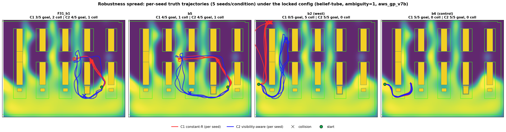

# Demo Media And Storyboard

This page indexes tracked visual assets. Planned GIF/MP4/image slots now live
inside the module folders so each demonstration page owns its own media plan:
[`yolo/demos`](../yolo/demos/), [`gp/demos`](../gp/demos/),
[`estimation/demos`](../estimation/demos/),
[`planning/demos`](../planning/demos/), and
[`experiments/demos`](../experiments/demos/).

## Tracked Visuals

| Asset | Use it for |
| --- | --- |
| [`paper_artifacts/figures/problem_setup_camera.png`](../paper_artifacts/figures/problem_setup_camera.png) | First-screen hero: the external-camera warehouse, robot, and driveable regions. |
| [`paper_artifacts/figures/problem_setup_snapshots.png`](../paper_artifacts/figures/problem_setup_snapshots.png) | Wider problem setup and camera/warehouse context. |
| [`paper_artifacts/perception/aws_yolo_simseg_v2/val_batch0_pred.jpg`](../paper_artifacts/perception/aws_yolo_simseg_v2/val_batch0_pred.jpg) | Detector demo: robot detections from the external camera. |
| [`paper_artifacts/perception/aws_yolo_simseg_v2/results.png`](../paper_artifacts/perception/aws_yolo_simseg_v2/results.png) | YOLO training performance over 30 epochs. |
| [`paper_artifacts/figures/yolo_training_clarification.png`](../paper_artifacts/figures/yolo_training_clarification.png) | Detector training provenance and label-generation explanation. |
| [`paper_artifacts/figures/gp_pipeline_aws.png`](../paper_artifacts/figures/gp_pipeline_aws.png) | GP story: detector-score samples to reliability field to induced covariance. |
| [`paper_artifacts/figures/localization_pathway.png`](../paper_artifacts/figures/localization_pathway.png) | Runtime localization path from camera image to planner state. |
| [`paper_artifacts/figures/robustness_spread.png`](../paper_artifacts/figures/robustness_spread.png) | Main campaign result and route-choice behavior. |
| [`paper_artifacts/figures/paired_mechanism_taskA.pdf`](../paper_artifacts/figures/paired_mechanism_taskA.pdf) | Single-run mechanism figure with paired C1/C2 behavior. |
| [`docs/media/system_architecture.svg`](media/system_architecture.svg) | Compact root-level architecture diagram. |

## Module Media Plans

| Module | Media plan |
| --- | --- |
| YOLO perception | [`../yolo/demos/README.md`](../yolo/demos/README.md) |
| GP covariance model | [`../gp/demos/README.md`](../gp/demos/README.md) |
| State estimation | [`../estimation/demos/README.md`](../estimation/demos/README.md) |
| EFE planning | [`../planning/demos/README.md`](../planning/demos/README.md) |
| Experiments | [`../experiments/demos/README.md`](../experiments/demos/README.md) |

Keep videos compressed and short for the repository. Large raw recordings
should live in an external archive or release artifact, with only final clips or
links referenced from the module pages.

Planned root overview video: `docs/media/videos/system_overview.mp4`. Do not
link it from the root README until the file exists.

## README Embed Pattern

Use stills until the video file exists. When a clip is tracked or hosted, replace
the still with a linked thumbnail:

```markdown
[](media/videos/04_c1_c2_route_compare.mp4)
```

## Storyboard

1. Problem: a robot localizes from one external camera in a cluttered warehouse.
2. Perception: the detector works well in some regions and weakly in others.
3. Learning: detector outcomes become a GP reliability field over robot position.
4. Planning: reliability changes future observation covariance, not the map
   geometry and not a direct visibility reward.
5. Result: across matched seeds, the visibility-aware condition reaches more
   goals and collides less often, while still showing the hard cases honestly.
