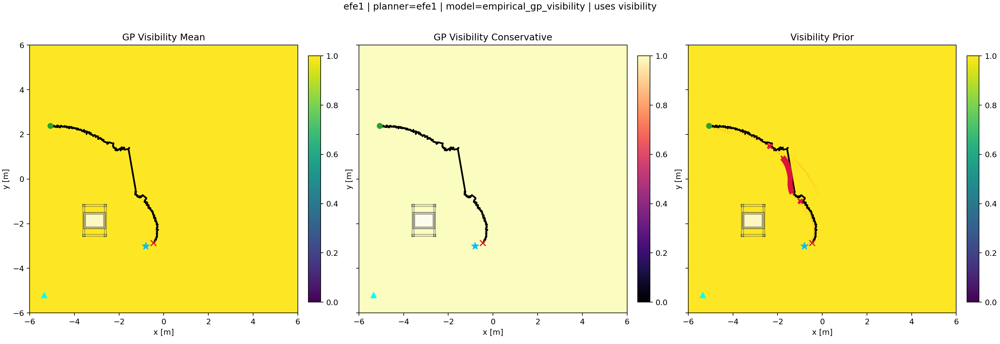
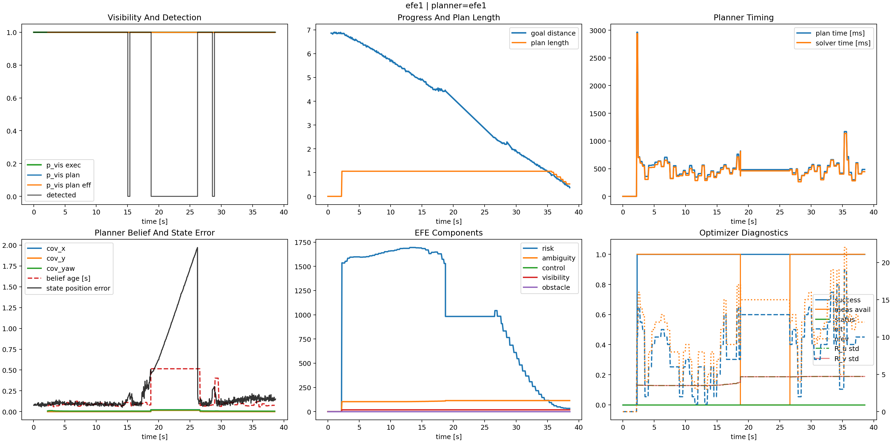
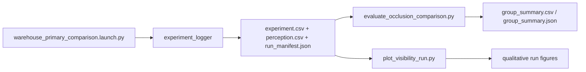

# Evaluation And Plots

This document explains what the repository logs now, what the core scripts produce, and which figures best explain the current milestone.

## Evaluation Flow

Caption: the logger is the bridge between runtime and evaluation. The current evaluation stack is useful for milestone summaries and qualitative analysis, but it is not yet a final thesis-grade analysis suite.

## What Is Logged Now

### Runtime logs

- `experiment.csv`
  - state
  - planner belief
  - command
  - goal distance
  - solve/planning time
  - visibility-related planner diagnostics
- `perception.csv`
  - detection availability
  - state estimate
  - pixel observation
  - truth when available
- `run_manifest.json`
  - planner label
  - world
  - task
  - seed
  - visibility-model settings
  - state-estimator provenance

### Core scripts

| Script | Role | Output |
| --- | --- | --- |
| [`../scripts/fit_empirical_visibility_gp.py`](../scripts/fit_empirical_visibility_gp.py) | offline GP artifact generation from simulated pose sampling or the retained driving mode | `empirical_visibility_gp.npz`, raw/aggregated capture CSVs, fit plot |
| [`../scripts/evaluate_occlusion_comparison.py`](../scripts/evaluate_occlusion_comparison.py) | summary/evaluation | `run_summary.csv`, `group_summary.csv`, `group_summary.json` |
| [`../scripts/plot_visibility_run.py`](../scripts/plot_visibility_run.py) | qualitative single-run plotting | visibility and trajectory figures |

## What The Current Evaluator Supports

Currently implemented summaries include:

- final goal distance
- minimum goal distance reached
- average planning time
- average solve time
- average planned visibility
- detection rate

This is enough for milestone inspection, but not enough for strong thesis claims on its own.

## Recommended Presentation Figures

| Title | Data source | X-axis | Y-axis | Methods | Insight | Caveat exposed |
| --- | --- | --- | --- | --- | --- | --- |
| Visibility field and trajectory overlay | `plot_visibility_run.py` + GP artifact | world `x` | world `y` | `efe1`, `visibility_unaware_baseline` | whether the GP-aware planner prefers more observable regions | if trajectories are similar, the GP may not be changing behavior much |
| Goal distance over time | `experiment.csv` | time | goal distance | `efe1`, `visibility_unaware_baseline` | progress and convergence trade-off | a more visible route may simply be slower |
| Planned visibility over time | `experiment.csv` | time or replan index | `p_vis_plan` | both methods | whether the GP-aware planner actually plans for higher observability | if flat/equal, the comparison may be methodologically weak |
| Detection rate summary | `perception.csv` or evaluator output | run or method | detection rate | both methods | whether route changes affect actual sensing availability | if no difference, observability modeling may be operationally irrelevant here |
| Solver time summary | `experiment.csv` | method | solve time | both methods and retained variants if needed | computational overhead | visibility-aware behavior may come at high runtime cost |
| Failure-case trajectory plot | logged run + world layout | world `x` | world `y` | selected bad runs | shows where the planner loses sensing or becomes over-conservative | qualitative evidence can reveal failure modes hidden by averages |

## Recommended Documentation Figures

Use these figures in the docs, not only in slides:

1. package architecture diagram
2. offline-to-online pipeline diagram
3. runtime ROS node/dataflow diagram
4. planner-internal method diagram
5. one qualitative trajectory-over-visibility plot

## Evaluation Caveats

- The evaluator is milestone-grade rather than thesis-final.
- It currently emphasizes distance, timing, visibility, and detection, not full statistical analysis.
- If you present quantitative results, state clearly which metrics are implemented now and which are still planned.
- A supervisor should not be told that the current evaluator fully proves route-quality or uncertainty-quality claims.
