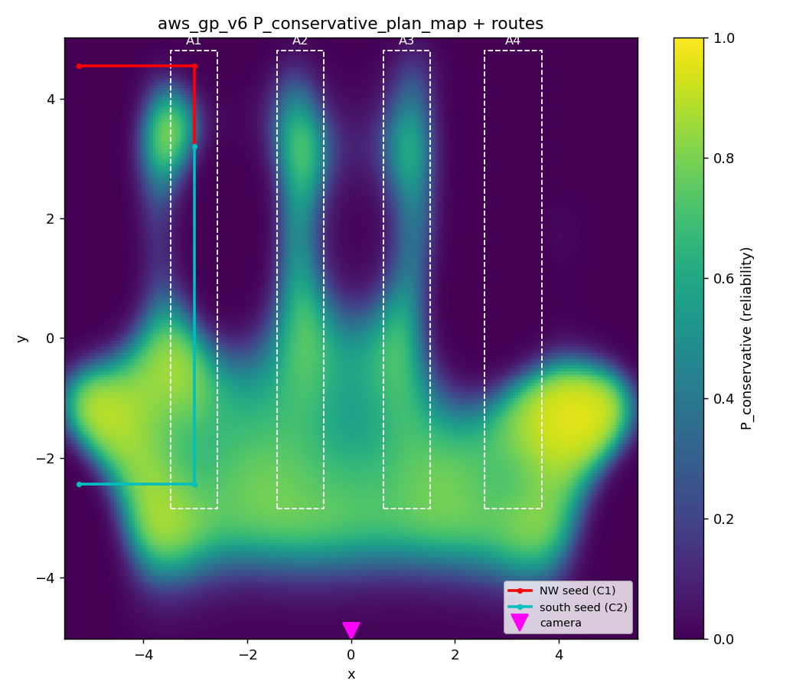

# Gaussian Process (GP) Reliability Field Details

This document records the mathematical formulation, training data aggregation, fitting parameters, and planner integration details for the GP-derived learned observation reliability field.

---

## 1. GP Artifact Details
- **Path:** `logs/visibility_comparison/aws_gp_v5/yolo_score_raw_gp.npz`
- **World Context:** `warehouse_aws.world.sdf`
- **Unique Spatial Poses ($X_{\text{train}}$):** 228 unique $(x, y)$ coordinate training locations.
- **Grid Resolution:** $120 \times 120$ spatial grid points spanning:
  - **X bounds:** $[-5.5, 5.5]$ meters
  - **Y bounds:** $[-5.0, 5.0]$ meters

---

## 2. Mathematical Formulation & Fitting
- **Target Extraction:** Planar average $p_i$ of raw detector scores collected across 4 headings at each unique $(x_i, y_i)$ position.
- **Score Clipping:** $p_i$ is clipped to $[\epsilon, 1 - \epsilon]$ with $\epsilon = 0.001$ to prevent logit singularities.
- **Logit Transformation:** The target vector for GP regression is computed in logit space:
  $$f_i = \ln \left( \frac{p_i}{1 - p_i} \right)$$
- **GP Regressor Setup:** Fit using scikit-learn's `GaussianProcessRegressor`:
  - **Kernel:** Radial Basis Function (RBF) with fixed length scale $l = 1.0$:
    $$K(x, x') = \sigma_f^2 \exp\left( - \frac{\|x - x'\|^2}{2 l^2} \right)$$
  - **Observation Noise Variance ($\sigma_n^2$):** 0.1
  - **Y Normalisation:** `normalize_y = True`
  - **Optimizer:** `None` (hyperparameters are fixed at fit time)
- **Conservative Probability Mapping:** The predicted mean $\mu_f(x)$ and standard deviation $\sigma_f(x)$ in logit space are back-projected to probability space:
  $$\rho_{\mathrm{plan}}(x) = \operatorname{sigmoid}(\mu_f(x) - \beta \sigma_f(x))$$
  with conservative discount factor $\beta = 1.0$.

---

## 3. Projection Geometry
- **Camera Position:** $(x, y, z) = (0.0, -4.9, 5.8)$ meters
- **Camera Orientation:** (roll, pitch, yaw) = $(0.0, 0.92, 1.5708)$ radians (pitch $0.92$ rad, yaw $1.5708$ rad).
- **Horizontal Field of View (FOV):** $1.5708$ rad ($90^\circ$)
- **Resolution:** $1280 \times 720$ pixels
- **Calibration Bias Offset:** $dy = 0.05$ meters (corrects oblique-camera back-projection bias).
- **Outlier Rejection Gate:** Single-step corrections exceeding $0.50$ meters are rejected to prevent near-rack YOLO centroid instability.

---

## 4. Planner Integration & Covariance Blending
- **Expected Visibility (Sigma-Points):** Calculated using an Unscented Transform (UT) query over $\rho_{\mathrm{plan}}$ with spread parameter $\kappa_\sigma = 1.0$.
- **Precision Blending:** Covariance $R_{\text{plan}}$ is blended between:
  - **$R_{\text{vis}}$ (visible scale):** 2.5 pixels
  - **$R_{\text{miss}}$ (shadow scale):** 40.0 pixels
  - **Formula:**
    $$\frac{1}{R_{\text{plan}}} = p_{\text{vis\_eff}} \frac{1}{R_{\text{vis}}} + (1 - p_{\text{vis\_eff}}) \frac{1}{R_{\text{miss}}}$$
- **Geometry Hash Alignment:** The GP artifact embeds a JSON snapshot of the 18 collision prisms from the world SDF. At launch, the SHA-256 hash of this JSON (`geometry_sha256`) is matched against the active world description to ensure spatial alignment.

---

## 5. GP Visibility Map Sanity Check

The fitted reliability map highlights the camera's blind spots and occlusions in the warehouse environment:

