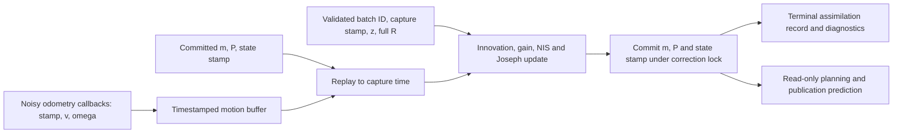

# State estimation, stochastic process and measurement-update audit

2026-09-06. Report first; no production-code, Q/R, configuration or recovery-policy edits made by this audit.

Confirmed current defects remain in motion support, input ordering, startup event identity and event logging. The tested coupled mean/Joseph covariance calculation is correct. The strongest additional reproductions are out-of-order odometry integrating an interval twice, a coverage-check/replay race losing a verified turn, encoder timestamps changing before input validation, and optional quorum recovery using the same camera evidence again.

**Evidence and scope.** The six requested documents were read first, followed by the earlier [module review](../state_estimation_module_review.md) and its executable probes. All eleven earlier probes still reproduce. The additional [probe](../../experiments/estimator_consistency/module_audit_01_20260906/probe.py) executes eleven cases, including a complete numerical trace, positive invariants and a qualified alias hazard. Its assertions deliberately establish the current behavior; a successful probe exit is not a clean bill of health.

Evidence retained with this report:

- [Additional numerical results and imported-source provenance](../../experiments/estimator_consistency/module_audit_01_20260906/results.json).
- [Rechecked earlier results](../../experiments/estimator_consistency/module_audit_01_20260906/prior_probe_results.json), using the unchanged [earlier probe](../../experiments/estimator_consistency/module_review_20260906/probe.py).
- [Actual launch-description evaluation and selected-run metadata](../../experiments/estimator_consistency/module_audit_01_20260906/wiring.json), generated by [wiring.py](../../experiments/estimator_consistency/module_audit_01_20260906/wiring.py).
- [Source SHA-256 manifest](../../experiments/estimator_consistency/module_audit_01_20260906/source_sha256.json), [existing-suite transcript](../../experiments/estimator_consistency/module_audit_01_20260906/existing_tests.txt), and [fatal-stop follow-up](../../experiments/estimator_consistency/module_audit_01_20260906/fatal_stop_followup.txt).

The reproductions use actual installed Python callbacks, real ROS message/time types and the real planner `predict`, with controlled clocks and recording publishers. They create no ROS graph. Launch evaluation constructs the actual launch descriptions and evaluates parameters without starting their actions. This establishes callback and configuration reachability; it does not measure how often each trigger occurs in a live drive.

The initial broader suite returned **138 passed, 3 skipped, 1 failed**. The failure was the newly added command-handoff fatal-stop regression. Another chat then repaired that command path; rerunning that exact regression returned **1 passed**. These are separate source snapshots, not a claimed fresh all-suite pass. The three skips are absent locked historical pixel traces. The six requested estimation files remained unchanged; `dynamics.py`, `belief_correction.py`, `motion_history.py` and `unicycle_planner_node.py` match the corrected-runtime protocol hashes. That protocol does not hash `base_planner.py` or `encoder_noise_node.py`; this audit records their hashes explicitly. Do not infer that the protocol freezes files it does not list.

The experiment chat confirmed the filter files would remain frozen while the running baseline continued. This audit wrote only its own report and reproduction artifacts and did not launch, terminate, clean up or modify an experiment. Later command-only changes are distinguished by the retained hashes and test transcripts.

**Ranked findings.** P1 means a causal-state or evidence-validity defect that deserves repair before relying on the affected behavior. P2 means a narrower or conditional defect. “Current” describes reproducible code behavior, not a claim that the trigger occurred in the selected drive. Prior-review findings are explicitly retained rather than presented as new discoveries.

| Rank | Finding | Reachability | Status / origin |
|---|---|---|---|
| R01 / P1 | Unsupported or unordered motion accepted; interval can be integrated twice | Active correction and prediction | Confirmed; prior support finding extended through odometry callbacks |
| R02 / P1 | Coverage checked on a different history from replay | Active long-gap branch near buffer eviction | Confirmed additional race; independently reproduced by timing audit |
| R03 / P1 | Planning bootstrap consumes an anonymous compatibility pose | Active mandatory-envelope startup | Confirmed prior finding |
| R04 / P1 | Event scorer can call an earlier prediction a post-correction belief | Current event-scoring helper | Confirmed prior finding; evaluation defect |
| R05 / P2 | Latest odometry heading backdated to camera capture | Active moving bootstrap; optional repeated heading anchoring | Confirmed prior finding |
| R06 / P2 | Encoder changes its clock before rejecting old or gapped input | Active encoder; pose/heading consumers most affected | Confirmed additional callback defects |
| R07 / P2 | Prediction diagnostics differ from applied Q/motion; terminal record lacks the transaction state | Active logging | Confirmed prior finding and trace limitation |
| R08 / P2 | Distinct fusion decisions discarded at equal receipt time | Active logger | Confirmed prior finding |
| R09 / P2 | Encoder reports injected noise when stopped or disabled | Active stopped encoder metadata; disabled mode optional | Confirmed prior finding |
| R10 / P2 | Coherent-distance drift restarts on every `predict` | Optional flag, off in baseline | Confirmed prior finding |
| R11 / P1 if enabled | Quorum recovery precedes causal gates and reuses its source evidence | Optional per-camera reanchoring | Stale recovery rechecked; information reuse additionally confirmed |
| R12 / P2 | Per-camera bootstrap/drops trigger rejection inflation | Optional per-camera mode | Confirmed additional bookkeeping defect |
| R13 / P2 | A second camera 0.5 ms later is still discarded | Optional per-camera mode | Confirmed boundary left by same-time repair |
| R14 / P2 | Pixel duplicates/backdating and refusal-frozen anchor remain | Optional/legacy pixel mode | Duplication rechecked; refusal behavior additionally demonstrated |

**Active wiring, historical boundaries and ownership.** The reference configuration is [network_navigation_runtime_pilot.yaml](../../experiments/icra_commissioning/network_navigation_runtime_pilot.yaml), named by the metrics registry, with its [corrected-runtime protocol](../../logs/studies/icra_commissioning_20260905/network_navigation_runtime_evidence/protocol.json). The completed P0 diagnostic selection is explicitly named in [P0_selection.json](../../logs/studies/icra_commissioning_20260905/network_navigation_runtime_evidence/diagnostics/P0_selection.json). The three-arm baseline completed before report delivery and its [aggregate selection](../../logs/studies/icra_commissioning_20260905/network_navigation_runtime_evidence/selection.json) now names P0/P1/P2, one seed each, as diagnostic rather than confirmatory evidence. No directories were selected by modification time or pooled by glob.

`wiring.py` evaluates `_build_launch_cmd` → the real entry point's declared defaults → `parse_common_launch_config` → `resolve_world_setup` → `build_agent_runtime_actions`. It produces:

| Boundary | Resolved behavior |
|---|---|
| Encoder | Enabled; `/odom` → `/odom_noisy`; simulation clock; linear slip mean 0.02, slip SD 0.05; angular slip SD 0.03; AR coefficient 0.8 |
| Filter executable | `efe_agent`, whose `EfeAgentNode` inherits `UnicyclePlannerNode`; two-thread executor |
| Correction | Fused metric EKF; mandatory identified envelope; `heading_update_mode=coupled`; pixel path off |
| Prediction | `/odom_noisy` body speed/angular rate; `use_odom_for_predict=true`; planner step 0.25 s; Q parameters 0.01 and 0.02 |
| Gates | Capture-age limit 0.5 s; correction interval cap 1.5 s; NIS threshold 9.21; XY reanchor threshold 0; metric jump threshold 0 |
| Retained uncertainty policy | Rejection inflation 0.05 m² per XY diagonal; extra stale-planning inflation off; minimum covariance diagonal 10⁻⁶ |
| Derived launch setting | Prediction speed cap 0.22 m/s, even though its raw command-line default is 0 |
| Optional paths | Direct per-camera correction, pixel correction, coherent drift and diagnostic-odom localization are not the baseline estimator |

The imports resolve from `build/` symlinks to the six requested `src/` files, rather than to stale independent installed copies. Launch routing is at [visibility_launch_common.py:1849](/home/joostleliveld/Thesis/UnembodiedNavigation/src/experiments/experiments/core/visibility_launch_common.py:1849), parameter delivery at [1921](/home/joostleliveld/Thesis/UnembodiedNavigation/src/experiments/experiments/core/visibility_launch_common.py:1921), and encoder construction at [1188](/home/joostleliveld/Thesis/UnembodiedNavigation/src/experiments/experiments/core/visibility_launch_common.py:1188). Subscription and lock ownership are at [unicycle_planner_node.py:601](/home/joostleliveld/Thesis/UnembodiedNavigation/src/planning/planning/nodes/unicycle_planner_node.py:601).

The camera manager supplies a prior-free robust metric measurement and full 2×2 R. It is not another recursive robot filter. It publishes the identified envelope and then a compatibility pose at [camera_manager_node.py:1811](/home/joostleliveld/Thesis/UnembodiedNavigation/src/reliability/reliability/nodes/camera_manager_node.py:1811). Comments saying `FusedMapMeasurementSource` is “not yet wired” or describing this current manager as a second robot KF are stale; executable calls and active configuration take precedence. The manager's optional forward propagation is separate from the active capture-time correction contract.

**One complete prediction, correction and logged outcome.** This is the deterministic `complete_trace` case, not a localization-accuracy measurement. State coordinates are map-frame `(x, y, θ)` in metres/radians. P is full 3×3: XY block in m², heading variance in rad² and cross terms in m·rad. The camera observes XY only; coupling through P can update heading.



At state time **9.4 s**:

```text
m = [1, -2, 0.4]
P = [[ 0.040,  0.005,  0.002],
     [ 0.005,  0.060, -0.003],
     [ 0.002, -0.003,  0.025]]
```

Real `_odom_cb` calls populate `(stamp, v, ω)` with `(9.35, .2, 0)`, `(9.6, 0, .8)`, `(9.75, .15, 0)`, `(10, 0, 0)`. Zero-order hold uses the sample at/before the start, then each new input from its own stamp. There are three integrated segments:

| Interval (s) | `(v, ω)` | Mean at interval end |
|---|---|---|
| 9.4 → 9.6 | `(0.2, 0)` | `(1.036842440, -1.984423266, 0.4)` |
| 9.6 → 9.75 | `(0, 0.8)` | `(1.036842440, -1.984423266, 0.52)` |
| 9.75 → 10.0 | `(0.15, 0)` | `(1.069385659, -1.965790261, 0.52)` |

`base_planner.predict` performs `m ← f(m,u,dt)` and `P ← F P Fᵀ + Q` at [base_planner.py:405](/home/joostleliveld/Thesis/UnembodiedNavigation/src/planning/planning/planners/base_planner.py:405). Mean and F both use the filter's heading, not an odometry world-position increment. The independent oracle obtains F and integrated Q using a continuous linear-system block exponential; it does not call the production Q formula. The chosen straight/rotation segments also have exact elementary mean expectations. Full intermediate F, Q, m and P are in `results.json`.

At capture **10.0 s**, before correction:

```text
m- = [1.069385659, -1.965790261, 0.520000000]
P- = [[ 0.039941029,  0.005205225,  0.001140593],
      [ 0.005205225,  0.059715841, -0.001257702],
      [ 0.001140593, -0.001257702,  0.025240000]]
z  = [1.089385659, -1.975790261]
R  = [[0.015, 0.003], [0.003, 0.025]]
H  = [[1, 0, 0], [0, 1, 0]]
nu = [0.02, -0.01]
Sy = [[0.054941029, 0.008205225], [0.008205225, 0.084715841]]
K  = [[ 0.728339126, -0.009100559],
      [-0.010685934,  0.705930800],
      [ 0.023314776, -0.017104293]]
```

At receipt **10.2 s**, `_state_correction_envelope_cb` checks schema 1, `map_bev`, finite XY/R/stamp, symmetric positive-definite R and unseen identity `audit:camera_A+camera_B@10000000000`. The correction lock covers this transaction. `FusedMapMeasurementSource` reaches `apply_correction` and `compute_update`; age 0.2 s and interval 0.6 s pass their gates. NIS is **0.009300646714**, below 9.21; gain scale is 1.

The committed result is:

```text
m+ = [1.084043447, -1.973063288, 0.520637338]
P+ = [[ 0.010897785,  0.001957503,  0.000298409],
      [ 0.001957503,  0.017616212, -0.000357663],
      [ 0.000298409, -0.000357663,  0.025191895]]
state stamp = 10.0 s
```

The separate expectation is `(I−KH)P−(I−KH)ᵀ + KRKᵀ`. Maximum covariance disagreement is **6.94×10⁻¹⁸**. Diagnostics indices 14–16 and 17–19 match the actual prior/posterior means; the accepted flag is 1 and reason code 0. The terminal record retains the exact batch ID, capture time 10.0, apply time 10.2, belief time 10.0, `accepted/accepted`, NIS and `accepted=true`. Subsequent publication/planning reads at 10.2 leave committed m, P and stamp unchanged.

The terminal record does **not** contain these prior/posterior covariances, the gain, motion support or a belief revision. Those quantities are available here because the test records the live transaction. A historical full update cannot be reconstructed exactly from that terminal CSV alone.

As a check of the real logging boundary, `wiring.py` loads the explicitly selected P0 through `aligned.assimilations`: the first ordinary accepted row is batch `strict:camera_A@3600000000,camera_B@3600000000,camera_C@3600000000,camera_D@3600000000,camera_E@3600000000`, capture/state stamp 3.6 s, apply stamp 4.001 s, status `accepted`. This verifies identity/time fields on an actual recorded event, not its unlogged full posterior. No drive accuracy is rescored in this report, particularly given R04.

**R01 — Unsupported and unordered motion enters the active recursion.** Sources: [node:1032](/home/joostleliveld/Thesis/UnembodiedNavigation/src/planning/planning/nodes/unicycle_planner_node.py:1032), [node:1271](/home/joostleliveld/Thesis/UnembodiedNavigation/src/planning/planning/nodes/unicycle_planner_node.py:1271), [node:1849](/home/joostleliveld/Thesis/UnembodiedNavigation/src/planning/planning/nodes/unicycle_planner_node.py:1849), [motion_history.py:11](/home/joostleliveld/Thesis/UnembodiedNavigation/src/planning/planning/core/motion_history.py:11).

Trigger: stale odometry, absent start support, missing intermediate/tail samples or callbacks arriving out of stamp order. `_odom_cb` appends arrival order without finite/order validation. Ordinary replay never calls `covers_interval`. A preceding sample is held regardless of age. If only later odometry exists, the unsupported prefix is assumed stationary and available commands are ignored. An out-of-order entry moves `prev_t` backward after skipping its negative interval, making the next positive interval overlap one already integrated.

Expected: verified chronological inputs, one integration of each supported interval, and explicit unsupported/fallback metadata. Observed deterministic results:

- `stale_motion`: a sample at 1.0 s moves the 9.9–10.0 s prior 2 cm and is labelled odometry/no fallback despite failing coverage.
- `out_of_order_motion`: callbacks at 9.4, 9.7, 9.5 s with constant 0.2 m/s integrate **0.3 + 0.5 = 0.8 s** over a **0.6 s** interval. Predicted x is **0.16 m**, expected **0.12 m**. Added yaw process variance is **0.00032**, expected **0.00024 rad²**. The outcome still reports replay duration **0.6 s**, accepts a small-innovation measurement and commits time 10.0.
- `missing_prefix_and_empty_history`: motion beginning in the buffer at 9.7 gives 0.06 m over 9.4–10.0 versus a scripted 0.12 m. The unavailable first 0.3 s is labelled no fallback. With both histories empty but last command 0.2 m/s, correction predicts 0.02 m over 0.1 s while publication predicts zero.

Consequence: wrong mean, heading and full covariance; prediction and correction can describe different priors at the same target. Camera callbacks can keep accepting short intervals indefinitely despite failed motion support.

Smallest repair: one common replay function operating on an immutable, finite, time-ordered motion snapshot, with explicit start/gap/tail support and actual integrated-duration metadata. Validate or safely insert out-of-order inputs at ingestion; do not merely sort malformed data and declare support. Use the same function for correction and read-only predictions. Route unsupported input through a named existing recovery decision. Choosing its new uncertainty/control policy is separate from fixing chronology and metadata.

**R02 — Coverage verification and replay are not one transaction.** Sources: [node:2310](/home/joostleliveld/Thesis/UnembodiedNavigation/src/planning/planning/nodes/unicycle_planner_node.py:2310), [node:1824](/home/joostleliveld/Thesis/UnembodiedNavigation/src/planning/planning/nodes/unicycle_planner_node.py:1824), buffer trim at [node:1046](/home/joostleliveld/Thesis/UnembodiedNavigation/src/planning/planning/nodes/unicycle_planner_node.py:1046).

Trigger: an odometry callback trims the ring buffer after `_advance_belief_over_outage` checks its copied entries and before `_predict_belief_to_now` takes another copy. The correction lock intentionally permits odometry I/O; it cannot protect two different snapshots.

Expected: replay exactly the verified history. Observed in `outage_support_snapshot_race`: dense 0.1 s motion covers 0–59.9 s, with a 0.2 rad turn in the first 0.2 s. A normal next sample at 60.2 s trims the prefix between check and replay. Coverage was true; the committed heading is **0 instead of 0.2 rad**, stamped **59.9 s**. The terminal row only says `dropped/replay_gap_too_large`. There is no unknown-heading allowance. The timing audit independently reproduces the same mechanism in [its probe](../../experiments/runtime_integrity/timing_callbacks_20260906/probe.py).

Consequence: the repaired long-outage branch can still discard available, already-verified motion under buffer pressure. Smallest repair: pass the checked snapshot directly into replay, including the selected source and interval; return and commit its support record. This needs no Q/R or camera-gap threshold change and avoids blocking odometry during a long calculation.

**R03 — Mandatory-envelope initialization is bypassed by planning.** Sources: guarded callback at [node:804](/home/joostleliveld/Thesis/UnembodiedNavigation/src/planning/planning/nodes/unicycle_planner_node.py:804), validated envelope at [node:827](/home/joostleliveld/Thesis/UnembodiedNavigation/src/planning/planning/nodes/unicycle_planner_node.py:827), bypass at [node:2655](/home/joostleliveld/Thesis/UnembodiedNavigation/src/planning/planning/nodes/unicycle_planner_node.py:2655).

Trigger: the compatibility `/state/bev` arrives and a planning cycle runs before its envelope. Cross-topic delivery ordering is not enforced by publishing the envelope first. Expected: only the validated identified envelope bootstraps an envelope-required filter. `untracked_bootstrap` observes the planning resolver initialize `(1,2)` without an assimilation row; the valid envelope then receives `dropped/not_newer_than_belief`.

Consequence: planning modifies the recursive estimate, and the ledger falsely reports a consumed measurement as refused. Initialization also bypasses envelope frame/SPD/identity checks. Smallest repair: when envelopes are mandatory, return “no belief yet” from this resolver until the envelope callback initializes it. In per-camera mode, bootstrap from identified camera events rather than the fused compatibility topic. Preserve the legacy fallback only for modes that explicitly own it.

**R04 — Accepted-event scoring can select a belief from before application.** Source: [aligned.py:406](/home/joostleliveld/Thesis/UnembodiedNavigation/experiments/fusion_on_fixed_routes/aligned.py:406).

Trigger: correction processing is delayed while read-only beliefs already have state times later than capture. The scorer checks eventual batch acceptance, then picks the first belief stamp above `fused_stamp`; it ignores apply time and has no revision linking the sample to that update. Expected: score the actual committed posterior at its own state time. `premature_event_belief` uses capture 1.0, apply 1.5 and a prediction at 1.1; the scorer selects 1.1 and labels it an accepted event. Its constructed 100 cm error belongs to the deliberately wrong prior, not the corrected state. The 0.30 s cutoff can also exclude delayed events.

Consequence: immediate-post-correction accuracy/covariance claims can be wrong even when batch accounting passes. This contradicts that helper's stated event semantics; its event-posterior output must not be promoted as such. This finding does not invalidate timestamp-aligned periodic belief evaluation as a different quantity.

Smallest sound repair: log committed m/P/state time and output revision on the terminal update; score that record directly. An apply-time filter alone cannot reconstruct an immediate posterior if further corrections occur before the next periodic sample. Q/R changes are irrelevant to this defect.

**R05 — Heading belongs to receipt time but is stamped at capture time.** Sources: [node:1900](/home/joostleliveld/Thesis/UnembodiedNavigation/src/planning/planning/nodes/unicycle_planner_node.py:1900), [node:2106](/home/joostleliveld/Thesis/UnembodiedNavigation/src/planning/planning/nodes/unicycle_planner_node.py:2106), optional override at [node:2580](/home/joostleliveld/Thesis/UnembodiedNavigation/src/planning/planning/nodes/unicycle_planner_node.py:2580).

Trigger: motion between capture and bootstrap/reanchor. `_map_frame_heading()` returns the latest received odometry yaw, with no associated target stamp. Expected: heading and covariance describe the declared state instant. `backdated_heading` supplies yaw 0.8 at capture 9.8 and yaw 1.0 at receipt 10.0. Bootstrap stores **1.0 at 9.8**; replay to 10.0 reaches **1.2 instead of 1.0 rad**. Active coupled mode is exposed at moving initialization; repeated hard reanchors are off. Optional `camera_xy_only` repeats the substitution on accepted updates. A stationary startup can mask the defect.

Smallest repair: retain timestamped odometry heading and obtain it at the bootstrap/correction time with checked support, carrying uncertainty for that same heading. Repeated anchoring must use this same accessor. If initialization requires stationarity, enforce and record that requirement instead of relying on an incidental stop.

**R06 — Encoder refusal changes the integration clock.** Source: [encoder_noise_node.py:251](/home/joostleliveld/Thesis/UnembodiedNavigation/src/sim/sim/encoder_noise_node.py:251), especially 263–270 and publication at 312–324.

Trigger: old/out-of-order odometry or a gap larger than `max_dt_s=0.5`. `_last_stamp` is overwritten before dt is validated. Expected for an old message: reject without changing the last integrated clock. `encoder_order_and_gap`, with zero random innovations and a 1 rad/s stationary turn, feeds 0, 0.2, 0.1, 0.3 s. The rejected 0.1 message moves the clock backward; heading reaches **0.4 instead of 0.3 rad**.

The large-gap branch deliberately skips motion to avoid a large jump, but has no validity/recovery output: stamps 0, 0.1, 1.1, 1.2 omit a 1 rad turn and then publish heading **0.2 at 1.2 s**, where the scripted heading is 1.2. Published yaw variance is only **0.00027 rad²**. The distinction between last received and last integrated time is lost.

Consequence: encoder pose/heading and its declared time diverge. The active coupled robot EKF uses the emitted velocities and its own Q, so this encoder-pose error is not blindly injected into every ordinary correction; bootstrap, heading-anchor modes and encoder-pose commissioning consumers are exposed. Gap-induced missing emitted odometry also exercises R01.

Smallest repair: update the integration anchor only after a valid chronological step. Track receipt and integrated clocks separately. For skipped gaps, publish an explicit invalid/support state or perform a declared full-state recovery before presenting a pose as current. The choice of missing-motion uncertainty remains a separate policy decision.

**R07 — Diagnostics are recomputed from different dynamics and omit the full event state.** Sources: [node:1828](/home/joostleliveld/Thesis/UnembodiedNavigation/src/planning/planning/nodes/unicycle_planner_node.py:1828), [node:1864](/home/joostleliveld/Thesis/UnembodiedNavigation/src/planning/planning/nodes/unicycle_planner_node.py:1864), [base_planner.py:397](/home/joostleliveld/Thesis/UnembodiedNavigation/src/planning/planning/planners/base_planner.py:397), [node:1444](/home/joostleliveld/Thesis/UnembodiedNavigation/src/planning/planning/nodes/unicycle_planner_node.py:1444), [node:2353](/home/joostleliveld/Thesis/UnembodiedNavigation/src/planning/planning/nodes/unicycle_planner_node.py:2353).

Expected: report the same inputs, Q, prior, posterior and decision that were used. `q_diagnostic` finds `_latest_Q_theta_theta=0.00016` for a 0.1 s interval where actual prediction adds **0.00004 rad²**. The diagnostic omits heading/speed when calling `process_noise`, selecting the diagonal `dt/base_dt` fallback; real prediction uses the integrated continuous-rate branch. Yaw diagnostics assign each new rate to the preceding interval, unlike the actual left-held replay, and omit a start-held rate if there are no interior samples.

The full trace confirms that accepted metric diagnostic means match the commit. It also confirms missing information: no full P−/P+ or R cross term in that diagnostic, no physical batch ID in the numeric vector, and no m/P/input support/revision in the terminal event. Rejected/reanchored terminal status may be reasoned correctly while the generic rejection diagnostic contains no committed state. Optional heading override writes corrected means back into `outcome.next_m`, but the pre-override `yaw_info` remains a separate reporting object.

Consequence: diagnosing Q or correlating a held numeric diagnostic with a batch can misdescribe the real update. Smallest repair: return accumulated dynamics/support diagnostics with replay, and publish one immutable terminal result containing batch/camera IDs, source/output belief revisions, all three relevant times, actual motion interval, m−/P−, z/R, innovation/Sy, effective gain, decision/reason and committed m/P/stamp. Periodic predictions should identify their anchor revision. This is instrumentation, not retuning.

**R08 — Logger deduplicates by receipt clock instead of event identity.** Source: [experiment_logger.py:1699](/home/joostleliveld/Thesis/UnembodiedNavigation/src/experiments/experiments/nodes/experiment_logger.py:1699).

Trigger: two queued fusion-decision callbacks execute at the same simulation-clock value. Expected: retain both distinct source batches. `same_clock_batches` supplies different batch IDs and captures 9.8 and 9.9 at one receipt time; only one observation row survives. Consequence: missing fusion evidence and possible ledger-accounting invalidation. Smallest repair: use physical batch/camera identity for uniqueness and retain receipt time only as a field. Do not disable downstream accounting to hide the lost row. The probe executes this logger method extracted from its current source; launch and subscription wiring establish its active reachability.

**R09 — Encoder covariance grows when the generator adds no noise.** Sources: [encoder:200](/home/joostleliveld/Thesis/UnembodiedNavigation/src/sim/sim/encoder_noise_node.py:200), [encoder:285](/home/joostleliveld/Thesis/UnembodiedNavigation/src/sim/sim/encoder_noise_node.py:285).

Expected: the injected process covariance obeys the generator's enabled/deadband conditions. `encoder_covariance_at_stop` holds a stationary input for ten seconds: position variance increases from 0.0001 to **0.000116 m²**, yaw from 0.0001 to **0.0005 rad²**, although the stop branch adds no motion noise. Disabled moving operation also retains the configured noise and coherent scale metadata. This affects encoder covariance consumers; the active EKF reads velocity and applies its own Q, not the encoder's published P.

Smallest repair: share the noise-activity decision between mean generation and covariance/scale-Jacobian propagation. Preserve already accumulated uncertainty. Separately decide whether published twist covariance means instantaneous variance or an AR long-window approximation; the current `(1+alpha)/(1-alpha)` inflation is not instantaneous variance.

**R10 — Optional coherent drift does not carry accumulated distance.** Sources: [dynamics.py:84](/home/joostleliveld/Thesis/UnembodiedNavigation/src/planning/planning/core/dynamics.py:84), [dynamics.py:96](/home/joostleliveld/Thesis/UnembodiedNavigation/src/planning/planning/core/dynamics.py:96), [base_planner.py:397](/home/joostleliveld/Thesis/UnembodiedNavigation/src/planning/planning/planners/base_planner.py:397).

The declared helper adds `block(d_after)−block(d_before)`, with total variance proportional to distance². The wrapper never supplies `distance_travelled_m`; every call starts at zero. `coherent_wrapper` executes fifty 0.1 s steps at 0.22 m/s: added lateral variance is **1.2470018×10⁻⁵**, versus **6.235009×10⁻⁴ m²** for the declared total-distance model, a factor of 50. The active flag is false, so this is not a baseline defect being explained away by tuning.

Smallest mechanically correct implementation needs persistent accumulation state carried through prediction, correction and read-only branching. Reset/correction semantics for a persistent bias require a declared model; a mutable planner-global distance counter would make publication change the recursive uncertainty. Keep the flag off until those semantics and forecast parity are tested. The existing coherent-drift narrative's claim that white lateral Q vanishes at zero angular rate is incorrect: its term depends on v. `frame_and_white_noise_checks` and the earlier probe verify ordinary white covariance composes across the same straight-line partition when `F P Fᵀ` is retained.

**R11 — Optional quorum recovery violates causality and reuses observations.** Sources: [node:2202](/home/joostleliveld/Thesis/UnembodiedNavigation/src/planning/planning/nodes/unicycle_planner_node.py:2202), [node:2243](/home/joostleliveld/Thesis/UnembodiedNavigation/src/planning/planning/nodes/unicycle_planner_node.py:2243).

Enabled only with per-camera corrections and a positive reanchor threshold. Expected: fresh causal evidence compared with a prior at the same supported time, consumed once. `stale_quorum` gives a belief at 10 s, receipt at 12 s, and agreeing cameras at 9 s. Recovery jumps position and backdates the belief to **9 s** before individual freshness gates drop those readings.

Even a fresh quorum is reused: `quorum_information_reuse` supplies two identical readings with R=0.03 I. Recovery initializes Pxy to 0.03 I using their median and one camera's R, then both same-time source readings are corrected into that prior again. Final Pxy is **0.01 I**, equivalent to **three** such independent readings; two independent readings alone give **0.015 I**. There are two accepted numeric diagnostics and no identified assimilation row for the recovery. The repaired same-time path makes this reuse explicit.

Smallest repair: validate age/order/support before recovery, produce one explicit recovery outcome and mark its source evidence consumed. Specify and compute the recovery covariance once. Do not use a data-derived median as an independent prior followed by the same data again. Reanchor threshold/corroboration policy can remain separately frozen.

**R12 — Optional per-camera non-rejections receive rejection inflation.** Sources: [node:2212](/home/joostleliveld/Thesis/UnembodiedNavigation/src/planning/planning/nodes/unicycle_planner_node.py:2212), [node:2422](/home/joostleliveld/Thesis/UnembodiedNavigation/src/planning/planning/nodes/unicycle_planner_node.py:2422), [node:2455](/home/joostleliveld/Thesis/UnembodiedNavigation/src/planning/planning/nodes/unicycle_planner_node.py:2455).

`accepted_any` recognizes only a returned `CorrectionOutcome.accepted`; bootstrap returns `None`. Stale/not-newer drops also return `None`. `per_camera_nonrejection_inflation` shows a single accepted bootstrap with R=0.03 I immediately becoming **0.08 I**, labelled “no camera accepted”. A newly seen stale camera also adds **0.05 I** without a statistical correction attempt. A single long-gap batch adds **0.10 I** in rejection inflation, instead of the configured once-per-batch **0.05 I**: the long-gap branch independently inflates despite `inflate_on_reject=False`, then batch handling inflates again.

Expected: distinguish bootstrap, accepted update, statistical rejection and transport/order drop; apply the declared rejection policy only to its intended outcome. Smallest repair: return a typed terminal outcome for every branch, honor the caller's inflation ownership and compute one batch decision. This preserves the selected inflation amount while correcting which events receive it. Exact duplicate camera/stamp deliveries already exit before this inflation and should stay no-ops.

**R13 — Near-simultaneous cameras are rejected by a 1 ms deadband.** Source: [node:2433](/home/joostleliveld/Thesis/UnembodiedNavigation/src/planning/planning/nodes/unicycle_planner_node.py:2433).

`allow_same_stamp` admits equality within 1 ns, but the next gate drops all other `dt<=1 ms`. `almost_simultaneous_camera` sends A at 9.95 s and B at 9.9505 s. A is accepted; B receives reason 8 (`not_newer_than_belief`) despite being newer. Expected: one contribution per distinct supported observation; replay the positive 0.5 ms interval. Smallest repair: separate identity from causal timestamp comparison, using integer nanoseconds and a common explicit time tolerance. Do not describe a positive interval as “not newer”. The replay's own 0.1 ms integration cutoff also needs consistent treatment if arbitrarily fine timestamps are supported.

**R14 — Legacy pixel recursion retains duplicate/backdating and refusal behavior.** Sources: [node:1225](/home/joostleliveld/Thesis/UnembodiedNavigation/src/planning/planning/nodes/unicycle_planner_node.py:1225), [node:1321](/home/joostleliveld/Thesis/UnembodiedNavigation/src/planning/planning/nodes/unicycle_planner_node.py:1321), [node:1670](/home/joostleliveld/Thesis/UnembodiedNavigation/src/planning/planning/nodes/unicycle_planner_node.py:1670).

Expected for duplicate/old data: no additional information, no backward state time. `duplicate_pixel` applies the 9.95 s reading twice; XY variance shrinks from **0.0222222 to 0.0142857**, then a 9.90 reading backdates the belief. Nonpositive dt is converted to nominal dt, and a positive throttle still does not reject negative differences. `pixel_refusal_freezes_anchor` rejects a 9.95 correction and leaves the anchor at **9.9**, as existing pixel tests intentionally require. The metric refusal-clock repair therefore must not be claimed as a shared-path property.

Smallest repair before re-enabling this mode: shared event identity/order prerequisites independent of throttle, and an explicit prediction/commit outcome for a refused measurement. Preserve historical replay expectations as historical tests; changing pixel recovery is a separately identified behavior change. `use_pixel_correction=false` keeps these triggers out of the active fused baseline.

**Recent regression examples: what is already repaired.** These are scoped passes, with the remaining related boundaries above.

| Example | Verified current behavior | Evidence / remaining boundary |
|---|---|---|
| Long camera outage erased a supported turn | Full replay is used when the checked history remains available | `test_outage_motion_replay.py`; R02 checks the second-snapshot race, and unsupported-history policy remains limited |
| Refused metric correction froze the clock | Long-gap refusal advances the anchor; ordinary rejection holds prediction, advances its stamp and applies configured inflation | State-correction refusal/lockout tests; stale/not-newer drops deliberately do not rewind; R14 is optional pixel behavior |
| Concurrent corrections overwrite the same prior | Correction RLock serializes envelope validation, update and commit; per-camera batch has one writer | `test_metric_corrections_cannot_compute_from_the_same_prior_concurrently`; R02 concerns mutable input snapshots, not two filter writers |
| Second distinct camera at identical time discarded | Both identified camera/stamp observations contribute with no second motion prediction; redelivery does not change P | `test_simultaneous_distinct_cameras_both_contribute_once`; R11 and R13 cover recovery and near-equality boundaries |
| Scaled gain had unmatched covariance | Generalized Joseph update uses effective gain in all covariance terms | [belief_correction.py:442](/home/joostleliveld/Thesis/UnembodiedNavigation/src/planning/planning/core/belief_correction.py:442); independent test covers scales 0, .1, .5, 1; active metric source uses 1 |
| Publication state/heading disagreed with recursive state | One declared prediction target and suppression of superseded-anchor publications; coupled mode retains joint posterior | Runtime transaction tests, state-planning tests and complete trace; R03 is startup ownership exception |

**Intentional policy limits and stochastic modelling questions — keep separate from correctness repairs.**

- **First camera after a long gap is refused even with supported motion.** The active 1.5 s total correction-gap rule remains. R02 fixes the replay transaction without changing that rule. A support-based acceptance policy is a separate ablation.
- **Unsupported-history recovery is explicitly heuristic.** `unsupported_heading` advances ten seconds using only a 1.5 s suffix: it adds XY reach inflation for 8.5 s, but only **0.0006 rad²** ordinary heading growth for the suffix. Missing turns have no additional heading allowance. This confirms the known limitation, not a calibrated recovery model. Separating last received/integrated/state-valid time is a correctness requirement; choosing an SE(2) bound, relocalization or control stop requires a declared policy.
- **Rejection inflation is not measurement covariance estimation.** Adding 0.05 m² can eventually admit a persistent outlier. Keep the numerical amount fixed while repairing duplicate/misclassified application. Evaluate alternative recovery separately.
- **The generator is not the filter's white-noise model.** Encoder slip has a nonzero speed mean, AR state and per-message additive draws. EKF Q is a continuous-rate zero-mean white approximation. AR state in `encoder_noise_node` and its scale Jacobian are retained between ordinary steps; the optional planner coherent-distance state is the broken one in R10. No empirical Q calibration is claimed here.
- **Noise depends on callback count by current design.** Actuation noise advances per incoming command, including periodic and immediate plan publications; encoder AR state advances per eligible odometry message. Fixed seeds do not guarantee equal time-indexed disturbances under different schedules. Changing to a time-grid process is an execution/stochastic-policy change, not a Joseph repair.
- **Euler/frozen-heading approximation has a defined scope.** Mean and F agree: finite-difference discrepancy is **8.23×10⁻¹¹**. Straight white-noise covariance agrees between one 5 s step and fifty 0.1 s steps to **2.61×10⁻¹⁸** when F is included; lateral variance is positive at zero angular rate. Curved-motion discretization and encoder endpoint versus filter held-input conventions still need a time-resolution study before any rate-invariant physical-model claim.
- **Robust fusion versus independent planner precision remains a model mismatch.** Runtime `joint_network` and planner future-information aggregation are different assumptions. Likewise legacy pixel `R_plan` mixes future visibility into an arrived measurement model. Neither is repaired by adjusting Q/R in this audit.

The completed, selected P2/seed-210 pilot makes the first-return policy a high-priority separate experiment. [policy_example.py](../../experiments/estimator_consistency/module_audit_01_20260906/policy_example.py) verifies the frozen assimilation-file hash and loads events through `aligned.assimilations`; [the result](../../experiments/estimator_consistency/module_audit_01_20260906/policy_example.json) identifies a **73.195 s apply-time gap between accepted corrections** (159.209 → 232.404). Four fused events occur after the former acceptance through the latter: capture 187.0 is refused for `replay_gap_too_large`, capture 231.4 is stale, capture 231.8 is again refused for the replay gap, and capture 232.0 is accepted. The first refusal discards an isolated opportunity with no second immediate fresh event to benefit from the advanced clock. The two committed prediction intervals are 28.2 and 44.8 s, both within the nominal 60 s buffer duration. Duration alone does not prove actual motion support, which is absent from the terminal records. This is a one-run policy diagnostic; alternative NIS acceptance, navigation improvement and a GP-field effect are not established.

**Qualified hazards and untested hypotheses.** `alias_hazard` proves accepted `outcome.next_m/next_S` share storage with the committed belief: mutating the returned outcome changes the anchor. Current production callers only publish/read it; no post-commit production mutator was found. This is a demonstrated API hazard, not a confirmed current corruption event. Copy-on-commit or immutable owned results are appropriate when extracting an event engine.

Non-finite odometry ingestion, mutable/latest heading read outside the data lock, future-stamp tolerance, clock resets, and camera/encoder delivery-rate effects warrant further tests. Some are visible missing checks, but their complete runtime consequences and occurrence rates were not reproduced here. No probability, drive-failure attribution, or calibrated covariance claim is assigned to them. For planning metadata, clock epochs and publication scheduling races outside the recursive commit, consult [the timing audit](02_timing_and_callbacks.md); for the concurrently repaired fatal-stop latch, consult [the command audit](03_command_execution.md) and the two retained test snapshots.

**Smallest repair sequence for a follow-up.** First implement one immutable supported motion replay for correction, publication and outage recovery (R01–R02), and remove anonymous bootstrap in identified modes (R03). Add a terminal event record and use it in event scoring (R04/R07/R08). Repair timestamped heading/encoder chronology with explicit validity (R05–R06). Then repair optional-mode bookkeeping before enabling those modes. Preserve the verified Joseph algebra and coupled covariance, and retain Q/R, camera model, gate amounts and baseline recovery thresholds through these mechanical changes.

Each repair should turn its corresponding reproduction into a desired-invariant regression and rerun the node wiring checks. For replay, include a turn, nonzero cross-covariance, late/duplicate input, eviction between support and integration, and agreement between correction/publication at the same target. For event records, compare the record directly to committed arrays and output revision under concurrent arrivals. A full ROS/DDS arrival-order replay or a separately frozen integration run remains necessary to estimate live trigger frequency and behavior after repairs. Existing drives must retain their original runtime identity.

Reproduce from the repository root, with no simulator or running-experiment intervention:

```bash
source install/setup.bash
OPENBLAS_NUM_THREADS=1 OMP_NUM_THREADS=1 python3 experiments/estimator_consistency/module_review_20260906/probe.py
OPENBLAS_NUM_THREADS=1 OMP_NUM_THREADS=1 python3 experiments/estimator_consistency/module_audit_01_20260906/probe.py
ROS_LOG_DIR=/tmp/state_estimation_launch_logs OPENBLAS_NUM_THREADS=1 OMP_NUM_THREADS=1 python3 experiments/estimator_consistency/module_audit_01_20260906/wiring.py
OPENBLAS_NUM_THREADS=1 OMP_NUM_THREADS=1 python3 experiments/estimator_consistency/module_audit_01_20260906/policy_example.py
```

The broader existing-suite command is the one in [the earlier review](../state_estimation_module_review.md); its exact observed outcome for this audit is retained in `existing_tests.txt`. The launch-description probe logs only under `/tmp` and never executes launch actions.
