# 08 — Planner objective, future camera model and solver results

**2026-09-08 method-development update.** The findings below describe the
audited legacy mode, now named `legacy_pixel_chart`. A separate explicit
`metric_expected_belief` mode evaluates world-XY goal risk and enumerates
per-camera Bernoulli reporting subsets using conditional metric covariances.
It recursively carries the expected posterior covariance. The mode is
unexecuted as a matched campaign and is not a final method or result.

Baseline audited 2026-09-06; current-source recheck 2026-09-07 after repair commits `5e844a89` and `f9e1a312`. **The active network planner evaluates a detector-score precision proxy along a motion-only Gaussian rollout. It does not recursively apply hypothetical camera corrections. Its global-result handoff can turn an incomplete or invalid result into an executable waypoint route, and does not revalidate a solve against changed belief or goal inputs.** Correcting result acceptance does not require replacing the planning method.

This is the first investigation deliverable. No runtime, fusion, controller, configuration, fitted artifact or experiment log was changed by investigation 08. Only `08_*` report/probe files were written. No ROS graph, Gazebo process, campaign, cleanup or failure injection against a running experiment was started. Host-wide process state is not established by the sandbox's process listing. The shared checkout advanced to commit `3c4ddeae4a7427bf374514dad6a1d65dc728a91c` during the audit; exact file hashes, not that commit alone, identify the inspected implementation.

**Source boundary:** the [baseline snapshot and SHA-256 manifest](08_source_snapshot/manifest.json) preserve 21 original source/configuration files. Most source-line links below target those bytes. The [current acceptance recheck](08_current_result_checks.json) records source identity after the two repair commits and concurrent performance/refactor changes. Its [source snapshot](08_current_source_snapshot/manifest.json) preserves that later boundary. Ordinary-stop cancellation and computation-age validation are now implemented for LOCAL/direct tapes; the Q-cache omission is also repaired. Global admission, goal/belief/configuration revisions and numerical-result validation remain open. “Current” below refers to this rechecked source, not later unreviewed changes.

## Ranked findings

P1 identifies a result-integrity problem to address before relying on that boundary. P2 identifies a narrower correctness problem or missing precondition. “Confirmed” describes reproduced code behavior under the stated trigger, not incidence in a live drive. Modelling approximations are listed separately below.

| Rank / ID | Finding | Reachability and status |
|---|---|---|
| 1 / P08-01 / P1 | Global handoff ignores validity and completion; appends an unchecked goal connection | **Confirmed current**, active hierarchical GLOBAL path; real incomplete solve and malformed-result probes |
| 2 / P08-02 / P1 | Originating belief/goal/configuration can change while solving; obsolete work still installs | **Confirmed current**, active global route installation and optional direct-solver execution; coordinated with 03/09 |
| 3 / P08-03 / P2 | Finite controls are insufficient: NaN objective, invalid P, absent validity and nonfinite clearance can pass separate boundaries | **Confirmed current boundary defects**, conditional on invalid input/output; normal active producer supplies most fields |
| 4 / P08-04 / P2 | Configured camera roster is not bound to the network artifact | **Confirmed current configuration defect** on a changed camera subset; current five-camera selection agrees |
| 5 / P08-05 / P2 | `future.py` cadence changes prescribed mean motion, not only observation timing | **Confirmed diagnostic bug**, outside active planner/runtime |
| 6 / P08-06 / P2 | Legacy outside-grid optimization and selection use different fields; optional mixture optimizes and ranks different objectives | **Confirmed optional-path bugs**; both excluded from active network comparison |
| 7 / P08-07 / P2 | Mutable fields can diverge from frozen symbolic constants; original cache key omitted Q/geometry | **Baseline defect partly repaired during audit**: Q invalidation independently verified; mutable arrays/unsupported coherent drift remain; no cross-arm leak found in fresh active objects |
| 8 / P08-08 / P2 | Sampled clearance omits the starting footprint and does not prove swept-disc clearance; NaN geometry becomes unconstrained | **Confirmed current validation gaps**; thin grazing collision and malformed geometry triggers, not diagnosed recorded collisions |
| 9 / P08-09 / P2 | Projection singularity is handled differently by NumPy and CasADi | **Confirmed boundary mismatch**; no singularity found on the three selected complete routes |
| 10 / P08-10 / P2 | Empirical forecast reports only nearest support while borrowing distant neighbors; start/end timestamps are not explicitly aligned | **Confirmed support-reporting gap/model approximation; timestamp hypothesis by inspection**, diagnostic `future.py` only |

The runtime robust-fusion/independent-planner mismatch, score-to-precision mapping, finite miss endpoint, five-point field averaging, nonrecursive rollout, branch compression, discrete-time objective and absence of a hard uncertainty constraint are **model choices/limits**, not silently repaired here. P0/P1/P2 do preserve the same active objective, dynamics, horizon and tuning; the earlier short probe does not have the same effective settings as the complete-route/runtime problem.

## Evidence and active configuration

Read before investigation: root/repository `AGENTS.md`, `PLAN.md`, the localization metrics contract and registry, `open_questions.md`, `runtime_integrity_audit.md`, and `experiments/icra_commissioning/planner_implementation_plan.md`. Also checked `ICRA_STATUS.md`, the module investigation map, existing audits 03–05 and subsequent 01/02/06 reports. The current September 6 updates take precedence over retained historical stage/status prose.

Configuration anchor: [network_navigation_runtime_pilot.yaml](08_source_snapshot/experiments/icra_commissioning/network_navigation_runtime_pilot.yaml). The separately registered [recovery pilot](08_source_snapshot/experiments/icra_commissioning/network_navigation_recovery_pilot.yaml) is P0-only and changes the local controller to `turn_then_go_recovery`; it is not another P0/P1/P2 field comparison. The registry's experimental evidence boundary remains in force. **No camera-reading, fused-correction or belief error/coverage estimate is computed in this report.** The stored full-route controls below are planned model outputs, not drives; they do not require substituting an offline trajectory-error metric for the mandated `aligned.py` run loader.

Actual launch resolution used `_build_launch_cmd` → launch defaults → `_launch_setup` → the runtime planner factory without executing launch actions. Python imports resolve to current `src/` modules. Full parameters, launch commands, source hashes and artifact checks are retained in [08_route_artifact_results.json](08_route_artifact_results.json).

| Active global setting | Effective value |
|---|---|
| Route/solver | Hierarchical `efe`; CasADi ET1 objective, SciPy L-BFGS-B; lane-graph multistart, no direct seed |
| Horizon and step | 200 steps × 1 s; maximum forward speed 0.22 m/s; omega ∈ [−1,1] rad/s |
| Q | `process_noise_xy=0.01`, `process_noise_theta=0.02`; heading/speed-dependent integrated white-noise formula; coherent drift off |
| Objective multipliers | Observation risk **1.25**; ambiguity **3.0**; control effort **0.0** |
| Discount/preference | Gamma 0.98 per step; camera-chart goal SD 80 → 4 pixels; tightening power 0.45; schedule 90 steps |
| Solver limits | 80 iterations, 500 function evaluations, ftol 1e−6, gtol 1e−5 |
| Completion preference | Terminal XY distance ≤0.35 m ranks ahead of incomplete candidates; presently not a final mandatory global gate |
| Geometry | Keep-in warning cost, weight 40, safe distance 0.55 m, warning band 0.05 m, near weight 50, violation scale 0.001 m |
| Footprint | Circumscribed disc radius 0.48541219597369 m, from 0.800 × 0.550 m body |
| Belief geometry | `use_belief_nogo_cost=false`; hard collision check uses nominal mean and disc |
| Field | Five cameras A–E; `uniform.npz`, `geometry.npz`, `gp.npz` for P0/P1/P2; `use_hit_miss_mixture=false` |
| Runtime observation | Frozen NN, then per-camera residual offset; full constant metric R; `joint_network`; identified fused metric EKF; pixel correction off |
| Runtime/local cadence | Manager decision request 5 Hz; local geometric tracker uses 0.25 s integration, 12-step (3 s) tapes and 4 Hz local planning; base planning timer 2 Hz, command publication 10 Hz; network field/observation risk/ambiguity disabled locally |
| Tracking | 0.20 m waypoint spacing, 0.10 m waypoint arrival radius; same tracker in all three arms |

Only `camera_network_artifact_path` differs in the resolved global planner settings across P0/P1/P2. Camera IDs, axes, conditional R and miss-proxy R are byte-equal as arrays. **Availability arrays also differ across artifacts**, although the active objective does not consume them. Comparing their separate forecasts therefore changes q, not just the score field.

Frozen NPZ SHA-256:

| Arm | SHA-256 |
|---|---|
| P0 | `9a312f1970c1689c1c830c12059e484fd285d97cb70c2e4d51b0a361319565ec` |
| P1 | `7a3f1c535c91373112b22205ac1d54435242ed0326cc2028473ef19f15755fd1` |
| P2 | `2564739e96dc30d48cf0846cebdc0f4f1019ad7e612dc9b21441b9a914b24930` |

At the initial source snapshot, the read-only equivalent of [verify_network_planner.py:17–40](08_source_snapshot/experiments/icra_commissioning/verify_network_planner.py#L17) passes all 25 export/short-probe provenance checks; nested commissioning source hashes also match. Later source changes are recorded separately and must not be represented as still matching those old provenance hashes. Its normal function writes `verification.json` into the study directory, so this audit reproduced its checks without calling that mutation. This verifies bytes and schema, not covariance calibration, route completion or navigation. Its retained “remaining” text describes the earlier short-probe gate, not current global-result acceptance.

## Trace of one candidate and the actual equations

```mermaid
flowchart LR
  B[Predicted initial mean and P] --> M[Motion-only mean and covariance rollout]
  M --> S[Five XY sigma points query detector-score fields]
  S --> J[Sum designed metric precision proxies]
  J --> C[Transform once into fixed camera-A cost chart]
  M --> E[ET1 observation mean, covariance and cross covariance]
  C --> E
  E --> O[Discounted risk plus conditional entropy plus control and lane cost]
  O --> L[L-BFGS-B with control bounds]
  L --> V[Compare optimized and seed candidates; sample geometry; rank completion]
  V --> G[Global result becomes waypoints; current acceptance gaps]
  G --> T[Geometric local tracker and command owner]
  Q[Separate q and conditional R] --> F[Separate one-step hit/miss reference]
```



### The six quantities

| Quantity | Meaning, units and owner | Actual use |
|---|---|---|
| Detector reliability score rho | Average selected detector score with miss=0, heading marginalized; dimensionless [0,1]. It is not calibrated observation probability | Exported score field, averaged over predicted XY sigma points, controls the IWAI precision blend |
| q | Fitted probability of `valid_detection_finite_ground_projection`; dimensionless | Separate forecast field; this target is **before** runtime silhouette/age/association/disagreement/filter gates, not final estimator acceptance |
| Conditional R_i | Full covariance of a delivered reference-XY camera measurement; map_bev m² | Fixed per-camera quality in network artifact and frozen runtime reference calibration; distinct from robust aggregate covariance |
| Robot P | 3×3 joint robot belief covariance: XY m², heading rad², cross terms m·rad | Initial belief and motion recursion; never replaced by GP uncertainty or by conditional camera R |
| Planner proxy information | Designed sum of score-weighted hit/miss endpoint precisions, metric m⁻²; inverse is C | Transformed to the fixed chart and inserted into observation risk/entropy; not an expected calibrated robot posterior |
| Hit/miss forecast | Expected conditional posterior covariance over specified future observation events | `CameraNetworkModel.forecast_posterior`; separately `future.py`/`commissioned_field.py`. These are not called by the active objective |

The export separates score fitting and q fitting: [export_network_planner.py:39–71](08_source_snapshot/experiments/icra_commissioning/export_network_planner.py#L39), [98–152](08_source_snapshot/experiments/icra_commissioning/export_network_planner.py#L98). R is reused from the frozen constant model; GP interpolation variance never becomes R or P. Investigation 12 owns fit-role/tuning provenance, including the distinction between covariance-fit residuals and subsequent selection-based scale tuning.

### Initial belief and motion

The node snapshots a goal reference and separately resolves `(m0,P0)` from its filter/prediction path: [baseline efe_agent_node.py:610–618](08_source_snapshot/src/planning/planning/nodes/efe_agent_node.py#L610). The new request context captures stop generation and computation start time, but still carries no belief, goal or configuration revision. The state-estimation/timing semantics of this starting prediction remain owned by [01](01_state_estimation.md) and [02](02_timing_and_callbacks.md).

For each control `(v_t,omega_t)`:

```text
m_(t+1) = [x_t + v_t dt cos(theta_t),
           y_t + v_t dt sin(theta_t), wrap(theta_t + omega_t dt)]
F_t = derivative of that discrete mean with respect to m_t
P_(t+1) = F_t P_t F_t^T + Q(theta_t, v_t, dt)
```

Sources: [dynamics.py:9–26](08_source_snapshot/src/planning/planning/core/dynamics.py#L9), [base_planner.py:397–411](08_source_snapshot/src/planning/planning/planners/base_planner.py#L397), [casadi_efe.py:101–144](08_source_snapshot/src/planning/planning/core/casadi_efe.py#L101), [545–557](08_source_snapshot/src/planning/planning/core/casadi_efe.py#L545). `rollout_unicycle` returns only mean states; it is not a belief/camera rollout: [rollout.py:8–15](08_source_snapshot/src/planning/planning/core/rollout.py#L8).

The tested NumPy/CasADi mean and covariance propagation agree. Q is the integrated linearized white-noise model with heading frozen within a step; this is not the actuator's per-message correlated disturbance generator. Euler turning and the frozen-heading Q approximation are model limits, discussed below, rather than evidence of mismatched derivatives in the active default.

### Future score and chart

At every motion-predicted `(m,P)`, the network evaluates bilinear `[camera,y,x]` score grids at five XY sigma points. Weights at kappa=1 are 1/3 for the mean and 1/6 for each ±Cholesky-axis point. Heading does not affect the learned query. This approximates a field average over XY uncertainty; it does not infer missed-event evidence about state: [camera_network.py:105–118](08_source_snapshot/src/planning/planning/core/camera_network.py#L105), [170–196](08_source_snapshot/src/planning/planning/core/camera_network.py#L170).

```text
rho_bar_i = five-point mean of score_i(x,y)
R_miss,i = R_i + 25 I   [m², designed endpoint: extra SD 5 m]
J_proxy = sum_i [rho_bar_i R_i^-1 + (1-rho_bar_i) R_miss,i^-1]
C = J_proxy^-1         [metric proxy covariance, not robot P]
D = derivative of fixed camera-A chart g(x,y), pixels/metre
R_plan = D C D^T       [pixel²]
```

Full matrices and off-diagonal terms are preserved. This is one metric aggregation followed by one chart transform; it does not add unrelated per-camera pixel precisions: [camera_network.py:120–137](08_source_snapshot/src/planning/planning/core/camera_network.py#L120). The chart remains camera A even when camera A is not the most reliable sensor; it defines the retained objective coordinates, not an additional measurement. `r_visible_uv=0.7642679` and `r_miss_uv=40` do **not** set the network's metric endpoints; they still enter legacy/reference diagnostics.

### Objective, not an assumed recursive camera update

With active ET1, let G=[D,0], g_goal=g(goal), and T_t be the scheduled goal preference covariance in pixels²:

```text
mu_t = g(m_t)
Sigma_t = G_t P_t G_t^T + R_plan,t
Gamma_t = P_t G_t^T
risk_t = KL(N(mu_t,Sigma_t) || N(g_goal,T_t))
ambiguity_t = 1/2 [2 log(2 pi e) + logdet(Sigma_t - Gamma_t^T P_t^-1 Gamma_t)]
H_eff = sum_(t=0)^(H-1) gamma^t
objective = sum_t gamma^t [1.25 risk_t + 3 ambiguity_t
                           + 0*(v_t²+omega_t²) + lane_warning_cost(m_t)] / H_eff
```

Sources: [casadi_efe.py:262–272](08_source_snapshot/src/planning/planning/core/casadi_efe.py#L262), [301–327](08_source_snapshot/src/planning/planning/core/casadi_efe.py#L301), [614–640](08_source_snapshot/src/planning/planning/core/casadi_efe.py#L614). For nonsingular ET1 algebra the conditional covariance is exactly `R_plan`; numerical jitter/floors add small differences. Thus the active ambiguity is **conditional observation differential entropy**, not mutual information, negative information gain or posterior state entropy. The helper docstring at line 319 and descriptions of a “deterministic ET update” at lines 341–345/524 are misleading: the ET constructs observation moments and does not assign a posterior to the recursive P.

In particular, there is no `P = posterior(...)` after the objective terms. `S_drive`/`S_nogo` are local temporary posterior-like matrices used only by the optional belief no-go term: [casadi_efe.py:629–631](08_source_snapshot/src/planning/planning/core/casadi_efe.py#L629), [base_planner.py:1159–1162](08_source_snapshot/src/planning/planning/planners/base_planner.py#L1159). That term is off in the active configuration. Even the optional `use_hit_miss_mixture` branch never feeds its mixture posterior into the next horizon step ([573–612](08_source_snapshot/src/planning/planning/core/casadi_efe.py#L573)). Calling either active horizon a recursively corrected hit/miss belief trajectory would be incorrect.

The independent probe records every P supplied to NumPy cost evaluation: it agrees exactly with motion-only recursion. Changing the loaded q field from all-zero to all-one while holding score/R fixed leaves the symbolic objective exactly unchanged (`24.537343546654313` in the synthetic control check). These are implementation checks, not a validation of uncertainty magnitude.

### Separate forecasts

`CameraNetworkModel.forecast_posterior(state,P,'branch')` enumerates up to 2^5 independent masks at the **mean** pose, uses conditional metric R and Joseph updates for cameras that hit, and leaves P unchanged for an all-miss mask. It never reads score or miss-proxy R. Its information approximation is `(P^-1 + embedded sum_i q_i R_i^-1)^-1`: [camera_network.py:139–168](08_source_snapshot/src/planning/planning/core/camera_network.py#L139).

`future.py` instead chooses 12 neighboring commissioned joint hit/miss/quality outcomes, preserving their within-opportunity availability dependence while assuming block-diagonal camera residual noise. Its caller **does** alternate motion and averaged camera posteriors: [future.py:29–70](08_source_snapshot/experiments/icra_commissioning/future.py#L29), [89–95](08_source_snapshot/experiments/icra_commissioning/future.py#L89). Each step compresses the branches into one matrix. This does not retain the full multi-step event tree, hypothetical measurement-conditioned means, or temporal camera dependence. Neither forecast represents manager scheduling, delay, dynamic prior-dependent admission, first-return refusal, repeated rejection inflation or robust runtime fusion.

The active planner samples its cost field once per 1 s stage. It does not simulate the manager's 5 Hz observation opportunities, latency or acceptance events. That stage spacing is a dynamics/cost discretization, not an implemented camera-update cadence.

## Detailed correctness findings and smallest repairs

### P08-01 — Global results are consumed without a mandatory acceptance gate

**Files:** [base_planner.py:323–351](08_source_snapshot/src/planning/planning/planners/base_planner.py#L323), [1322–1437](08_source_snapshot/src/planning/planning/planners/base_planner.py#L1322), [efe_agent_node.py:827–887](08_source_snapshot/src/planning/planning/nodes/efe_agent_node.py#L827).

**Trigger:** no seed/optimized candidate completes the task, all optimized candidates are invalid, or a producer returns malformed/nonfinite route states. **Expected:** require finite valid route data and the configured completion contract before handing a global route to tracking; a safe stop must remain a stop. **Observed:** the base selector ranks safety, completion, then cost but can still return the best incomplete candidate when none completes. Its all-invalid fallback can return a zero-control safe stop. The node unconditionally extracts waypoints, appends the mission goal and switches to LOCAL, without calling `_result_safe_to_execute`, checking `rollout_valid`, checking terminal gap or validating the appended connection. A later per-leg solve exception also creates a straight-line route without this gate (lines 832–847).

**Reproduction:** a real two-step, 0.5 s L-BFGS-B solve returns finite controls and `rollout_valid=true`, status 1, but stops **1.89 m from a 2 m goal**. Actual `_plan_once` installs its 0.11 m endpoint followed by the 2 m mission goal. Separate invalid and NaN-state producer probes also reach LOCAL; NaN states yield a NaN waypoint. See `incomplete_real_solve_handoff`, `global_handoff_invalid`, `global_handoff_nonfinite` in [probe results](08_planner_probe_results.json).

**Current recheck:** all three behaviors persist after `f9e1a312`, in `global_incomplete`, `global_invalid` and `global_nonfinite` in [08_current_result_checks.json](08_current_result_checks.json). The handoff is now at [efe_agent_node.py:947–1008](08_current_source_snapshot/src/planning/planning/nodes/efe_agent_node.py#L947). The new tape installer is not called on this GLOBAL route boundary.

**Consequence:** a planner route's feasibility evidence does not cover what the tracker is asked to execute. This can reintroduce an unchecked straight connection or turn a safe-stop fallback into continued mission pursuit. It is not evidence that the recorded three complete routes took that fallback.

**Smallest repair:** add one global-result validator before extracting/publishing/storing waypoints: require finite shapes, controls/states consistent with the request and bounds, explicit validity, and finite terminal distance satisfying the configured tolerance. Treat safe-stop source as stop/replan. Validate every added connection, or stop appending an unplanned connection. Preserve feasible iteration-limit candidates. Apply the same route contract to per-leg fallback. Coordinate handoff consequences with investigation 09; do not change the EFE cost, horizon or route seed family to conceal this gate defect.

### P08-02 — Solve provenance is not revalidated at installation

**Files:** [efe_agent_node.py:610–618](08_source_snapshot/src/planning/planning/nodes/efe_agent_node.py#L610), [827–887](08_source_snapshot/src/planning/planning/nodes/efe_agent_node.py#L827), [1223–1369](08_source_snapshot/src/planning/planning/nodes/efe_agent_node.py#L1223); [unicycle_planner_node.py:2972–2978](08_source_snapshot/src/planning/planning/nodes/unicycle_planner_node.py#L2972), [3091–3120](08_source_snapshot/src/planning/planning/nodes/unicycle_planner_node.py#L3091).

**Trigger:** belief correction, goal replacement, relevant in-process setting change or clock/stop change during a solve. **Expected:** a route/tape must retain its originating request and be rejected or revalidated if that request is obsolete. **Current behavior:** the new `_capture_plan_request` carries only `stop_generation` and `started_at`. LOCAL/direct installation checks those fields. GLOBAL route installation checks neither them nor belief/goal/configuration identity. See [efe_agent_node.py:617–728](08_current_source_snapshot/src/planning/planning/nodes/efe_agent_node.py#L617), [947–1008](08_current_source_snapshot/src/planning/planning/nodes/efe_agent_node.py#L947) and [1469–1518](08_current_source_snapshot/src/planning/planning/nodes/efe_agent_node.py#L1469).

**Reproduction:** a thread runs actual `_plan_once` and pauses inside a controlled solver. A separate thread changes belief from `(0,0,0)` to `(1,2,1)`, replaces goal x=2 with x=−2, changes a command bound, advances clock 10→30 s, rewinds it 10→5 s, or issues an ordinary stop. In the [current 19-group probe](08_current_result_checks.json), GLOBAL installs the old route after all six changes. Direct execution still publishes `[0.2,0]` after belief/goal/configuration changes within valid age. It correctly refuses the positive/negative-age and stop cases; a fresh unchanged request still installs. The GLOBAL probe establishes route installation, not immediate nonzero control publication.

**Repaired baseline behavior:** the original [eight slow-solve cases](08_planner_probe_results.json) showed the direct age gate was inert because `_pending_plan_started_at` stayed None, while LOCAL bypassed that gate. Commit `f9e1a312` now checks computation age at the shared final tape installer independently of that legacy field. Missing execution context also refuses installation. Do not cite the old direct-age result as a remaining defect. Investigation [03's implementation record](03_command_execution_repair_implemented.md) and the current tests separate this repair from the unresolved revision policy.

**Consequence:** the route/tape is timestamped or used as current despite having been computed for different inputs. A goal change can eventually provoke another replan, but that is not atomic rejection of the stale result; investigation 09 also finds the strict >1 m goal-move threshold misses smaller changes. Configuration mutation is a defensive API case: the active node has static startup parameters, not a demonstrated live hot-reload path.

Investigation 02's [completed current-source handoff](02_current_source_handoff.md) and [callback revalidation](../../experiments/runtime_integrity/timing_callbacks_revalidation_20260907/results.json) separately reproduce a goal message/progress-signature race and planning metadata read from a different belief anchor. Goal revision must therefore be committed with its message and progress state; attaching an independently sampled timestamp to a request is insufficient. Its possible expiry-side-effect race is an inspected helper/API hazard, not a confirmed overlapping-planner execution under the live mutually exclusive planning group. 02/03 retain that boundary.

**Smallest repair:** extend the existing request with goal revision, coherent belief anchor/revision, configuration/model digest, clock epoch and planning target time. Check it atomically at both route and tape installation. A changed goal/configuration/epoch requires rejection or explicit revalidation. For routine belief corrections, define when the remaining route/tape must be rerolled and revalidated from the fresh belief; blanket rejection after every camera update could starve execution. Do not hold the state lock throughout optimization. Log the disposition. Reuse 03's stop/age mechanism rather than implementing a second tape owner; coordinate belief identity with 01/02 and route policy with 09.

### P08-03 — Validation checks geometry labels, not the complete numerical candidate

**Files:** [base_planner.py:20–51](08_source_snapshot/src/planning/planning/planners/base_planner.py#L20), [582–684](08_source_snapshot/src/planning/planning/planners/base_planner.py#L582), [1284–1299](08_source_snapshot/src/planning/planning/planners/base_planner.py#L1284), [1373–1403](08_source_snapshot/src/planning/planning/planners/base_planner.py#L1373); [camera_network.py:105–111](08_source_snapshot/src/planning/planning/core/camera_network.py#L105); [efe_agent_node.py:1231–1272](08_source_snapshot/src/planning/planning/nodes/efe_agent_node.py#L1231).

**Triggers and observed behavior:**

| Probe | Expected | Observed |
|---|---|---|
| Finite optimizer x, first candidate cost NaN, later finite seed cost | Exclude nonfinite objective before ranking | NaN candidate remains incumbent: finite `< NaN` is false; returned cost NaN, controls finite, rollout marked valid |
| P=diag(0.1,0.1,−0.02) | Refuse invalid robot covariance before planning | Network XY query/cost evaluation accepts it; cost finite, `rollout_valid=true`. Separate forecast correctly rejects full P |
| Controls only, no validity/clearance/states evidence | Require producer contract | Direct solver gate accepts; `PlanResult.rollout_valid` itself defaults true |
| Controls `[2,3]` with node bounds v≤0.22, abs(omega)≤1 | Refuse bounds violation | Direct solver gate accepts |
| NaN cost, NaN states, or clearance −infinity with finite controls | Refuse nonfinite required fields | Direct solver gate accepts each |
| Explicit `rollout_valid=false` or NaN controls | Refuse | Correctly refused |

These are independent boundary tests; the NaN-cost selector case injects a solver-evaluation fault to isolate ranking, not a claim that a current fitted field naturally generated NaN. The active SciPy producer normally obeys bounds and fills diagnostics. The active global consumer is weaker still (P08-01). Full filter-envelope R validation does not establish that every later P is valid; full-P validation belongs at this public planning boundary too.

**Current recheck:** with a valid new request context, all seven result variants were also passed through actual `_after_plan_result`. Missing numerical validity fields, excessive controls, nonfinite cost/states and −infinity clearance still install tapes. Explicit invalid rollout and NaN controls refuse. A missing **request context** now refuses even though missing **result validity fields** do not. These are different contracts. See [08_current_result_checks.json](08_current_result_checks.json), `direct_numerical_contract_with_valid_context`, and [current gate:1363–1415](08_current_source_snapshot/src/planning/planning/nodes/efe_agent_node.py#L1363).

**Consequence:** malformed data can be classified as a valid candidate, and “valid rollout” currently means sampled geometry passed, not all numerical/model preconditions passed. A false-success default weakens both fallback safety and evidence interpretation.

**Smallest repair:** validate finite symmetric PSD/SPD P under an explicit supported degeneracy policy, finite state/goal, expected control shape/bounds, and finite objective/gradient/components before selection. Exclude nonfinite candidates before assigning the first incumbent. Require explicit typed validity fields and finite model evidence at installation; represent “no geometry configured” explicitly rather than through arbitrary nonfinite values. Keep solver convergence status separate from feasibility. Do not eigenvalue-clip an invalid input and label it valid without recording the repair policy.

### P08-04 — Network artifact can retain disabled cameras

**Files:** [base_planner.py:228–237](08_source_snapshot/src/planning/planning/planners/base_planner.py#L228), [camera_network.py:62–85](08_source_snapshot/src/planning/planning/core/camera_network.py#L62), [visibility_launch_common.py:844–857](08_source_snapshot/src/experiments/experiments/core/visibility_launch_common.py#L844).

**Trigger:** change runtime `manager_camera_ids` while retaining an exported five-camera artifact. **Expected:** validate the expected future camera roster, or require an explicit declared camera-loss/model-mismatch experiment. **Observed:** actual launch resolution with manager IDs A/B succeeds while the constructed global planner still loads A–E and credits all five fields. The loader supports an explicit keyed mask, but the planner constructor never supplies one. [08_boundary_results.json](08_boundary_results.json), `camera_roster_not_bound`.

**Consequence:** an accidental camera-subset comparison changes actual perception without changing the advertised future network. A failed camera can likewise remain represented by its commissioning field; that latter case can be a deliberate robustness experiment if declared. No roster mismatch exists in the inspected five-camera P0/P1/P2 setup. All 120 permutations of the actual artifact's camera order preserve metric proxy covariance within 3.47e−18 m²; this is a binding problem, not an observed order/index swap.

**Smallest repair:** carry the declared future camera IDs from launch and validate them against the artifact; either select a corresponding keyed subset consistently or require a subset artifact. Record intentional known/unknown camera-loss assumptions. Bind deployment geometry/calibration/source identity alongside roster with investigations 05/12/13. Do not silently mask a deliberately unannounced failure and change the robustness question.

### P08-05 — Forecast cadence changes the motion input

**File:** [future.py:86–99](08_source_snapshot/experiments/icra_commissioning/future.py#L86).

**Trigger:** odometry controls vary inside a forecast opportunity interval, especially during a turn. **Expected:** propagate the same prescribed control stream to identical target times in both cadence arms, differing only in observation opportunities. **Observed:** line 92 selects the latest control at `previous` and holds it for the entire 0.2 or 1 s interval. Interior odometry events are discarded at coarse cadence.

**Reproduction:** execute the exact production loop from its AST with no available cameras. The prescribed stream is `[0.22,0]` at t=0 and `[0,1]` from t=0.2 s. At t=1, 0.2 s cadence predicts `(0.044,0,0.8)`; 1 s cadence predicts `(0.22,0,0)`. Thus 17.6 cm translation and 0.8 rad rotation differ even though observation updates are disabled. P differs too. [08_route_artifact_results.json](08_route_artifact_results.json), `future_cadence_changes_prescribed_motion`.

**Consequence:** a supposed future-observation-rate sensitivity contains a mean-dynamics/process-propagation change. This diagnostic cannot isolate the camera cadence effect. It does not affect the active EFE objective, which does not call `future.py`.

**Smallest repair:** propagate the exact same timestamped control event segments in each arm; insert observation-only events at the chosen cadence. Integrate every control change once, splitting intervals at opportunity endpoints. Recompute diagnostic results under a successor protocol; do not overwrite or relabel archived figures as a camera-only effect.

### P08-06 — Optional branches optimize a different function from candidate selection

**Files:** [visibility_gp_map.py:115–150](08_source_snapshot/src/planning/planning/core/visibility_gp_map.py#L115), [174–178](08_source_snapshot/src/planning/planning/core/visibility_gp_map.py#L174); [base_planner.py:443–489](08_source_snapshot/src/planning/planning/planners/base_planner.py#L443), [246–253](08_source_snapshot/src/planning/planning/planners/base_planner.py#L246), [875–905](08_source_snapshot/src/planning/planning/planners/base_planner.py#L875), [1064–1179](08_source_snapshot/src/planning/planning/planners/base_planner.py#L1064).

**Outside-grid trigger:** a legacy single-camera query or sigma point leaves the fitted grid. **Expected:** optimization, finite-difference checks and candidate ranking use the same outside-support rule. **Observed:** NumPy catches an outside-support exception and returns 0.0001; CasADi clamps the point to the nearest edge and reads its value. A constant 0.8 field queried beyond its boundary gives **0.0001 versus 0.8**. Thus an optimized line search can credit a high-visibility boundary where later candidate evaluation credits essentially no visibility. The exact-edge ±1e−9 admission tolerance also exceeds the strict SciPy interpolation bounds; sufficiently tiny overshoots may raise `ValueError`, which the `RuntimeError` fallback does not catch.

**Mixture trigger:** enable `use_hit_miss_mixture` on the legacy planner. **Expected:** candidates and their seeds must be compared using the same mixture objective the solver optimized; any alternate diagnostic must be labeled separately. **Observed:** CasADi uses branch-weighted risk and state posterior entropy, whereas `_evaluate_controls` and candidate selection still use the frozen precision-blend observation risk/entropy. The synthetic same-control check gives **−1.792463** optimized versus **6.480148** normalized selection objective. This is more than the known H_eff scaling difference. The code comments disclose blend-based diagnostics, but those diagnostics are also used to select winners.

**Reachability/consequence:** both are optional/legacy paths; the active network uses its own matched outside-zero interpolation, and launch rejects combining the network proxy with the mixture flag. If these optional branches are used, a returned candidate may lose or win under a different function from the one optimized.

**Smallest repair:** use one outside-domain model in NumPy/CasADi and a single authoritative candidate objective for the selected method, leaving separately named component diagnostics if necessary. Retain legacy baselines and version changed behavior. A recursive q/R planner is a method change; correcting a selector to evaluate its already-selected objective is a correctness repair.

### P08-07 — Mutable state and symbolic caches can diverge

**Files:** [base_planner.py:397–403](08_source_snapshot/src/planning/planning/planners/base_planner.py#L397), [907–1032](08_source_snapshot/src/planning/planning/planners/base_planner.py#L907), [1459–1461](08_source_snapshot/src/planning/planning/planners/base_planner.py#L1459); [camera_network.py:75–96](08_source_snapshot/src/planning/planning/core/camera_network.py#L75), [174–195](08_source_snapshot/src/planning/planning/core/camera_network.py#L174); [visibility_gp_map.py:127–143](08_source_snapshot/src/planning/planning/core/visibility_gp_map.py#L127).

**Trigger:** reuse a planner after mutating process-noise settings, chart geometry, covariance arrays or field values. **Expected:** the optimized function and numerical candidate evaluation describe the same immutable model. **Observed in the baseline:** `_autodiff_cache_key` omits `process_noise_xy`, `process_noise_theta`, coherent-drift mode and camera H. The symbolic graph freezes those constants when built. Network arrays remain writable despite a “frozen” description and their signature stays the original file SHA; the NumPy interpolators view the changed score arrays while the existing symbolic interpolants retain the old values. The legacy signature hashes the path, size/grid summary and rounded map mean rather than full field content.

**Reproduction:** change theta-noise 0.02→0.7 after cache construction: cached cost stays **9.948981238942316**, rebuilt cost is **9.94700935655087**. Changing a loaded synthetic score array leaves the network signature and CasADi output unchanged while NumPy chart covariance differs by up to **804.2914 pixel²**. These are deliberate in-memory mutations, not changes to frozen files. Enabling coherent drift changes NumPy propagation but CasADi still has no corresponding term, even when built afresh; a separate active-artifact short check yields 24.536904 versus 24.537344 after normalizing the numerical sum.

**Documented follow-up:** the separately owned performance changes add Q, camera H and legacy endpoint R arrays to the key. The independent [follow-up probe](08_cache_followup.py) confirms that changing theta-noise now creates a new function, and its cost equals a manually rebuilt function exactly (5.870261479605744 in that fixture). This repairs the tested Q-cache omission; it does not implement coherent drift or freeze mutable field arrays. The optional disk/JIT cache's four focused tests pass in isolation. An initial combined invocation had two deserialization/reload failures (53 pass), but each predecessor-file pairing and a later full invocation pass; the latter contains 59 tests after four tracker tests were added. Those invocations overlap concurrent work and do not establish a deterministic test-order cause. The initial full-packet failure was not reproduced. Failed loads warn and rebuild; no wrong cached function was demonstrated. The performance owner received both outcomes.

**Later algebra repair verified:** current `risk_ca` replaces CasADi's diagonal `solve` operator with componentwise division when the goal covariance is diagonal ([current casadi_efe.py:301–326](08_current_source_snapshot/src/planning/planning/core/casadi_efe.py#L301)). A minimal independent CasADi 3.7.2 diagonal-solve function reproduces the same serialization assertion. The repaired risk function reloads exactly and matches a dense-inverse oracle over 20 SPD cases to 8.89e−16, with finite-difference gradient error ≤4.12e−10. The later NumPy `risk_components` inverse-to-solve edit matches its dense reference to 3.56e−15. [Algebra probe and source hashes](08_current_algebra_checks.json). These are numerical implementation repairs, not a new risk objective or demonstrated navigation speed/quality improvement. The final focused packet including cache tests passes all 139 tests.

**Scope:** the selected runtime freezes startup settings, coherent drift is off, and each P0/P1/P2 process/preflight arm constructs a fresh planner. No actual inter-arm cache or RNG leak was found. `prev_controls_flat` is instance-local; goals moving >0.5 m reset it, and each seed is reevaluated from supplied `(m0,P0)`. It is therefore an initialization heuristic, not an implicit committed robot belief. However `PlanResult.controls` is a reshape view of `prev_controls_flat`, so a caller mutating returned controls can also mutate the next warm start. Current consumers copy into command tapes.

**Smallest repair:** make loaded model arrays read-only, return nonaliasing result controls, and include all dynamics/chart/model identities in the cache key or use a single immutable configuration digest. Invalidate caches and warm starts through explicit reconfiguration. Reject unsupported coherent-drift planning until NumPy and symbolic models agree; coordinate that model's semantics with 01. Do not quietly enable it in a matched existing campaign.

### P08-08 — Geometry acceptance is approximate and fails open for invalid geometry

**Files:** [base_planner.py:560–575](08_source_snapshot/src/planning/planning/planners/base_planner.py#L560), [596–667](08_source_snapshot/src/planning/planning/planners/base_planner.py#L596); [nogo_cost.py:43–71](08_source_snapshot/src/planning/planning/core/nogo_cost.py#L43), [98–151](08_source_snapshot/src/planning/planning/core/nogo_cost.py#L98).

**Trigger/expected/observed:** the global validator samples points up to 5 cm apart on straight segments and starts at `alpha=1/n_seg`, omitting the supplied start. With the **active body radius**, a 4 cm segment whose endpoints clear a thin obstacle by 0.36 mm passes, while the intermediate swept disc penetrates by 0.05 mm. A separate initial 1 mm penetration followed by a clear first sample is also marked valid. This proves a missing boundary check, not a centimetre-scale recorded collision mechanism. Sampling physical clearance is stronger than checking only endpoint centres, but is not a continuous swept-volume proof.

An invalid rectangle with a NaN bound produces NaN signed distance; `collision_clearance_state_np` converts any nonfinite distance to +infinity. `_trajectory_plan_diagnostics` accepts the resulting absence of a finite constraint. This is a malformed-map trigger, not a finding that the selected map contains NaNs.

**Consequence:** `rollout_valid` can overstate geometric evidence. Hard checks also intentionally omit robot-belief uncertainty: the active belief no-go flag is false, physical collision uses a mean-centred disc, and keep-in accepts mean signed distance ≥−0.05 m without its soft 0.55 m standoff. The latter policy is why passing the global check does not guarantee local trackability; 09 owns the local hard-standoff mismatch and waypoint chord geometry.

**Smallest repair:** validate finite ordered geometry at construction; distinguish an intentionally absent map from an invalid distance. Include the starting footprint, with any escape/recovery exception explicit. Use exact segment-versus-inflated-geometry clearance for the declared piecewise-linear route, or a conservative sampling-error margin. Check the final waypoint polyline as well as original states. Adding a chance constraint or new P-dependent safety margin would change the planning method and needs separately frozen treatment; it is not implied by fixing NaN handling or an omitted endpoint.

### P08-09 — Singular fixed chart lacks a shared refusal rule

**Files:** [camera_network.py:30–37](08_source_snapshot/src/planning/planning/core/camera_network.py#L30), [194–196](08_source_snapshot/src/planning/planning/core/camera_network.py#L194); [casadi_efe.py:83–94](08_source_snapshot/src/planning/planning/core/casadi_efe.py#L83); [camera_model.py:44–55](08_source_snapshot/src/unav_common/unav_common/camera_model.py#L44), [81–84](08_source_snapshot/src/unav_common/unav_common/camera_model.py#L81).

**Trigger:** the predicted mean approaches or crosses the fixed chart's projective denominator zero; large P can also make a first-order chart approximation inappropriate near that line. **Expected:** coherent numerical-domain handling and a declared conditioning bound across cost/derivatives/validation. **Observed:** network NumPy raises for abs(denominator)<1e−8; the symbolic proxy divides without this check and returns nonfinite covariance at the same exact singular query. Separately the raw NumPy chart mean returns `(0,0)` at its 1e−10 singular guard while the symbolic homography divides. The different thresholds/fallbacks do not describe one model.

**Reproduction:** a synthetic nonsingular homography with denominator x gives NumPy `network cost chart is singular at this query` and nonfinite CasADi covariance at x=0. Away from singularity, the full quotient-rule Jacobian agrees with finite differences to 2.19e−8 pixel/m and transformed information obeys `D^T (D R D^T)^-1 D = R^-1` to 7.11e−15. No wrong frame, transposition or lost cross term was found in that supported calculation.

**Active limit:** all three selected full routes remain on the supported chart side; minimum absolute denominator 5.6604, maximum Jacobian condition <4.658. Their modeled denominator mean minus three modeled standard deviations remains positive (minimum 5.5525). This is a numerical support check for these candidates, not a calibrated probability guarantee or validation of the first-order approximation everywhere the optimizer can search.

**Smallest repair:** define and check the chart domain/conditioning when accepting a planning problem and candidate, using consistent NumPy/CasADi behavior. Prevent nonfinite objective/gradient from becoming accepted candidates. A singularity-avoiding numerical domain is correctness work within supported geometry; replacing the fixed pixel chart with a world-coordinate objective changes the method and should be a separate comparison.

### P08-10 — Empirical forecast support and time labels are weaker than they appear

**File:** [future.py:53–70](08_source_snapshot/experiments/icra_commissioning/future.py#L53), [85–99](08_source_snapshot/experiments/icra_commissioning/future.py#L85).

**Support trigger:** one near commissioned sample but the other eleven neighbors are far away. **Observed:** the ≤2 support gate and logged distance examine only `distances[0]`; every neighbor still contributes equal probability. A constructed query with a colocated miss and eleven hits 10–20 embedding units away reports support distance 0, usable probability **11/12**, and reduces XY covariance trace from 2 to **0.184818**. This establishes what information is borrowed, not that actual commissioned support has this extreme pattern. `k=12` also assumes at least 12 training outcomes; a smaller dataset can yield cKDTree sentinel indices rather than an explicitly rejected unsupported query.

**Interpretation/repair:** nearest-query support is a deliberate local-model convention, but reporting only the nearest distance hides the extent of evidence used. Report neighbor count and distance range; validate minimum data size. Requiring all contributors within a declared radius or distance-weighting them changes the empirical forecast approximation and should be predeclared and refrozen. Do not call the current nearest-distance output a bound on all evidence support.

**Timestamp lead (inspection, not drive reanalysis):** `i=searchsorted(trace.time,start)` selects the next stored state, but propagation begins with `previous=start`, without adopting `trace.time[i]`. The reference uses index j at/after `start+horizon`, again without recording its offset. Unless the grid happens to align, the start state is relabeled earlier and the endpoint error/trace describes another time. In addition, the script reads cached replay arrays and odometry CSV directly; it is not an arrival-time replica of runtime acceptance.

**Smallest timing repair:** use the actual chosen anchor time and exact endpoint, propagate/interpolate under the shared alignment contract, and fail on missing support. Report offsets and source hashes. A complete corrected forecast score must use the frozen selection and appropriate aligned replay/reference loader; none is claimed by these synthetic probes.

## Modelling approximations and documented repairs

### What a no-camera or identical-camera limit actually means

The network explicitly maps detector score into precision; no missing mapping was found in the active code. The mapping is **designed**, not a calibration theorem. At score=0, five identical cameras still give `C=(R+25I)/5`; one gives `C=R+25I`. For the synthetic R used here the five-camera diagonal is 5.008/5.018 m² versus 25.04/25.09 m² for one. This is finite cost information at an all-miss endpoint. **It is not an actual fictitious camera correction in the active horizon**, because there is no recursive camera update. If the optional posterior-based no-go cost is enabled, that proxy would also reduce its temporary P even at zero score; the resulting safety interpretation must be stated. An empty camera mask is rejected by the current API; “no available cameras” is represented by all q/score zero or outside-field queries, not an empty list.

The separate q/R forecast correctly gives no update at q=0, including cross-covariances. With all q=1, Joseph branch updates agree with a direct joint independent-information calculation for 1, 2 and 5 cameras. With identical R the independent model contracts as R/N. Runtime `joint_network` does not: investigation [07](07_multicamera_fusion.md) verifies

```text
A = sum_i w_i R_i^-1
B = sum_i w_i² R_i^-1 (R_i + e_i e_i^T) R_i^-1
n_eff = (sum_i w_i)² / sum_i w_i²
R_fused = n_eff A^-1 B A^-1
```

With unit weights and agreeing means this is N times inverse summed precision, hence R for identical R. Do not claim planner/runtime posterior equivalence from matching each camera's R. Investigation 07 owns fusion repairs and tests with identical arrival events; optional direct-camera runtime mode also changes admission/common-time/quorum paths, so toggling it is not automatically a pure fusion-rule ablation.

For uncertain availability the information approximation is optimistic relative to averaging the specified event-conditioned covariance. In the one-camera synthetic case q=0.4, branch XY trace is **0.340874 m²**, versus **0.194147 m²** for inverse expected information; both agree at q=0 and q=1. These traces are mathematical test outputs, not measured belief error. Multi-step branch compression adds another approximation: a scalar two-step check gives 0.0985091 versus 0.0973920 for the full tree's expected variance. One-step exactness does not make the recursive compressed forecast exact.

### Support, interpolation and units

- **Network layout/order checks pass.** A non-square asymmetric synthetic field returns its independently calculated bilinear values; NumPy/CasADi covariance agrees at interior, boundary and outside queries within 3.64e−12 pixel². Actual five-camera permutations preserve the aggregate. Schema, unique IDs, sorted finite axes, [0,1] fields and full SPD camera R are checked at load. No active wrong-field or wrong-camera covariance selection was found.
- **Grid support is approximate.** Export masks vertices beyond 2 m nearest-training XY distance, on a 0.5 m grid. Bilinear interpolation blends supported and zeroed vertices, so it does not enforce an exact 2 m support boundary between vertices. A synthetic 0.8/0 adjacent pair yields 0.4 halfway. At the outer extent, a constant 0.8 field falls discontinuously to zero immediately outside; both network implementations agree. Five-point averages can change when a sigma point crosses that edge. This is a documented field approximation with nonsmooth boundaries, not a smooth GP posterior evaluated everywhere. A boundary derivative must not be “validated” with a smooth central-difference assumption.
- **Full metric covariance is mapped correctly on supported queries.** No per-camera pixel matrices from different views are added. The retained cost chart creates position-dependent pixel entropy and goal geometry even for a constant metric field. That coordinate dependence is inherent in the frozen IWAI objective; turning it into a world-space objective would be a method change, not a frame bug fix.
- **Logging semantics are partly explicit.** `planning_diagnostics` labels `p_vis` as mean expected detector score; the logger manifest preserves that wording ([experiment_logger.py:811–812](../../src/experiments/experiments/nodes/experiment_logger.py#L811)). `PlanResult.p_vis_plan` and R std fields describe the **initial** plan belief, while horizon fractions are separate. The “high ambiguity” threshold still uses `sqrt(r_visible_uv*r_miss_uv)` despite network R being metric then projected ([base_planner.py:647–650](08_source_snapshot/src/planning/planning/planners/base_planner.py#L647)). These are legacy proxy diagnostics, not q, robot covariance, posterior entropy or calibrated reliability thresholds.

### Motion, covariance and derivative limits

The original ±1.5 versus ±1 rad/s tracker mismatch is a **documented repair independently reverified** by both directional bound regressions in the 51-test packet. Active local prediction uses declared limits. The three saved global solutions also respect abs(omega)≤1.

Mean Euler motion, its F and the active NumPy/CasADi Q agree for valid inputs. The control-gradient finite-difference error is 1.62e−10 in the independent smooth network check; a no-go warning-band derivative agrees within 2.42e−7. This verifies the represented discrete model, not exact continuous turning. At v=0.22, omega=1 and dt=1, one Euler step differs from the exact constant-twist endpoint by **0.10698 m**. The maximum one-step difference on the actual three saved control sequences is only **0.0008733 m**, because large turns mostly occur with near-zero translation. Neither observation proves complete-route tracking equivalence. A continuous-time dynamics upgrade requires matched baselines and coordinated tracker/Q changes; it is not silently introduced here.

For the saved 200-step controls, propagated P remains symmetric to ≤6.22e−15 and its smallest eigenvalue over all states is >0.001554. There is no observed spurious confidence collapse on those model rollouts. The terminal motion-only XY trace is roughly **21.6 m²**, which also makes clear that these are not camera-corrected horizon posteriors. This is a modeled covariance, not empirical error or containment. Public prior validation gaps remain P08-03. Helpers named `_ensure_symmetric_pd` merely symmetrize/add jitter, while determinant floors can hide indefiniteness; they are not substitutes for an input covariance contract.

The fatal command publication latch, negative tape-age refusal and idle diagnostics were already repaired in the baseline. Commit `f9e1a312` additionally repairs ordinary-stop cancellation and computation-age checks for LOCAL/direct installation; P08-02 rechecks their positive and refusal cases. Commit `5e844a89` supplies one immutable checked motion snapshot to replay, mandatory-envelope initialization and chronological/atomic input handling. See [03's implemented package](03_command_execution_repair_implemented.md) and [01's implemented package](01_repair_package_a_implemented.md). Missing-motion support, wrong-time heading, publication ordering, epoch reset and planning belief/goal revisions remain separate findings. The concurrent local safety-result refactor also rejects nonfinite state/dt and raw NaN/−infinity clearance, but does not repair GLOBAL geometry validation in P08-08 or 09's accumulating recovery tolerance.

### Time/distance scaling and comparison integrity

CasADi divides every discounted component by H_eff; NumPy candidate diagnostics report the discounted **sum**. The independent same-control check gives 9.948981 normalized versus 47.794509 summed, H_eff=4.80396016. Within one fixed H/gamma and the active matched model this common positive factor preserves candidate ranking. It changes absolute printed values and the numerical meaning of optimizer tolerances; it is not evidence of an objective term being omitted.

No term is a distance integral. All active terms share per-step gamma and the same normalization. A constant dt multiplier would cancel if applied to all terms and their normalization, but changing dt without transforming gamma and the 90-step preference schedule changes their **physical-time** meaning. At dt=1, gamma=0.98 has a half-life of about 34.3 s and the preference schedule spans 90 s; at dt=0.25 those are 8.58 s and 22.5 s. P0/P1/P2 use the same values, so this is not an inter-arm confound in the active three-arm problem.

The short reviewed probe and complete-route runtime have these effective differences:

| Parameter/behavior | Short reviewed probe | Active complete-route problem |
|---|---|---|
| Task | 2 m south-lane integration query | Warehouse traverse, global route |
| H × dt | 40 × 0.25 s = 10 s | 200 × 1 s = 200 s |
| Angular bound | ±0.8 rad/s | ±1 rad/s |
| Control weight | 0.02 | **0** |
| Ambiguity multiplier | 1 | **3** |
| Goal final SD | Default 18 px | **4 px** |
| Completion selection tolerance | Default disabled (0) | **0.35 m** preference |
| Direct initial route | Default included | Disabled; lane-graph route seeds |
| Physical collision scene | Not supplied by the short script | Explicit scene plus body disc checked |
| Optimizer ftol / warm start | 1e−7 / off | 1e−6 / on |
| Initial P | Explicit synthetic 5 cm XY SD, 5° heading SD | Same for stored full-route preflight; live starting belief is separately produced by runtime |

`obs_noise_uv` and `goal_sigma_uv` also differ (2.5/30 versus 2/2), but these are not the active network-R or scheduled-goal covariance inputs; report effective terms, not merely parameter names. The planner seed resolves to 0 despite campaign seed 210; it creates an unused instance RNG in this deterministic selector, while simulation/perception disturbance seed handling is a different boundary. The short probe's successful arithmetic/optimization cannot substitute for a complete-route feasibility or tracking test.

## Complete-route and regression evidence

The exact selection is `network_planner/full_route_v1/{P0,P1,P2}_result.json`, already named through the registry's preflight evidence. No directory-recency selection or run pooling was used. At initial verification, the recorded source hashes for the route probe, planner base, network, lane graph and launch common match the audited baseline bytes. Each saved control sequence was independently propagated, its endpoint/cost recomputed, and its polyline sampled at ≤2 cm including the start. An independent rectangle-distance/disc oracle was used for body clearance. The recorded optimizer was **not rerun** for this verification. Subsequent source changes require a new provenance check before using this as evidence for a new build.

| Planned model output | P0 | P1 | P2 |
|---|---:|---:|---:|
| Recomputed terminal goal gap | 6.653 cm | 9.577 cm | 8.422 cm |
| Minimum sampled body clearance | 38.442 cm | 38.468 cm | 38.505 cm |
| Planned polyline length | 37.165 m | 37.175 m | 37.179 m |
| Recorded solver status | 1, iteration limit | 1, iteration limit | 1, iteration limit |
| Audited baseline sampled rollout gate | Pass | Pass | Pass |
| Recomputed cost equals stored cost | Yes | Yes | Yes |

These satisfy the scoped complete-route model preflight, with the continuous-sampling limitation in P08-08. Status 1 is neither a proof of failure nor a certificate of feasibility: the independent route checks supply the latter scoped evidence. Conversely a converged optimizer could still be geometrically invalid or incomplete, because the solver receives control bounds and soft lane cost, not explicit terminal/physical-collision constraints. The base selector appropriately prefers a safe complete higher-cost seed over a cheaper invalid/partial candidate when one exists; P08-01 concerns the missing final acceptance requirement when none exists.

The recent short-probe/complete-route tracking failure sequence remains a **documented regression example**. This audit did not replay live navigation or infer a camera-model improvement from the rechecked paths. [Investigation 09](09_tracking_routes_termination.md) owns corner removal during waypoint extraction, global/local standoff disagreement, complete-route tracking and mission completion. Its ideal-motion checks and the retained failed pilot selections remain distinct from solver feasibility.

Independent evidence retained:

| Evidence | Scope |
|---|---|
| [08_planner_probe.py](08_planner_probe.py), [results](08_planner_probe_results.json), [transcript](08_planner_probe_output.txt) | 37 synthetic case groups: 1/2/5 cameras, q endpoints/mixed outcomes, score/field layout, derivatives, invalid covariance/results, real short incomplete solve, controlled threaded slow solves |
| [08_route_artifact_checks.py](08_route_artifact_checks.py), [results](08_route_artifact_results.json), [transcript](08_route_artifact_output.txt) | 12 groups: actual launch settings, immutable artifacts/provenance, three complete saved routes, covariance/chart checks, forecast cadence/support, sampled geometry and no-go derivative |
| [08_boundary_checks.py](08_boundary_checks.py), [results](08_boundary_results.json), [transcript](08_boundary_output.txt) | Four groups: all 120 actual camera-order permutations, mismatched runtime roster, q-only metamorphic test, optional coherent-drift mismatch |
| [08_existing_regressions.txt](08_existing_regressions.txt) | 51 tests passed: camera network, legacy mixture/golden checks, network launch routing, state/command transaction and tracker guard regressions |
| [08_source_snapshot/manifest.json](08_source_snapshot/manifest.json), [loader](08_snapshot_support.py) | Exact original source bytes; the 37-case probe was rerun successfully with `--frozen-baseline` after the concurrent cache edits |
| [08_cache_followup.py](08_cache_followup.py), [results](08_cache_followup_results.json), [transcript](08_cache_followup_output.txt) | New Q-cache invalidation independently verified; source differences recorded separately from baseline evidence |
| [Initial cache follow-up](08_followup_regressions.txt), [isolated cache tests](08_cache_isolated_regressions.txt), [combined repeat](08_cache_combined_repeat.txt) | Initial 53 passed / 2 reload failures; isolated 4 passed; combined repeat 59 passed. Initial failure not reproduced; no cache-runtime failure claim |
| [08_current_result_checks.py](08_current_result_checks.py), [results](08_current_result_checks.json), [transcript](08_current_result_checks_output.txt) | 19 current-source groups after packages A/B: GLOBAL and direct request changes, incomplete/invalid handoff, actual numerical-result installation, and missing-context refusal |
| [08_current_regressions.txt](08_current_regressions.txt) | **139 passed**: network/objective, cache, command installation/watchdog, tracker, replay/bootstrap and encoder chronology checks |
| [08_current_algebra_checks.py](08_current_algebra_checks.py), [results](08_current_algebra_checks.json), [transcript](08_current_algebra_checks_output.txt) | Minimal diagonal-solve serialization failure; repaired risk value/gradient/reload equivalence over 20 cases; current NumPy solve equivalence |

The probes assert behavior in their recorded source snapshots, including reproduced defects; their successful exit is not a pass of proposed repairs. Scalar synthetic variances/traces and model-clearance distances above are labeled as such. No empirical navigation, localization improvement, uncertainty calibration, rate of failure or physical stop guarantee follows from them.

Reproduction from repository root:

```bash
OPENBLAS_NUM_THREADS=1 OMP_NUM_THREADS=1 MPLCONFIGDIR=/tmp/icra_mpl \
  python3 docs/module_audits/08_planner_probe.py --frozen-baseline

source install/setup.bash
ROS_LOG_DIR=/tmp/08_ros_log OPENBLAS_NUM_THREADS=1 OMP_NUM_THREADS=1 \
  MPLCONFIGDIR=/tmp/icra_mpl python3 docs/module_audits/08_route_artifact_checks.py
ROS_LOG_DIR=/tmp/08_ros_log OPENBLAS_NUM_THREADS=1 OMP_NUM_THREADS=1 \
  MPLCONFIGDIR=/tmp/icra_mpl python3 docs/module_audits/08_boundary_checks.py

OPENBLAS_NUM_THREADS=1 OMP_NUM_THREADS=1 MPLCONFIGDIR=/tmp/icra_mpl \
  python3 -m pytest -q tests/planning/test_camera_network.py \
  tests/planning/test_efe_hit_miss_mixture.py \
  tests/visibility_comparison/test_network_planner_config.py \
  tests/planning/test_runtime_transactions.py tests/planning/test_tracker_guard.py

OPENBLAS_NUM_THREADS=1 OMP_NUM_THREADS=1 MPLCONFIGDIR=/tmp/icra_mpl \
  python3 docs/module_audits/08_current_result_checks.py
OPENBLAS_NUM_THREADS=1 OMP_NUM_THREADS=1 MPLCONFIGDIR=/tmp/icra_mpl \
  python3 docs/module_audits/08_current_algebra_checks.py
```

`install/setup.bash` supplies ROS package-index lookup for read-only launch construction, and ROS log output is directed to `/tmp`; Python packages are explicitly resolved to the repository. None of these commands launch actions. The first command loads the preserved baseline runtime modules; the route/boundary probes and pytest commands inspect the checkout at rerun time, so changed provenance hashes must be expected after concurrent edits. Repeating the probes replaces their own `08_*` output files, not frozen study evidence; copy those audit outputs first if preserving multiple audit versions. The combined cache follow-up adds `tests/planning/test_casadi_cache.py` to the shown pytest list; its isolated invocation contains only that file.

The 139-test packet additionally includes `tests/planning/test_command_installation.py`, `tests/sim/test_command_watchdog.py`, `tests/planning/test_outage_motion_replay.py`, `tests/planning/test_planner_node_state_correction.py` and `tests/sim/test_encoder_input_chronology.py`. [08_final_verification.json](08_final_verification.json) records the command, evidence hashes and final source differences. The current acceptance source and subsequent algebra source are separate recorded boundaries.

## Repair ownership and remaining gates

1. **08 with 03/09:** implement explicit global/direct result contracts, finite candidate filtering, route completion and appended-connection checks. Capture request identity and revalidate at route/tape installation. 03 owns command locks, stop generations and publication; 09 owns waypoint/controller/mission policy. No concurrent edits to `efe_agent_node.py` are authorized by this report.
2. **08 with 05/12/13:** bind roster/chart/deployment metadata, freeze loaded arrays, complete cache identities, validate numerical domains and finite geometry. Keep source/artifact snapshots and run protocols immutable. Active camera-order/full-R algebra already passes; preserve it.
3. **Diagnostic correctness:** fix `future.py` control/time alignment and optional objective-selection mismatches, record a successor diagnostic protocol and recompute from its explicit selection. Do not reuse old forecast comparisons as though they held motion/cadence fixed.
4. **07-led modelling decision:** choose and validate the intended aggregation/arrival/admission interface before claiming calibrated expected information. Keep robust runtime fusion and independent score proxy explicitly distinct meanwhile. Missing cameras, correlated errors, selection gates, delay and temporal persistence require held-out event/drive evidence, not manufactured Gaussian draws.
5. **Separate method/tuning changes:** recursive q/R belief planning, world-coordinate risk, new control costs, exact-turn model, hard uncertainty constraints, coherent drift or revised support smoothing are separate treatments. Freeze matched objective/dynamics/horizon/constraints/tuning and rerun whole-route tracking before assigning any navigation change to a field.

Unperformed: no complete new optimizer campaign, live slow-solver callback scheduling experiment, held-out forecast calibration, physical swept-body proof, empirical uncertainty coverage, final route ranking under camera loss, or replicated navigation-effect study. Source-level and controlled numerical evidence is sufficient for the proposed correctness repairs; it does not settle those research questions.
