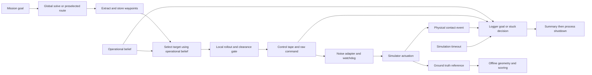

# 09 — Route tracking, waypoint handoff and termination

Audited 2026-09-06. **The recorded corner failure is reproducible without camera error. The corrected-runtime stop short of the goal is consistent with a local clearance refusal, with waypoints still remaining. Current correctness defects also let invalid belief data declare success, obsolete work resume after an ordinary stop or goal change, and experiment completion occur without verified physical rest.** The existing runtime repairs address several earlier failures; they do not establish the whole route-to-stop contract.

This is an investigation and proposed repair report. No production code, configuration, recorded drive, frozen selection or running experiment was changed. Audit scripts and evidence are under `docs/module_audits/09_*`. No ROS initialization, live topic injection, process cleanup or new simulation was performed by this investigation.

## Ranked findings

Priority reflects consequence and reachability, not estimated frequency. “Current” refers to the hashed source used by `probes_current`; conditional input failures are not attributed to the recorded pilots without evidence.

| Rank / ID | Classification and reachability | Finding | Smallest repair |
|---|---|---|---|
| 1 / T09-01 / P1 | Confirmed current; active simple tracker, conditional on a boundary excursion | The 5 mm recovery allowance renews on every replan, permitting cumulative penetration; nonfinite clearance passes | Require non-worsening recovery against a persistent bound; reject invalid geometry results |
| 2 / T09-02 / P1 | Confirmed current; active logger and hierarchical planner; mission-tour branch optional | Stale, wrong-frame or invalid belief can advance a target or satisfy success; readiness can remain true | Share a validated operational-belief contract and invalidate readiness/holds on unusable input |
| 3 / T09-03 / P1 | Confirmed current; active installers; changed-goal trigger dormant in the fixed single-goal pilot | Old goal/belief/stop context can install or continue a tape; moves of at most 1 m do not replace the global goal | Goal revision and stop generation at installation/publication; explicit belief revalidation policy |
| 4 / T09-04 / P1 | Confirmed current; all terminal paths; recorded runtime P2 demonstrates nonzero command at success | Summary completion neither cancels commands nor verifies physical stop; distinct stop causes collapse into `stuck` | Keep cause identity; request and acknowledge stop before physical finalization |
| 5 / T09-05 / P1 | Confirmed current boundary, shared with 08; active GLOBAL handoff | Invalid/incomplete global output and an appended goal connection can become an executable route | Validate result and every added connection before route installation |
| 6 / T09-06 / P2 | Original failure confirmed; dense spacing is a documented policy repair; remaining geometry limitations active | Downsampling and radius-based skipping remove corners; final approach has another stopping threshold | Preserve required bends and validate the actual tracking polyline; declare compatible tolerances |
| 7 / T09-07 / P2 | Confirmed current; active logger, conditional on prolonged rotation/wait or held belief | Stuck detection ignores heading and controller phase, and measures endpoint displacement | Use bounded phase-aware progress from valid operational belief |
| 8 / T09-08 / P2 | Confirmed current; active contact/logging/campaign paths | Contact silence has no end-to-end health proof; geometric and physical collision evidence share outcome fields | Separate operational outcome, physical contact evidence and offline scoring |
| 9 / T09-09 / P2 | Confirmed current stamp defect; active publication, presently latent for XY-only goal consumers | Mission publishes system-time goal stamps while nodes use simulation time | Stamp goals with the ROS clock; separate startup wall timing from mission progress |
| 10 / T09-10 / P3 | Confirmed optional seed-generator defect; not triggered by the selected warehouse routes | Horizontal corridor at world `y=0` is omitted | Include zero-centred corridors; verify translation invariance |

## Scope, configuration and ownership

Read first: repository `AGENTS.md`, `PLAN.md`, `docs/localization_metrics.md`, its registry, `docs/open_questions.md`, `docs/runtime_integrity_audit.md`, and `experiments/icra_commissioning/planner_implementation_plan.md`. Checked the completed 01–08, 10 and 11 audits and the 03 repair package as they became available. Checked current status and the explicit registered selections, rather than selecting directories by recency.

The primary corrected-runtime anchor is [network_navigation_runtime_pilot.yaml](/home/joostleliveld/Thesis/UnembodiedNavigation/experiments/icra_commissioning/network_navigation_runtime_pilot.yaml:57). The separately registered P0-only recovery follow-up completed during this investigation. It uses `turn_then_go_recovery`, under its own protocol and selection; it is not another three-arm comparison. Concurrent cache/diagnostic/launch edits were inspected, then the 50 probes and 55 relevant existing tests were rerun against the resulting source. Their hashes are retained in [probe_results.json](09_tracking_evidence/probes_current/probe_results.json). The ideal-motion replay retains its earlier source hashes separately. A later shared-source edit added a frame check and return after fatal handling specifically to the optional per-camera map-observation callback; it was inspected during final QA, is outside these active fused-path reproductions, and does not supply the hierarchical/mission/logger validity checks below. Line references reflect that five-line shift; the retained probe hashes describe the actual tested bytes.

| Active setting | Resolved value and implication |
|---|---|
| Global output | Hierarchical EFE, lane-graph seeds, H=200, dt=1 s, multistart, maxiter=80; no direct seed |
| Geometry | Disc radius 0.48541219597369 m; global/local lane standoff 0.55 m; these are distinct from body collision clearance |
| Route handoff | Spacing threshold 0.20 m, arrival radius 0.10 m; original pilot used 1.0/0.35 m |
| Local tracking | `turn_then_go`, H=12, dt=0.25 s, planning 4 Hz, command publication 10 Hz, v limit 0.22 m/s, angular limit 1 rad/s |
| Replanning | Minimum remaining tape 0; waypoint-change-only replanning false; latency compensation false; goal-move replan threshold defaults to 1 m in the node |
| Mission | One final goal (10.6, 6.5), `map_bev`; no mission tour; initial-belief wait false and sigma limit disabled |
| Operational termination | Goal radius 0.35 m for 2 s; secondary stable radius 0.20 m, 2 s, 0.04 m displacement |
| Stuck | 8 s, endpoint displacement ≤0.08 m, net goal improvement ≤0.05 m; active command fraction ≥0.50 or idle fraction ≤0.10 |
| Command activity | Absolute v ≥0.02 m/s or angular rate ≥0.10 rad/s |
| Timeouts | Logger 600 simulated seconds after first command; adapter watchdog 0.5 simulated seconds after last input, checked periodically with strict `>` |
| Belief/support | Fused envelope required, coupled heading EKF, prediction from `/odom_noisy`; camera NN/bias/full R and Q frozen across each stated pilot |
| Physical/reference evidence | Contacts may terminate; GT geometry is offline; `terminate_on_geom_collision=false` |

Defaults and wiring: [visibility_launch_common.py:122](/home/joostleliveld/Thesis/UnembodiedNavigation/src/experiments/experiments/core/visibility_launch_common.py:122), mission at :1291, logger at :1331, planner at :1923. The unplumbed node-only goal threshold is [efe_agent_node.py:356](/home/joostleliveld/Thesis/UnembodiedNavigation/src/planning/planning/nodes/efe_agent_node.py:356).

Coordination completed with **03** command ownership, **08** planner output, **14** simulator contacts and **10** outcome logging. The 03 report/repair package owns ordinary-stop cancellation and computation age; 08 independently reproduces invalid/partial global-result admission and stale solve installation; 10 independently confirms summary finalization and command/contact provenance gaps. Investigation 14 reports a known-contact private fixture producing contact messages and a clear fixture producing silence. That establishes event-driven silence as a possible healthy behavior, not proof that a quiet live channel delivered every event. No command or simulator edits were made here.

## Route-to-outcome trace



The missing connection is an acknowledged stop transaction between the logger's terminal decision and final physical outcome. An output `Twist` is a command publication, not measured velocity. A latest CSV row is a collection of held messages, not an atomic controller decision snapshot.

## Findings and deterministic evidence

### T09-01 — Recovery can become cumulative penetration

**Source:** [efe_agent_node.py:1141](/home/joostleliveld/Thesis/UnembodiedNavigation/src/planning/planning/nodes/efe_agent_node.py:1141), especially :1173–1187. The simple-track gate computes `min(start_clearance, 0) - 0.005` anew for both collision and lane clearance. It accepts a leading prefix and repeats this calculation from the next plan's starting pose.

**Trigger / expected:** a pose marginally outside a boundary; holding or recovering that excursion should not permit continually worsening penetration. **Observed:** the real `_simple_local_plan` with an analytic boundary `clearance=-y`, start `(0, .001, .08)`, dt .25, v .22, and a target along that heading produces a first step worsening clearance by 4.395 mm. The gate accepts one step and rejects the second. Thirty replans increase penetration from **1 mm to 132.859 mm**, each spending a fresh allowance. This uses no camera, solver noise or simulator. A separate NaN-clearance fixture admits all 12 controls.

**Consequence:** the claimed holding/recovering rule is not enforced. The gate is on the active `turn_then_go` path as well as the recovery follow-up. This synthetic boundary demonstrates a current defect; it does not diagnose the two recorded physical contacts.

**Smallest repair:** use a non-worsening persistent reference for recovery, with a numerical tolerance that cannot accumulate as permission to move inward. Distinguish physical collision from a lane-standoff preference. Reject nonfinite geometry when a geometry model is enabled. Any change to the intended standoff or permitted penetration policy requires its own configuration/protocol change.

### T09-02 — Operational belief is consumed without a shared validity gate

**Sources:** [goal_mission_node.py:81](/home/joostleliveld/Thesis/UnembodiedNavigation/src/experiments/experiments/nodes/goal_mission_node.py:81), :98–109; [experiment_logger.py:2240](/home/joostleliveld/Thesis/UnembodiedNavigation/src/experiments/experiments/nodes/experiment_logger.py:2240), :2489–2506, :2774–2805, :1502–1579; [efe_agent_node.py:610](/home/joostleliveld/Thesis/UnembodiedNavigation/src/planning/planning/nodes/efe_agent_node.py:610). The inherited frame check is at [unicycle_planner_node.py:3008](/home/joostleliveld/Thesis/UnembodiedNavigation/src/planning/planning/nodes/unicycle_planner_node.py:3008); the hierarchical override bypasses it.

**Trigger / expected:** stale, future, incompatible-frame or invalid-covariance input near a waypoint or goal should not establish valid arrival. **Observed:** mission stores XY before validating covariance and checks only two diagonal variances. An invalid later covariance leaves `_belief_ready` unchanged. A valid message followed by negative variance, indefinite XY covariance, wrong frame or stale data leaves readiness true and advances the synthetic tour. NaN XY can leave readiness true too. `_maybe_advance` does not consult readiness, age or frame.

The logger reports a held belief as available whenever one exists. Its age field is not an admission gate; negative age is clamped. With goal gap **0.349 m**, ticks at t=10 and t=12 generate a real `run_summary.json` with `goal_reached` even for belief stamp 0, stamp 100, frame `odom`, negative variance or indefinite covariance. Valid controls confirm that gap **0.350 m succeeds**, while **0.351 m does not** after that hold. A wrong-frame hierarchical input near a waypoint advances the route index and publishes nonzero control.

**Reachability / consequence:** logger and hierarchical callbacks are active; mission tours/readiness waiting are optional in this single-goal pilot. The usual valid producer reduces exposure but does not repair consumer semantics. These injected boundary failures are not claimed as causes of the selected stops.

**Smallest repair:** validate finite pose, covariance semantics, common frame, clock epoch and supported state timestamp before publishing a usable operational state. Clear readiness and goal/stuck history when that contract is lost. Use the same validity result for target advancement and termination. Fresh odometry-supported prediction during a camera outage must remain distinguishable from a stale held belief; do not replace this with a blanket camera-age veto or introduce GT into online decisions.

### T09-03 — Goal, belief and stop changes do not consistently invalidate work

**Sources:** [efe_agent_node.py:624](/home/joostleliveld/Thesis/UnembodiedNavigation/src/planning/planning/nodes/efe_agent_node.py:624), :827–887, :939–965, :1223–1379; [unicycle_planner_node.py:1007](/home/joostleliveld/Thesis/UnembodiedNavigation/src/planning/planning/nodes/unicycle_planner_node.py:1007); [experiment_logger.py:1784](/home/joostleliveld/Thesis/UnembodiedNavigation/src/experiments/experiments/nodes/experiment_logger.py:1784).

**Expected:** a changed mission goal invalidates old route/hold identity; old computations cannot undo a later stop. Belief changes need an explicit continuation/revalidation rule. **Observed:** the replan comparison is strictly `>1.0 m`. Goal moves of .999 and 1.000 m leave the old goal/route installed; a robot at the old final target continues returning zero. At 1.001 m the replan branch is reached. A controlled global solve changes goal 1→−2 and belief to `(0,1,π)` before returning: the route to the old goal is still installed.

During local computation, changing the goal or flipping the belief heading by π still permits publication of the pre-change `(0.22,0)` tape. An ordinary safe stop injected during computation publishes zero and is then followed by nonzero publication. The current fatal-stop latch correctly keeps both publications zero. A belief change after installation also leaves the next timer publication on the old tape.

The logger's goal callback only replaces the message. A goal at +.3 m starting a hold at t=10, replaced by a distinct goal at −.3 m at t=12, immediately inherits the old two-second hold and reports success.

**Smallest repair:** canonical goal identity/revision, stop generation and epoch bound to each request and checked atomically on install/publication. Reset mission-progress history on a genuine goal change, not on the mission's periodic restamp. Coordinate cancellation/age mechanics with 03 and GLOBAL validation with 08. Do not discard every routine belief update indiscriminately: define which corrections require rerolling/revalidating the remaining controls so continuous updates do not starve planning. The fixed single-goal pilots do not demonstrate a live goal-change race.

### T09-04 — A terminal decision is not a verified physical stop

**Sources:** [efe_agent_node.py:952](/home/joostleliveld/Thesis/UnembodiedNavigation/src/planning/planning/nodes/efe_agent_node.py:952), :989, :1297–1302, :1371; [actuation_noise_node.py:190](/home/joostleliveld/Thesis/UnembodiedNavigation/src/sim/sim/actuation_noise_node.py:190); [experiment_logger.py:3256](/home/joostleliveld/Thesis/UnembodiedNavigation/src/experiments/experiments/nodes/experiment_logger.py:3256), :3394–3504; launch :1337.

**Expected:** retain the initiating stop cause and distinguish operational completion, requested zero, received/applied zero, and rest. **Observed:** safety refusal, tape expiry and explicit stop clear the tape and publish zero through the same helper. A controller arriving within 5 cm can instead install 12 zero controls and continue reporting an active tape. Watchdog zero originates in the adapter and has no ordinary command-noise diagnostic event. Neither the mission nor the logger owns a stop handshake.

`_finish_run` marks completion, writes the summary, and schedules ROS shutdown after .15 wall seconds. It does not publish zero, invalidate the planner's generation or wait for actuation/rest. The deterministic `summary_not_physical_stop` fixture creates the real summary and then permits another nonzero planner publication. Recorded runtime **P2 reports `goal_reached` at 242.701 s while raw angular command is −1.0 rad/s and output is −0.966531 rad/s**. This establishes nonzero publication at completion, not physical angular velocity. P1's last observed zero tail is only .502 s; its two-second goal hold is not a two-second rest hold.

All controlled one-metre-short idle cases—planner refusal, controller zero, exhausted tape, watchdog, waiting for replanning, and fatal stop if the logger survives—become `stuck` at t=8. Distinct contact and timeout fixtures correctly become `collision` and `timeout_after_first_cmd`, but also do not acknowledge rest.

**Smallest repair:** carry structured controller status and cause identity to the logger. Emit an immutable operational terminal event, request stop with a command generation, acknowledge receipt/application, then finalize physical outcome after a bounded operational stationary check or explicit stop-ack timeout. Keep contacts recording through that boundary. Summary/event durability belongs with 10; command ownership and the watchdog remain with 03. Do not redefine current historical `stop_stamp` as physical stopping time.

### T09-05 — Global feasibility does not cover the installed route

**Sources:** [efe_agent_node.py:827](/home/joostleliveld/Thesis/UnembodiedNavigation/src/planning/planning/nodes/efe_agent_node.py:827), :848–887; [base_planner.py:324](/home/joostleliveld/Thesis/UnembodiedNavigation/src/planning/planning/planners/base_planner.py:324). Full solver evidence and ownership: [audit 08, P08-01/02](08_planner_and_future_camera_model.md).

**Trigger / expected:** a partial, invalid or stale solve must retain that disposition instead of becoming a complete executable route. **Observed:** the hierarchical GLOBAL path extracts result states, appends `final_goal`, installs the waypoint list and enters LOCAL without validating `rollout_valid`, finite state/terminal contract, or the added connection. A later-leg solver exception can similarly install a densified straight line. The selector ranks terminal feasibility but does not require it when no complete candidate exists.

Audit 08 independently reproduces a real incomplete solve ending 1.89 m from its goal, malformed results and changed-input solves becoming LOCAL. This audit independently reproduces the stale global handoff and the geometric losses during extraction. The selected complete three-arm route artifacts do not prove this fallback occurred in their drives.

**Smallest repair:** one shared GLOBAL admission gate before publishing/storing/executing route data; require explicit valid finite result and the declared completion contract, or preserve a labelled partial/stop state. Validate every appended/fallback connection. Keep feasible iteration-limit solutions admissible when they actually satisfy that contract. No camera-cost or horizon change is needed to fix admission.

### T09-06 — Waypoint geometry and approach tolerances are different contracts

**Sources:** [base_planner.py:55](/home/joostleliveld/Thesis/UnembodiedNavigation/src/planning/planning/planners/base_planner.py:55); [efe_agent_node.py:893](/home/joostleliveld/Thesis/UnembodiedNavigation/src/planning/planning/nodes/efe_agent_node.py:893), :969–1001, :1044–1067; [preselected_route.py:91](/home/joostleliveld/Thesis/UnembodiedNavigation/src/unav_common/unav_common/preselected_route.py:91), :205–299; [lane_graph_routes.py:70](/home/joostleliveld/Thesis/UnembodiedNavigation/src/unav_common/unav_common/lane_graph_routes.py:70).

**Observed:** extraction accumulates path length and chooses existing vertices when the threshold is reached; it does not interpolate a maximum spacing or preserve every bend. Source `(0,0)→(.11,0)→(.11,.11)` with .20 m spacing yields only `(.11,.11)`, removing the corner. Source samples .22 m apart remain .22 m apart. Local handoff increments monotonically while target distance is strictly less than the radius. A route `[(0,0),(.04,0),(.04,0),(.04,.04),(1,.04)]` at the origin with .10 m arrival jumps from index 0 to 4 and commands toward the distant point.

There is **no demonstrated reordering or index exhaustion**: the last index is retained. Preselected canonicalization rejects adjacent duplicates; lane seeds deduplicate them. The short-route probe exercises the common tracker list, not a claim that duplicate preselected input bypasses that validator. Preselected validation samples its exact polyline and preserves the points on installation; radius-based execution may still bypass nearby bends. Lane-graph membership samples are seed checks, not swept body clearance certificates.

The final controller target is also retained, but the geometric controller stops within **.05 m**, independent of .10 m intermediate arrival and .35 m logger success. At .049 m it installs zero controls; at .051 m it moves. A configured arrival radius below .05 m could strand an intermediate waypoint; that is not the active .10 m setting. Optional pure pursuit uses `max(3*spacing,.30)` lookahead (.60 m at current spacing), can select farther route vertices, and retains a hard-coded 1.5 rad/s limit. It is not the active controller.

**Smallest repair:** preserve mandatory corners or validate each shortcut against the same geometric contract, then replay the resulting tracker under ideal motion. Explicitly relate maximum segment length, arrival, body/lane clearance and optional lookahead. Changing 1/.35 to .2/.1 is a documented tracker-policy correction, not a localization repair. Choosing different final success/arrival radii can be intentional; invalid stale success and stopping without acknowledgement are correctness defects regardless of those values.

### T09-07 — Rotation, waiting and missing state can all look stuck

**Source:** [experiment_logger.py:1431](/home/joostleliveld/Thesis/UnembodiedNavigation/src/experiments/experiments/nodes/experiment_logger.py:1431), :1472–1489, :1549–1579. Motion history contains logger time, XY, goal distance and binary command activity; no heading or controller phase.

**Expected:** valid progress in an expected turn or bounded planning wait has a distinguishable outcome. **Observed:** a fixed-XY robot rotating 1.6 rad toward the target over eight seconds at .2 rad/s becomes `stuck (active)`. An idle replanning wait becomes `stuck (idle)`. Held stale XY under .22 m/s commands also becomes stuck. An oscillation returning to its starting XY has zero endpoint displacement despite travel. Conversely, activity fraction one third lies between the active and idle thresholds and avoids stuck at eight seconds. A window can be accepted with only four seconds of samples after startup has passed eight seconds.

These are deterministic policy/observability failures under stated triggers. An ordinary 90-degree turn at the active 1 rad/s limit usually finishes well inside eight seconds; no claim is made that every normal turn falsely terminates. Camera outage alone is not evidence of no motion: fresh supported odometry prediction should still progress the operational belief.

**Smallest repair:** record phase (`turning`, `tracking`, `planning`, `safety_hold`, `waiting_for_valid_state`) and goal revision, include heading/route progress with a bounded phase budget, and require usable belief support for a locomotion-stuck diagnosis. Keep timeout/recovery limits explicit. Merely increasing eight seconds conceals which phase failed.

### T09-08 — Contact, operational success and offline geometry are partially conflated

**Sources:** [experiment_logger.py:1985](/home/joostleliveld/Thesis/UnembodiedNavigation/src/experiments/experiments/nodes/experiment_logger.py:1985), :2978–3017, :3231–3237, :3381–3387; [run_visibility_campaign.py:1493](/home/joostleliveld/Thesis/UnembodiedNavigation/scripts/visibility_comparison/run_visibility_campaign.py:1493). See [10, L10-11](10_logging_and_event_accounting.md).

**Observed:** the first nonzero command requires a contact publisher; the positive no-publisher fixture correctly ends `infra_invalid_contact_channel`. Publisher disappearance after that check does not invalidate success: one publisher at first command, zero at the goal, and no received messages still produces `goal_reached`, valid=true, contact=false. A publisher count is discovery evidence, not event delivery or sensor health. All nine original/tracking/runtime summaries have 46 publishers; the seven without a contact event have zero messages. State the result as **no recorded contact**, not verified collision-free motion. Investigation 14's clear physics fixture also produces silence, so requiring an arbitrary contact message would incorrectly reject healthy quiet operation.

GT geometry does not terminate the active logger, which is correct. However, geometry and physical contacts share `_first_crash_stamp`, `collision_reason` and summary `crashed`; the geometry branch uses `odom_map_stamp` for geometry computed from GT. The campaign prioritizes `crashed` over `completion_reason`, so offline geometric evidence can relabel an operational goal as a collision. The synthetic geometry case confirms `goal_reached` with `crashed=true`; the selected nine runs did not exercise a geometry-only remap. `goal_region_success` is offline ever-entered-without-crash, not the online hold rule. Final GT goal distance also lacks its reference sample stamp in the summary.

**Smallest repair:** three explicit axes: operational termination, contact evidence/health, and offline GT scoring. Preserve native contact source time, callback receipt time, complete object identities and a command/state snapshot in an append-only event record. Use the GT sample's own stamp for geometric evidence. Establish heartbeat/health semantics with 14 rather than treating absence of events as a healthy negative observation. None of these repairs should feed GT into target, goal or stuck decisions.

### T09-09 — Mission clock domain and readiness are inconsistent

**Source:** [goal_mission_node.py:69](/home/joostleliveld/Thesis/UnembodiedNavigation/src/experiments/experiments/nodes/goal_mission_node.py:69), :113–140; launch :1291–1302.

**Observed:** despite `use_sim_time=true`, goal stamps and the repeat timer use `SYSTEM_TIME`. The controlled message has stamp 1788728000 while simulation time is 10. The current goal consumers use XY without freshness enforcement, so this does not itself explain the recorded P0 stop. It does prevent meaningful source-age comparisons and is incompatible with adding a correct goal-time gate. Optional tours also progress on wall ticks, and `_maybe_advance` runs before the first goal publication, permitting already-near points to be bypassed before they are announced.

**Smallest repair:** ROS-clock goal stamps and simulation-time mission progress; retain a separately named wall-clock startup deadline only if it is required for pre-clock startup. Apply T09-02 readiness invalidation and T09-03 goal identity at the same boundary. Explicit tour-final identity is needed before the logger can distinguish an intermediate mission goal from mission completion; the fixed one-goal experiment does not expose that ambiguity.

### T09-10 — Seed availability depends on the arbitrary map origin

**Source:** [lane_graph_routes.py:162](/home/joostleliveld/Thesis/UnembodiedNavigation/src/unav_common/unav_common/lane_graph_routes.py:162). Corridors are split using `y<0` and `y>0`, omitting `y=0`.

**Reproduction:** rectangle `[-2,2]×[-.5,.5]`, start `(−1,0)`, goal `(1,0)` yields no seed. Translating the same geometry and poses by +1 m in Y yields a route. **Expected:** availability invariant under translation. **Consequence:** valid centre corridors disappear in other maps; no missing zero-centred route is diagnosed in the selected warehouse. **Smallest repair:** retain centre corridors explicitly and add this translation pair to seed tests. The routine is a small corridor seed family, not a general exhaustive graph planner; that broader limitation is intentional.

## Recorded regressions and ideal-motion replay

The read-only [09_ideal_replay.py](09_ideal_replay.py) uses the recorded P0 route/settings, retained original controller source and `tracker_preflight.py`. The retained old source hash `688484713982…` matches the original recorded P0 preflight source hash. The current EFE hash is `a575ba53e74a…`. Full hashes, trajectories, commands and gate reasons are in [ideal_replay.json](09_tracking_evidence/ideal_replay.json).

| Controller / spacing / radius (m) | Replayed result | First-stop or goal-region time | Target index / goal gap |
|---|---|---:|---|
| Original / 1.0 / .35 | Lane-clearance refusal at first corner | 76.75 s | 16 / 17.480 m |
| Original / .20 / .10 | Enters existing goal region | 169.75 s | 168 / .320 m |
| Current / 1.0 / .35 | Same corner refusal | 77.00 s | 16 / 17.481 m |
| Current / .20 / .10 | Enters existing goal region | 170.75 s | 168 / .320 m |
| Current / .20 / .05 | Enters existing goal region | 172.75 s | 168 / .323 m |

These are .25 s ideal unicycle steps with replanning and no camera/actuation noise, ROS latency, contact delivery or two-second success hold. `goal_region` is not a simulated completed mission. The original minimum modeled body clearance at refusal is .4195 m: this is a lane-standoff refusal, not body contact. Dense handoff clears that corner in both controller versions; it cannot establish noisy-runtime success.

For corrected-runtime **P0**, the last published belief at **240.200 s** is `(10.007497, 6.575743, .145548)`. Logged target **167/171** is `(10.212942, 6.550523)`; the final index would be 170. The next proposed control is `(v=.168331, w=−.535389)`. The unchanged gate rejects step zero with `driveable_clearance_violation_step_0:-0.032`. Modeled body clearance is **.419725 m**, while lane-standoff clearance is **−.025743 m**. The saved global route itself reaches a minimum standoff clearance of **−.000761 m**: global soft preference and local hard refusal are different contracts.

The zero command tail begins at logged time **232.303 s**; the logger declares stuck at **240.301 s**, operational goal gap **.597325 m**. Offline summary GT gap is **.566833 m**. The route is not exhausted. Turning toward the same target first passes the unchanged gate; the opt-in recovery continuation enters the .35 m goal region after **1.75 s**, while the baseline continuation stops immediately. This is a deterministic reconstruction from a published belief, **not the unrecorded exact live planning snapshot or a causal live recovery estimate**.

The separate registered recovery run `experiment_20260906_223453` is now complete: summary `goal_reached` at **239.901 s**, belief stamp **239.800 s**, operational gap **.019870 m**, last target 170/171, raw/output commands zero, 46 publishers and zero recorded contacts. Its separately validated [terminal trace](09_tracking_evidence/recovery_trace_current.json) preserves pose/covariance/command stamps and the original summary. The registered follow-up records one checked rotation activation. This is one development branch check; differing route/timing/noise realizations prevent a paired causal improvement or general success-rate claim.

## Exact recorded terminal evidence

[09_run_trace.py](09_run_trace.py) loads only the three explicit registry selections through `aligned.py` and verifies all **81 selected file hashes**. The recovery companion verifies its separate nine hashes. Each listed arm has **one seed, 210**. No time samples or arms are treated as independent replicates, and the three pilots are not pooled.

`O` = original pilot; `T` = spacing/arrival follow-up; `R` = corrected-runtime pilot. Run IDs below append to the corresponding registered `.../fusion_network_traverse/P{arm}/seed210/` path; full paths and CSV line numbers are in [run_traces.json](09_tracking_evidence/runs_current/run_traces.json). Indices are zero-based. `raw/output` shows held command values, not executed velocity. The last pre-decision logger row is used, never a later post-contact row.

| Pilot / arm / experiment suffix | Terminal reason / source time (s) | Last CSV / belief time (s) | Target | Operational gap (m) | Raw → output (v m/s, w rad/s) |
|---|---|---|---|---:|---|
| O / P0 / 201018 | stuck / 143.004 | 143.004 / 142.912 | 16/35 | 17.481756 | (0,0) → (0,0) |
| O / P1 / 202110 | stuck / 148.701 | 148.701 / 148.600 | 16/35 | 17.481801 | (0,0) → (0,0) |
| O / P2 / 203330 | stuck / 147.201 | 147.201 / 147.113 | 16/35 | 17.483175 | (0,0) → (0,0) |
| T / P0 / 204507 | stuck / 196.901 | 196.901 / 196.807 | 117/171 | 13.732753 | (0,0) → (0,0) |
| T / P1 / 210032 | contact / 165.184 | 165.100 / 165.001 | 100/171 | 13.652364 | (.196740,−.223490) → (.182262,−.147416) |
| T / P2 / 211343 | contact / 163.414 | 163.402 / 163.303 | 97/171 | 14.199000 | (.218303,.015484) → (.205068,.070559) |
| R / P0 / 213015 | stuck / 240.301 | 240.301 / 240.200 | 167/171 | .597325 | (0,0) → (0,0) |
| R / P1 / 214913 | goal_reached / 231.302 | 231.302 / 231.203 | 170/171 | .010523 | (0,0) → (0,0) |
| R / P2 / 220801 | goal_reached / 242.701 | 242.701 / 242.601 | 170/171 | .066676 | (0,−1) → (0,−.966531) |

Goal/stuck stamps originate at logger simulation-time decisions. Both contact stamps originate in the contact callback's message header; the object is `warehouse_v2_occluders::obs_A2b3e::collision`. The nearest preceding CSV is **84 ms** before T/P1 contact and **12 ms** before T/P2 contact. T/P1 also has one row after the contact decision; it is retained but not substituted for the terminal input. Every terminal target matches the indexed saved waypoint. No exact applied-command or contact-time controller-state record exists, so those missing snapshots cannot honestly be reconstructed.

Investigation 14 identified, and this audit independently hash-verified, the actual finalization mismatch in T/P1: summary contact count **1** at 165.184 s versus **17** in the raw CSV row at 165.200 s. That row retains nonzero output `(.186216,−.310306)` stamped 165.102 s, before contact; it does not establish a new post-contact command delivery. The [contact tail snapshot](09_tracking_evidence/contact_tail.json) preserves both records. This is recorded evidence of counters changing after summary creation, alongside 10's deterministic finalization reproduction.

The following are **single terminal planner-belief errors**, scored against `gt_stamp`-aligned reference at the belief's own stamp, not camera-reading accuracy and not drive aggregates. Each row has N=1 terminal pose. Full pose covariance is positive definite in these samples; planar/pose NEES describe only these terminal samples. Nominal planar 95% inclusion uses 5.991; it is not a calibration estimate. Dropped-correction percentage and longest accepted-correction gap cover the first-command-to-stop interval and accompany the errors as required by the contract.

| Pilot / arm | Position error (cm) | Heading error (deg) | Planar / pose NEES | In planar 95% ellipse | Dropped (%) / longest gap (s) |
|---|---:|---:|---|---|---|
| O / P0 | 7.474 | 0.195 | 2.471 / 2.505 | yes | 10.315 / 12.596 |
| O / P1 | 6.972 | 1.625 | 1.717 / 1.719 | yes | 11.966 / 14.300 |
| O / P2 | 8.947 | 1.020 | 3.307 / 3.309 | yes | 1.600 / 14.398 |
| T / P0 | 100.217 | 106.427 | 23.692 / 372.798 | no | 13.008 / 26.599 |
| T / P1 | 116.758 | 147.971 | 39.956 / 1111.529 | no | 4.651 / 27.802 |
| T / P2 | 68.441 | 88.816 | 3.864 / 401.674 | yes | 1.531 / 23.801 |
| R / P0 | 3.799 | 1.786 | 2.096 / 2.432 | yes | 4.976 / 28.400 |
| R / P1 | 3.752 | 2.253 | 1.324 / 2.567 | yes | 6.136 / 27.397 |
| R / P2 | 4.131 | 0.480 | 1.598 / 2.321 | yes | 8.057 / 73.195 |

This exposes the earlier heading failure: T/P0, P1 and P2 have approximately **106°, 148° and 89°** terminal heading error. A small drive-wide position median, or even a heading p95 that excludes a late divergence, cannot characterize that terminal control state. `network_navigation_analysis.py:277–318` now includes heading and full-pose consistency; earlier planar-only results are retained as historical diagnostics. Its trajectory panels at :334–367 still emphasize position. The trace here does not use the defective post-correction-event association helper identified by 01/11.

## Terminal cause and evidence matrix

| Initiating source | Source time and state/command snapshot available | Logger disposition / remaining gap |
|---|---|---|
| Local geometry refusal, EFE :940–954 | Replan context, proposed control and gate reason exist in memory; console/held execution diagnostics are incomplete event evidence | Cleared tape and raw zero; short-of-goal idle eventually `stuck`; no structured initiating cause in summary |
| Controller within .05 m, EFE :989 | Current target/pose and zero-control rollout | Zero tape can remain “active”; success only if mission-goal hold qualifies, otherwise can become `stuck` |
| Tape expiry / negative age, EFE :1292–1302 | Command timer ROS time and active tape age | Raw zero, same helper; no unique terminal cause or epoch record |
| Ordinary explicit safe stop / fatal latch | Publication clock and in-memory ownership; fatal latch prevents subsequent nonzero publication | Ordinary stale installer can resume; fatal teardown may yield interrupted/no summary rather than the synthetic surviving-logger `stuck` |
| Watchdog, adapter :190–201 | Adapter receipt-age clock, log warning and output zero | No matching ordinary diagnostic record; logger cannot identify this zero's provenance |
| Goal hold / stable goal, logger :1502–1547 | Logger decision time, held operational belief/goal/commands | `goal_reached` / `goal_reached_stable`; no zero or rest acknowledgement |
| Stuck, logger :1549–1579 | Logger decision time; XY endpoint history and activity fraction | `stuck`; no heading/phase distinction |
| Physical contact, logger :1995–2019 | Contact header time and object string; exact callback-time pose/command unavailable in stored evidence | Immediate `collision`; no append-only full contact ledger or verified subsequent rest |
| Logger timeout, :3240–3244 | Logger simulated time since first active command | `timeout_after_first_cmd`; does not itself command stop |
| Missing initial contact publisher, :3231–3237 | First-active-command logger tick and discovery count | `infra_invalid_contact_channel`; no physical stop acknowledgement |
| Campaign no-first-command / wall timeout | Runner wall clock; first command detected from CSV; external process teardown | `no_first_cmd_timeout`, `wall_clock_timeout` or `no_summary`; not a motion-stuck observation |
| Logger/process interruption, :3506–3520 | Partial `interrupted` summary may omit stop timestamp, pose and commands | Incomplete experiment, not proof of a commanded stop |
| Offline GT geometry, :2978–3017 | GT pose is available but shared crash stamp incorrectly uses odometry time | Does not terminate active logger; may override campaign outcome through `crashed` |

The deterministic stop fixtures retain the exact injected source, real output publisher calls, a **harness-only** terminal state/command snapshot, and the real `_finish_run` summary. That extra harness snapshot is not a claim that production logging already records it. The one-metre-short cases record `stuck` at t=8, contact at t=8.123 and timeout at t=600; the replanning-wait case models idle waiting, and the fatal case explicitly assumes the logger remains alive. These isolate classification, not DDS delivery or physical braking.

## Verification and repair boundary

Evidence:

- [09_tracking_probe.py](09_tracking_probe.py), [50-case results](09_tracking_evidence/probes_current/probe_results.json) and [console output](09_tracking_evidence/probe_current_output.txt): real callbacks/controllers with controlled clocks, publishers, solve boundaries and belief inputs; real summary writer; unchanged AST-extracted logger distance/dispatch statements. Assertions establish observed behavior, including defects, rather than claiming repaired invariants.
- [Ideal replay](09_tracking_evidence/ideal_replay.json): five complete ideal route replays and two final-stop continuations, with source hashes.
- [Terminal CSV](09_tracking_evidence/runs_current/terminal_rows.csv), [complete terminal snapshots](09_tracking_evidence/runs_current/run_traces.json) and [separate recovery trace](09_tracking_evidence/recovery_trace_current.json): exact selections, selected-file hashes and timestamp limits.
- [Existing regressions](09_tracking_evidence/current_regressions.txt): **55 passed** across runtime transactions, tracker guard, lane routes, preselected routes, logger alignment and watchdog. All four audit scripts compile. Older `probes`, `probes_final`, `runs` and `runs_final` directories are intermediate audit outputs, not additional experiment selections.

Reproduce without launching ROS/Gazebo or modifying a recorded experiment, from the repository root:

```bash
audit09_out=$(mktemp -d /tmp/unav_audit09.XXXXXX)
OPENBLAS_NUM_THREADS=1 OMP_NUM_THREADS=1 python3 docs/module_audits/09_tracking_probe.py --out "$audit09_out/probes"
OPENBLAS_NUM_THREADS=1 OMP_NUM_THREADS=1 python3 docs/module_audits/09_ideal_replay.py --out "$audit09_out/ideal_replay.json"
OPENBLAS_NUM_THREADS=1 OMP_NUM_THREADS=1 python3 docs/module_audits/09_run_trace.py --out "$audit09_out/runs"
OPENBLAS_NUM_THREADS=1 OMP_NUM_THREADS=1 python3 docs/module_audits/09_recovery_trace.py --out "$audit09_out/recovery.json"
OPENBLAS_NUM_THREADS=1 OMP_NUM_THREADS=1 python3 -m pytest -q tests/planning/test_runtime_transactions.py tests/planning/test_tracker_guard.py tests/planning/test_lane_graph_routes.py tests/planning/test_preselected_route.py tests/experiments/test_logger_time_alignment.py tests/sim/test_command_watchdog.py
```

**Documented repairs, not newly open bugs:** verified full supported-motion replay; serialized state and command transactions; shared prediction/publication timestamp; angular-limit correction for the active simple tracker; envelope validation; per-camera deduplication; finite tape expiry; adapter watchdog; later fatal publication latch, negative tape-age guard and idle diagnostics. The 55-test packet rechecks its relevant subset; it does not replay every archived defect. Older command-timer races must not be presented as unfixed when their specific regression is now covered. Ordinary-stop generation and changed-input installation remain distinct open cases. The checked rotation option is implemented and has a separately registered live branch check; the unchanged gate still has T09-01's renewable allowance.

**Intentional policy limits:** intermediate arrival can precede exact waypoint passage; final goal is position-only with a hold, not a requested final orientation; thresholds and lookahead are controller policy; lane seeds are not exhaustive routes; robust runtime fusion differs from the independent planner precision model; command noise is sampled per received message. Changing these requires explicit comparison scope. None excuses violating the selected goal/frame, installing invalid output or losing terminal cause identity.

**Hypotheses not established:** that any particular camera caused the two contacts; that an arbitrary stale/wrong-frame message occurred in the selected pilots; that a waypoint was reordered or the P0 route exhausted; that contact silence proves no collision; that a published zero proves rest; that the recovery follow-up proves a causal success improvement. Exact controller computation inputs, applied commands and contact-time snapshots remain unobserved in the existing logs.

Proposed implementation order: coordinate generation/age cancellation with 03 and route admission with 08; add shared operational validity and goal identity; fix the cumulative recovery allowance; agree terminal/stop/contact records with 10/14; then compare explicitly configured tracking and progress policies using these deterministic cases before another simulation. Preserve the frozen failures as regression evidence.
