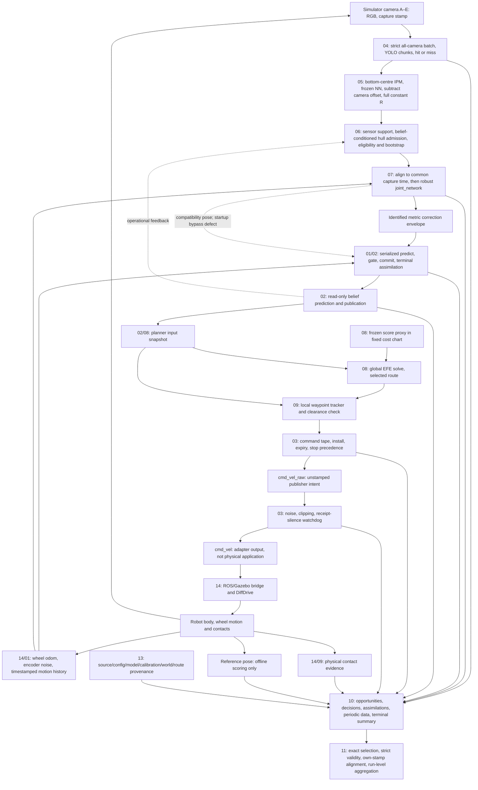

# 15 — End-to-end acceptance and repair integration

**Verdict: NOT ACCEPTED for a corrected matched navigation pilot.** The recent repairs establish useful local properties, but the complete capture-to-motion-to-evidence contract still fails. A new audit-15 simulator integration drive was **not run**, because the user explicitly made passing component contracts its prerequisite. Audit 14's bounded private physics probes instead provide direct failure evidence: a downstream drive target survives clock/adapter loss, `reset.all` does not create a fresh epoch, and a positive contact fixture works while clear-scene silence is ambiguous. These component results do not constitute an integrated goal-approach acceptance.

This investigation owns reconciliation, evidence and repair sequencing. It changed no shared runtime/configuration/model file, launched or killed no experiment, reset no simulator, and altered no frozen selection or source snapshot. Audit artifacts are under [`experiments/runtime_integrity/end_to_end_20260906`](../../experiments/runtime_integrity/end_to_end_20260906). Each repair below has an owning investigation. Historical failures remain visible.

## Scope and evidence identity

The baseline configuration is [`network_navigation_runtime_pilot.yaml`](../../experiments/icra_commissioning/network_navigation_runtime_pilot.yaml), selected explicitly by the registry. It configures the corrected three-arm diagnostic baseline, **not** an end-to-end accepted release. The later [`network_navigation_recovery_pilot.yaml`](../../experiments/icra_commissioning/network_navigation_recovery_pilot.yaml) is a separate controller follow-up. A report saying “current” means its own recorded bytes, not any subsequently edited working tree.

The first audit-15 harness records source hashes, resolved imports and an immutable source archive. It found no source changes during execution. The existing 290-test focused suite passed before the subsequent batching edits; some tests intentionally reproduce defects. Thirty-nine component probes also reproduced their asserted observations, including failures. These counts must never be summed into an acceptance score.

- [`identity_start.json`](../../experiments/runtime_integrity/end_to_end_20260906/identity_start.json), [`identity_end.json`](../../experiments/runtime_integrity/end_to_end_20260906/identity_end.json): exact inspected source/test identity and dirty checkout status.
- [`audited_sources.tar.gz`](../../experiments/runtime_integrity/end_to_end_20260906/audited_sources.tar.gz), [`audited_sources_manifest.json`](../../experiments/runtime_integrity/end_to_end_20260906/audited_sources_manifest.json): matching source/fixture bytes retained without reverting shared files. The manifest names unrecoverable unrelated audit-work files; those were not imported by audit 15. Model/data bytes remain separately hash-bound inputs.
- [`runtime_identity_comparison.json`](../../experiments/runtime_integrity/end_to_end_20260906/runtime_identity_comparison.json): manager, fusion, robot correction and adapter matched the frozen pilot protocol; the initial working EFE was already the newer fatal-stop/negative-age/idle-diagnostic version. The protocol does not enumerate the entire source closure.
- [`launch_wiring.json`](../../experiments/runtime_integrity/end_to_end_20260906/launch_wiring.json): actual launch declarations/parameter resolution without executing launch actions. Importing launch descriptions is not a live deployment check.
- [`source_drift_after_harness.json`](../../experiments/runtime_integrity/end_to_end_20260906/source_drift_after_harness.json), [`fusion_rerun_boundary.json`](../../experiments/runtime_integrity/end_to_end_20260906/fusion_rerun_boundary.json): later acquisition changes and failed old-fixture reruns kept explicitly separate. An AttributeError from an obsolete fake manager is not a proven runtime regression.

The full component-report inventory and any independently verified later repairs appear below. Completion of an investigation report is distinct from repair completion and integration acceptance.

## Exact chain and ownership

Dashed feedback is not a second recursive filter. Active camera mean/R and robust aggregation do not implement a perception-KF posterior cascade. The single robot filter owns recursive state. Admission and common-time motion can nevertheless depend on operational belief/motion and introduce dependence that the covariance interfaces do not represent.

| Boundary | Owner and authoritative value | What the next stage is entitled to assume / present gap |
|---|---|---|
| Capture → detector | 04/14: camera, epoch, capture sequence, exact nanosecond stamp, original 1280×720 image | Five-camera order is explicit; historical “four_camera” filenames do not define count. 960 is inference size. Physical model calls and logical batch cycles need distinct identities. |
| Detector → observation | 04/05: bbox, score, selected pixel, image/calibration identity, hit/miss, receipt/inference/publish clocks | A miss is evidence that inference ran; absent frame, unscheduled work, overload and abort are different outcomes. Metadata must validate geometric meaning. |
| Observation → fusion | 05/06/07: capture-time robot ground-reference XY in map_bev metres and full 2×2 R in m² | Active z=NN(IPM,bbox,score,camera)−b_camera. Frozen R replaces provisional pixel-projection R. Hull correction is off; hull admission remains on. |
| Fusion → filter | 07/01: immutable common-time z/R, original captures, source/member IDs and support | joint_network uses Huber-weighted covariance with residual scatter and effective-camera-count multiplier. It is a measurement; equal identical cameras retain one camera's R. |
| Motion → filter/publication | 01/02: finite ordered body v/ω, source/frame, covered interval, timestamped heading | Dense odometry through a blind turn supports dead reckoning. Missing motion is not supported merely because a camera returned or a covariance was inflated. |
| Filter transaction | 01: full m/P/frame/state time and input/output revision; terminal status/reason | Only this transaction may modify recursive state. The compatibility/planning bootstrap and commit-before-event publication break that authority today. |
| Belief → planning | 02/08: read-only projection of one revision at one target, with support/age | Prediction does not commit. Publication order, equal-time revisions and plan metadata need explicit tokens. |
| Global route → local controller | 08/09: validated complete route and waypoint progression | Active global EFE controls are not the executed tape. Local turn_then_go produces the actual controls; clearance and final-goal semantics must agree. |
| Tape → adapter → actuator | 03/14: one command owner, stop generation, epoch/sequence, source time, validity, bounded control | Selected bounds are v∈[0,.22] m/s, ω∈[−1,1] rad/s. Twist lacks age/ownership/application evidence. Adapter zero requests are not measured body stops. |
| Mission/contact → termination | 09/10/14: operational belief decision, physical contact event, infrastructure failure, stop request/confirmation | Goal, stuck, command silence, contact silence and actual collision are distinct. GT is never an online goal/stuck criterion. |
| Logging → offline | 10/11/13: durable source-bound event set plus terminal summary | Complete identity reconciliation precedes scoring. Periodic predictions cannot be relabelled immediate posteriors. Failures and reasoned refusals remain selected. |

Resolved baseline limits: strict native YOLO CPU, A–E, confidence .25, NMS .45, max capture spread .05 s; manager 5 Hz; manager eligibility age 1.25 s versus filter age .5 s; metric correction-gap cap 1.5 s; NIS 9.21; XY rejection inflation .05 m²; no hard reanchor; coupled heading; measured /odom_noisy; Q parameters .01/.02; local step .25 s, local planning 4 Hz, belief and command publication 10 Hz. The 60 s retained motion horizon is not a guarantee of supported arbitrary camera absence. The newer rotation-recovery controller remains a separate configuration.

## Bounded scenario and acceptance interpretation

This is one bounded scenario specification with isolated fault branches and actual-method/component harnesses. It is **not** a claim that one continuous simulated drive exercised every branch. Online methods receive operational odometry and camera data only. Scripted reference geometry/poses are test oracles and offline references.

| Scenario | Bounded stimulus and evidence | Integration verdict |
|---|---|---|
| S1 normal motion | Five named camera inputs, recorded-box projection/NN/R equality, exact registered B/C fusion, full Joseph trace and read-only prediction; tape timer connected to actual adapter callback | Local algebra/wiring passes. Invocation identity, startup ownership and event reconstruction prevent complete-chain acceptance. |
| S2 camera outage, complete odometry, turn | 0–2 s east at .2 m/s, 2–4 s stationary π/4 rad/s turn, 4–10 s north; .1 s odometry; valid returns at capture 10 and 10.2 | Actual filter preserves (.4,1.2,π/2) at 10 s, reasonedly refuses first return, accepts next. Buffer-eviction race and explicit policy limit remain. |
| S3 camera outage with missing motion | Same stream independently removes prefix, turn interval or tail | All three support checks fail; fallback still advances full stamp and a later XY update accepts with the missing turn nearly absent. Not accepted as a supported current belief. |
| S4 delay, duplicate, reorder, simultaneity | Distinct simultaneous cameras, identical envelope redelivery, 0.5 ms newer direct camera, staggered .04 s captures, accepted 10.2 followed by 10.1 then 10.4 | Normal dedup/serialization and reasoned old-frame refusal pass. Common-time support, invocation epochs, direct-mode semantics and ledger pairing fail or require later-repair verification. |
| S5 correction during solve/execution | Barrier-controlled correction/publication races; LOCAL/direct computation changes belief/goal/stops or takes 1 s; GLOBAL computation crosses the same changes; timer crosses tape replacement | Old-timer, fatal latch, ordinary-stop generation and direct/LOCAL safe-prefix age-gate regressions pass. GLOBAL route installation bypasses that transaction and still mutates phase/route after stop, backward clock, belief, goal or config change; revision revalidation also remains open. |
| S6 detector and command silence | Incomplete five-camera batches; no subsequent offers; detector publication failure; adapter clock advances beyond receipt timeout, then delayed Twist arrives; audit 14 suspends the clock bridge and restarts the adapter | Bounded batching/fail-fast repair and ordinary adapter timeout pass locally. Physical probe fails: the robot moves 0.17997 m during clock loss and 0.25122 m after adapter restart without a new command. |
| S7 refusal followed by recovery | Four rejected outliers then valid camera; complete blind return then fresh successor; perfect bbox under wrong position/heading prior | Valid downstream recovery exists. Repeated inflation also admits persistent outlier; upstream point-prior gate can suppress recovery altogether. |
| S8 final approach, safe stop, physical contact | Existing ideal tracker/clearance regressions, selected terminal traces, explicit stop through actual adapter, and audit 14's isolated clear/forced-contact physics fixtures | Forced contact produces exact named collisions and points; explicit zero stops the private robot. The combined final approach → acknowledged zero → settled body → contact/status → drained summary chain is NOT RUN and fails its deterministic prerequisites. Selected no-contact outcomes do not close this gate. |
| S9 controlled restart/reset | Clock 100.1→1 s with live callback state; new producer at repeated stamps; tape/adapter reset orderings; native moving `reset.all` probe | FAIL: acknowledged reset rewinds time but retains robot pose, wheel-odometry integral and DiffDrive target, so motion continues. A coordinated all-process restart remains required and unverified. |
| S10 shutdown with terminal work pending | Actual logger destructor with six buffered handles; first close failure; owning logger summary/drain probes; synthetic missing/extra/duplicate terminal logs | Normal closes flush buffers. Failure isolation, summary ordering and queue drain are not accepted. No power-loss durability claim. |

For **each scenario**, assess all fourteen obligations: I1 invocation identity; I2 unique truthful terminal assimilation; I3 coherent state/P/frame/time; I4 authorized recursive writer; I5 snapshot and stale-work rejection; I6 command ownership/stop priority; I7 shared executed limits; I8 capture/arrival/belief clock distinction; I9 camera absence versus motion support; I10 contact/receipt/application/mission distinction; I11 exact provenance; I12 durable reconstruction; I13 loader acceptance/refusal; I14 documentation truthfulness. A scenario does not inherit a system-wide pass because its local mean equation passed. I1/I2/I5/I10/I11/I12/I13/I14 retain cross-cutting gaps; the matrix names the concrete evidence and owners. An obligation with no exercised physical channel is **not verified**, not “pass” or “no collision”.

The master acceptance matrix below consolidates duplicate findings by mechanism. `FAIL` means a reproduced current-at-that-snapshot defect; `OPTIONAL` identifies a disabled path; `POLICY LIMIT` preserves a declared choice without endorsing it; `NOT RUN` identifies absent evidence. P1 blocks reliance on that behavior, P2 is narrower/conditional, P3 is bounded numerical/diagnostic. A repaired row requires both its new source identity and a desired-invariant test, not merely a defect-asserting test exiting zero.

## Component report inventory and current boundary

Audit 15 read every Markdown report and addendum in `docs/module_audits/`, including the coordinator queue and the later implementation notes. The matrix preserves the original findings and records later repair evidence separately.

| Audit | Completed report and scope | Reconciled current status |
|---|---|---|
| 01 | [`01_state_estimation.md`](01_state_estimation.md), package [plan](01_repair_package_a_plan.md) and [implementation](01_repair_package_a_implemented.md) | Snapshot race, envelope bypass and input chronology repaired and revalidated. Missing-motion validity, capture-time heading, full transaction/revision and epoch remain open. M08–M12, M20–M25, M27, M66. |
| 02 | [`02_timing_and_callbacks.md`](02_timing_and_callbacks.md) | Publication/revision/frame coherence, planner snapshot provenance, epoch and worker scheduling remain open; package 01 closes only its named overlap. M06, M08–M14, M16, M27–M28. |
| 03 | [`03_command_execution.md`](03_command_execution.md), [repair plan](03_command_execution_repair_package.md) and [implementation](03_command_execution_repair_implemented.md) | Ordinary-stop cancellation and real age gate repaired and revalidated. Belief/goal/epoch revision, stamped commands, final actuator watchdog, physical stop and fixed-time disturbance remain open. M15–M19, M52, M62, M66. |
| 04 | [`04_camera_acquisition_and_batching.md`](04_camera_acquisition_and_batching.md) | Bounded queues, chunk cardinality/IDs, conflict/timeout outcomes and fail-fast exits pass 101 scoped tests. `source_batch_id` still names a logical cycle, durable outcomes and hard-loss reconciliation remain open. M01–M04, M24, M27, M65. |
| 05 | [`05_observation_geometry_and_calibration.md`](05_observation_geometry_and_calibration.md) | Active frozen NN, offset and full R reproduce exactly. Input/calibration semantic binding and optional geometry/covariance paths remain open. M05, M25, M48, M64. |
| 06 | [`06_admission_bootstrap_recovery.md`](06_admission_bootstrap_recovery.md) | Reasoned refusal and some valid recovery pass. Point-prior suppression, repeated-inflation admission, motion support and optional paths remain policy or correctness gates. M08, M20, M22–M26. |
| 07 | [`07_multicamera_fusion.md`](07_multicamera_fusion.md) | Active robust formula and registered B/C event reproduce. Later fusion contract hardening passes scoped tests; common-time motion and state/outcome transaction remain open, model-floor choices stay isolated. M06–M08, M20–M26, M65. |
| 08 | [`08_planner_and_future_camera_model.md`](08_planner_and_future_camera_model.md) | Active score-precision proxy is documented; it is not a recursive camera posterior forecast. Complete-route gate, immutable solve provenance, numerical/geometry validation and forecast support remain open; later cache tests are scoped. M16, M18, M30–M35, M65. |
| 09 | [`09_tracking_routes_termination.md`](09_tracking_routes_termination.md) | Clearance accumulation, belief/goal validity, route handoff/corners, stuck/clock handling and physical terminal-stop proof remain open. Historical controller changes stay separate. M50–M53. |
| 10 | [`10_logging_and_event_accounting.md`](10_logging_and_event_accounting.md) | Current logs cannot guarantee one durable terminal outcome per consumed correction, reconstruct exact posteriors/applied commands, or drain before final summary. M20–M21, M36–M39, M63. |
| 11 | [`11_alignment_replay_and_reporting.md`](11_alignment_replay_and_reporting.md) | `aligned.py` parses valid selected ledgers but does not provide one strict run certificate; posterior association, epoch/reference support, selection, aggregation and metric validation remain open. M21, M36, M39–M45. |
| 12 | [`12_capture_commissioning_and_export.md`](12_capture_commissioning_and_export.md) | Frozen 7,138 image / 15,440 view corpus and active artifacts verify within scope. Capture resume, exact inference-image identity, acquisition failures and calibration/lineage sufficiency remain open. M46–M49, M64. |
| 13 | [`13_configuration_provenance_campaigns.md`](13_configuration_provenance_campaigns.md) | Selected file hashes verify, but attempt identity, strict resolved config, execution attestation, transitive asset closure, leases and durable campaign ledger remain open. M54–M58. |
| 14 | [`14_simulator_world_and_physical_outcomes.md`](14_simulator_world_and_physical_outcomes.md) | Exact direct shell/occluder boxes and private contact transport verify. Five physical props are omitted, reset is not a fresh epoch, final drive target survives failures, TF/startup/contact/provenance contracts fail. M59–M64. |

The coordinator report [`COORDINATION.md`](COORDINATION.md) is a moving ownership/status queue. It is not runtime evidence and still says audits 14/15 are pending; the documentation table assigns its final update.

## Scenario-by-invariant verification projection

Codes: **P** = verified within the exercised scope, **R** = a scoped repair/local property passes but the complete invariant remains open, **F** = reproduced failure, **N** = the scenario did not exercise that channel. Every row below accounts for I1–I14 from the obligation list above; the cited matrix rows contain commands, evidence, owners and repairs.

| Scenario | P | R | F | N | Primary matrix evidence |
|---|---|---|---|---|---|
| S1 normal observations | I7 | I1,I3,I4,I6,I8 | I2,I5,I10,I11,I12,I13,I14 | I9 | M01,M05–M08,M12–M13,M18,M20–M21,M36,M54–M60,M64–M66 |
| S2 long camera outage, complete odometry and turn | I3,I4,I5,I9 | I2,I8 | I11,I12,I13,I14 | I1,I6,I7,I10 | M09–M12,M20–M23,M39–M45,M54–M61,M66 |
| S3 outage with missing/gapped odometry | — | I5,I8 | I3,I4,I9,I11,I12,I13,I14 | I1,I2,I6,I7,I10 | M09–M11,M23,M39–M45,M54–M61,M66 |
| S4 delayed/duplicate/reordered/simultaneous camera | — | I1,I5,I8 | I2,I3,I4,I11,I12,I13,I14 | I6,I7,I9,I10 | M01,M03,M06–M08,M13,M20–M26,M36,M39–M49,M54–M58,M65 |
| S5 correction during planning/execution | I6,I7 | I5 | I3,I4,I8,I11,I12,I13,I14 | I1,I2,I9,I10 | M13–M18,M30–M35,M50–M53,M54–M58,M66 |
| S6 detector/command silence | — | I1,I9 | I6,I8,I10,I11,I12,I13,I14 | I2,I3,I4,I5,I7 | M03–M04,M14,M17,M20,M23,M36–M39,M54–M58,M62–M63,M65 |
| S7 rejection then valid recovery | — | I2,I3,I4,I8,I9 | I5,I11,I12,I13,I14 | I1,I6,I7,I10 | M05–M08,M20–M25,M33,M39,M43,M48–M49,M54–M58 |
| S8 final approach, stop and contact probe | I7 | I5 | I6,I10,I11,I12,I13,I14 | I1,I2,I3,I4,I8,I9 | M15–M18,M29–M32,M37,M50–M53,M59,M62–M63,M66 |
| S9 controlled restart/reset | — | I1 | I2,I3,I4,I5,I6,I8,I9,I10,I11,I12,I13,I14 | I7 | M01,M11,M13,M17,M27–M28,M51,M54–M63 |
| S10 shutdown with buffered terminal events | — | I8 | I2,I10,I11,I12,I13,I14 | I1,I3,I4,I5,I6,I7,I9 | M20–M21,M29,M36–M49,M54–M58,M63 |

`N` means absent evidence, never an implicit pass. I14 fails until the exact documentation corrections below are made. I11 fails system-wide because the selected protocol lacks complete imported-source and transitive physical-asset closure even where narrower hashes match.

## Master acceptance matrix

| ID | Scenario | Expected invariant | Evidence and test command | Actual result | Responsible module | Severity | Required repair or explicit accepted limitation |
|---|---|---|---|---|---|---|---|
| M01 | S1,S4,S9 | Each physical model invocation has a unique identity, separately from capture and logical cycle | C1 acquisition probes; 04:F03,F04; source identity manifest | PARTIAL after repair: producer epoch/cycle and /chunk/N invocation IDs are unique in the 101-test acquisition packet. The requested source_batch_id still names one logical cycle shared by physical chunk calls, so invocation identity is a different field | 04 perception; 13 epoch/provenance | P1 interface | Keep producer epoch/cycle/invocation hierarchy, then either make source_batch_id invocation-unique or amend the cross-repository contract and propagate invocation_id into detector outcomes/logger. Preserve exact capture nanoseconds. |
| M02 | S1,S4 | Backend output count and camera mapping agree for each call | C1 test_chunk_result_counts_can_compensate_and_shift_identity; 04:F03 | REPAIRED in later scoped packet: every chunk count is checked before concatenation and conflict/count tests pass; no simulator integration followed | 04 perception | P1 conditional | Retain per-chunk cardinality/mapping regressions and log the abort outcome. No model or selection change is needed. |
| M03 | S4,S6,S9 | All pending and superseded camera transactions are bounded and accounted for | C1 acquisition tests; 04:F01,F05,F06; 06:D10; 07:F07 | PARTIAL after repair: manager pending batches are bounded to 64 with timeout/closed-ID ledgers and detector buckets to 32; conflicts/expiry are explicit. Physical-round identity and logger persistence of all outcomes remain open | 04 acquisition; 07 receiver; 10 logs | P1/P2 | Retain bounded ledgers and explicit conflicts. Bind physical frame/cycle membership and persist every terminal batch outcome; all-five scheduling remains a declared limitation. |
| M04 | S6,S10 | Detector failure has an explicit abort/lifecycle consequence and differs from a miss | C1 acquisition tests; 04:F02,F05 | PARTIAL after repair: detector/manager process exits trigger shutdown and preclaim/abort outcomes pass scoped tests. DDS/process hard loss can still leave only a prefix, and the logger does not durably collect every acquisition outcome | 04 perception; 13 launch; 10 logs | P1 | Retain lifecycle wiring/preclaim. Add independent liveness, durable cycle outcomes and prefix/abort reconciliation; never synthesize a miss. |
| M05 | S1,S7 | Input image, bbox pixel, camera calibration and physical reference are consistent before gating | C1 reference tests; C3 geometry.json; 05:G01,G02; 06:D10; 07:F10 | FAIL on malformed/configured substitution: frame/calibration labels ignored, inconsistent/reversed boxes map to finite measurements; substituted B projection shifts output. Normal frozen-box projection/NN/R equality passes | 05 geometry; 04 producer; 13 artifacts | P1 conditional | Validate dimensions, positive half-open bbox, selected pixel, per-ID geometry digest and target. Keep current model bytes; no refit is needed for metadata checks. |
| M06 | S4 | Common-time operands use supported physical displacement in the correct frame | C4 fusion probes; 07:F01; 06:P05; 02:T02-06 | FAIL: nearby same/future pose may produce zero displacement while advancing stamp; belief correction jump can become motion; raw odom delta ignores map rotation | 07 manager with 01/02 motion API, 05 frames | P1 | Use one immutable supported motion-only displacement query, exact endpoints and map transform. Retain original capture mean/R and support metadata; model shared motion uncertainty separately. |
| M07 | S1,S4 | Normal robust fusion preserves full R and emits a single measurement rather than another robot posterior | C1 fusion tests; C4 registered event; 07 equations | PASS scoped: selected B/C event reconstructs exact mean/full R; joint identical equal-R cameras retain R; empty set emits no correction | 07 fusion | PASS / model limit | Keep robust semantics explicit. This verifies algebra, not covariance calibration, temporal independence or equivalence to planner precision addition. |
| M08 | S1,S4,S10 | State commit, seen-ID and terminal outcome are one recoverable transaction | C2 untracked_bootstrap; C4 node publication-failure probes; 01:R03; 02:T02-02; 06:D01; 07:F02 | PARTIAL after owner repair: mandatory-envelope compatibility bootstrap is removed and its identified bootstrap regressions pass. Commit/seen-ID/terminal-outcome atomicity and manager-to-filter publication failure remain open | 01 filter transaction; 07 fusion event; 10 ledger | P1 | Retain envelope-only bootstrap. Make state/revision/seen ID/terminal result one stored transaction before outward publication; retry returns the immutable outcome. |
| M09 | S2,S3,S4 | Every replay uses finite chronological input and verifies start/interior/tail support | C2 out_of_order_motion, stale_motion, missing_prefix_and_empty_history, event_stream.json; 01:R01; 02:T02-01; 06:D02 | PARTIAL after owner repair: finite input validation, an accepted nanosecond watermark and late/equal-stamp refusal make callback completion order deterministic. Missing prefix/interior/tail motion still lacks a persistent invalid-state contract; large gaps still rebase the encoder interval | 01 recursion; 02 ingestion | P1 | Retain chronological refusal. Add immutable replay support coverage and state validity for omitted intervals, propagated through belief/planning/logger; define recovery separately. |
| M10 | S2,S3,S5 | Coverage check certifies exactly the history replayed | C2 outage_support_snapshot_race and coverage_check_and_replay_use_different_buffers; 01:R02; 02:T02-05 | REPAIRED scoped: one frozen odometry/command fallback snapshot feeds coverage and replay; current desired-invariant regressions pass. Broader missing-motion validity remains M09 | 01 replay; 02 scheduling | P1 | Retain the immutable snapshot regression and expose its support result in the state/revision record. |
| M11 | S1,S4,S9 | Bootstrap heading, covariance and XY describe the capture instant | C2 backdated_heading, encoder_order_and_gap; 01:R05,R06,R09; 06:D06 | FAIL: latest yaw backdated then replayed again; old encoder sample rewinds integration clock; large gap skips motion without invalid state; stopped/disabled metadata grows noise | 01 heading/encoder model; 14 input lifecycle | P1/P2 | Timestamp heading and validity, advance integrated clock only on valid steps, distinguish receipt/integrated/support clocks. Preserve accumulated covariance; align noise activity metadata without claiming Q calibration. |
| M12 | S1,S2,S5 | Initialized coupled update is serialized and Joseph mean/covariance are coherent | C1 runtime_transactions/commissioning_joseph; C2 complete_trace, full_covariance_snapshot, simultaneous_duplicate_envelopes | PASS scoped: one writer, correct full Joseph covariance, read-only prediction after initialization, superseded-anchor output suppressed | 01 estimator; 02 callbacks | PASS | Retain regressions. Alias of returned committed arrays is an API hazard (01:R07/R08 diagnostics separate; 01 alias_hazard); copy/own immutable outputs when extracting transaction engine. |
| M13 | S4,S5,S9 | Belief publications and planner metadata identify one frame/epoch/revision/target and never regress | C2 publication_overtakes, equal_time_revision_lost_by_consumer, planner_metadata_from_superseding_update, frame_from_different_event; 02:T02-03,T02-06,T02-07,T02-08 | FAIL: same-anchor publications arrive 10.2 then 10.0; equal-time newer revision is dropped by manager; planning metadata rereads newer anchor; compatibility frame can relabel state | 02 snapshot/publication; 07 consumer; 03 installation | P1/P2 | Authoritative frame plus epoch/revision/target snapshot and publication watermark; token-aware consumers and installation. Do not stamp completion time onto earlier state. |
| M14 | S5,S6 | Correction serialization leaves input and command callbacks serviceable | C2 correction_worker_starvation; 02:T02-09 | FAIL scheduling mechanism: one calculating and one lock-waiting correction occupies both executor workers; live latency/loss unmeasured | 02 scheduling | P2 | Mutually exclusive correction callback group or dedicated event worker; preserve input servicing and instrument queue age. More threads alone do not prove a bound. |
| M15 | S5,S8,S10 | Stop generation cancels in-flight work; fatal stop dominates all nonzero publication | C1 transactions; C2 commands.json local_ordinary_stop/local_fatal; 03:C03-01 | REPAIRED scoped in current tree: stop generation is captured before work and rechecked atomically at the shared install boundary; cancelled work cannot erase a replacement. Fatal latch remains dominant. Physical zero/application is still M17/M52/M62 | 03 command owner | P1 | Retain current stop-generation and fatal regressions. Extend the token with goal/belief/epoch validity separately; verify downstream physical stop under 14. |
| M16 | S5,S8,S9 | Plan acceptance and ongoing execution revalidate belief, goal, epoch and age | C2 commands.json local_correction/local_goal/local_delay; 02:T02-07; 03:C03-04,C03-05 | PARTIAL after owner repair: direct and LOCAL tape installs enforce finite nonnegative computation age against the actual safe-prefix duration under the install lock. GLOBAL route installation bypasses that gate; belief/goal/epoch revisions are still not revalidated | 03 execution; 02 snapshot; 08/09 planner/tracker | P1/P2 | Retain the shared age gate and request context. Add bounded belief/goal/epoch revision policy without invalidating every plan on benign camera updates; log the decision. |
| M17 | S6,S8,S9 | Command validity and silence stop reach the final actuator owner | C1 watchdog; C2 commands.json adapter_silence/restart/backlog/reset and tape_to_adapter_expiry; 03:C03-02,C03-03,C03-08 | PARTIAL/FAIL: healthy adapter requests zero after receipt silence, but restart emits none and old Twist resumes output after zero. 0.25 s tape expires at 0.30 s timer tick; downstream physical stop unproven | 03 actuation; 14 final actuator; 13 lifecycle | P1 gate / stated timing limit | Epoch/sequence/valid-until command envelope and downstream watchdog; startup/teardown stop confirmation. State timer quantization and clock-health assumptions. Never equate output command with applied velocity. |
| M18 | S1,S5,S8 | Executed controls obey the same declared envelope as predictions | C1 corner_speed/runtime/watchdog tests; C2 adapter_clip; 03:C03-09 | PASS selected 0..0.22 m/s and ±1 rad/s. Conditional FAIL: missing rollout fields/oversized synthetic controls accepted before adapter clipping; custom bounds not shared everywhere | 03 execution; 08/09 producers; 13 config | P2 conditional | One validated limit source and required typed producer evidence. Acceleration/jerk, deadband and motion-model changes are separate experiments; none is currently promised. |
| M19 | S1,S5,S6 | Equal nuisance seed claims include the actual disturbance schedule | 03:C03-07 cadence probes; 01 policy discussion | POLICY LIMIT: immediate+periodic publication advances noise per message; duplicates change the time-indexed realization | 03 noise; 11 statistics; 13 manifests | P2 experimental limit | Freeze/document existing schedule and record deliveries. Fixed-time noise and one periodic publisher must be a separately frozen execution experiment, not bundled as a camera gain. |
| M20 | S1,S4,S10 | Logged diagnostics belong to the exact update/command they describe | C2 q_diagnostic, same_clock_batches; 01:R07,R08; 03:C03-06; 06:D07,D11; 07:F02; 10:L10-04,L10-08 | FAIL: recomputed Q differs from applied Q; no full posterior/revision; fusion rows dedup by receipt time; mixed raw/adapter diagnostic events; optional reanchor ledger disagrees with numeric rejected flag | 10 logger with 01 transaction and 03 commands | P1/P2 | Immutable update record containing actual prior/posterior/Q/support/revision; identity-keyed event logging; paired command fields retain their own times. New EFE idle diagnostic repair is scoped pass. |
| M21 | S4,S10 | Loader enforces complete known reasoned terminal accounting and selects the committed posterior | C2 alignment.json, premature_event_belief; 01:R04; 06:D11; 07:F02; 10:L10-06; 11:A11-01 | FAIL: parser accepts extra/unknown/unreasoned rows; event helper catches duplicate/empty ledger but silently ignores other violations and can select pre-apply prediction | 11 alignment; 10 event schema | P1 | Central strict run validator then score committed event m/P/revision at state time. Retain reasoned drops as valid refusals, exclude them from accepted-update beliefs. Periodic belief is a separate quantity. |
| M22 | S2,S7 | Supported outage return and rejection recovery have declared semantics | C2 event_stream.json and policy.json; 06:P01,P02; 01 policy example | POLICY LIMIT: exact blind turn preserved with complete history; first return still dropped by 1.5 s rule, next accepted. Ten unchanged outliers eventually admitted after repeated inflation; valid recovery after rejections also passes | 06 policy; 01 recursion | P1 policy gate | Keep first-return refusal/inflation explicit in baseline. Test support-based admission and bounded recovery separately with fixed mean/R/Q and positive/negative recovery evidence. |
| M23 | S3,S6,S7 | Missing camera evidence, missing motion support and prior-induced rejection remain distinct | C2 policy.json; 06:P03,P05,D02 | FAIL semantics/POLICY: wrong point prior rejects useful perfect box; stale unmatched belief history blocks quorum; covariance is ignored; filter cannot recover from evidence that never reaches it | 06 admission; 02 belief support; 10 reasons | P1 | Always validate sensor-only support and log refusal stage. Uncertainty-aware admission/relocalization needs its own policy experiment; no blanket gate relaxation or truth input. |
| M24 | S1,S4,S7 | Optional direct/pixel modes obey their own causal identity and recovery contracts before activation | C2 quorum_information_reuse, per_camera_nonrejection_inflation, almost_simultaneous_camera, pixel_refusal_freezes_anchor, duplicate_pixel; C4 direct probe; 01:R11,R12,R13,R14; 02:T02-11; 04:F07; 06:D03,D04,D05,D07,P04; 07:F03 | OPTIONAL FAIL: stale/reused or one-camera quorum, inflation on bootstrap/drop, 0.5 ms newer camera rejected, foreign frame/ID loss, pixel old-stamp/new-value and duplicates; optional detector silence/reinference | 01 receiver; 04 detector; 06 recovery; 07 transport | P1 if enabled | Keep disabled in accepted fused baseline. Validate immutable identity/frame/time before mutation; typed per-camera outcomes, consume quorum once, match gate stream before robust/direct comparison. |
| M25 | S1,S4 | Optional covariance utilities preserve quantity, uniqueness and scale semantics | C3 geometry; C4 fusion; 01:R10; 05:G03,G04,G05,G06,G07; 07:F04-F08,F10 | PARTIAL current repair: later fusion-contract packet passes identity/type/unit/tie/sequential-precision/duplicate/conditioning checks. Posterior-floor semantics, model provenance, optional geometry and coherent-distance reset remain unsupported or policy choices | 05 geometry; 07 fusion; 01 process model | P2; P1 if relied upon | Retain later fusion regressions. Keep optional geometry/GP/direct paths disabled; choose posterior floor/persistent-bias semantics as an isolated model decision and revalidate end to end. |
| M26 | S1,S4 | Robust solver reports convergence and provenance metadata is validated | C4 IRLS_iteration_cap and malformed envelope; 07:F09,F10; 06:D08,D09 | FAIL conditional: IRLS cap returns no convergence flag; schema bool/member/common-time inconsistency accepted; min-one bootstrap setting ineffective; future stamp may anchor ahead of receipt | 07 fusion; 01 envelope; 13 config | P2/P3 | Log terminal convergence; strict types, unique members and finite ordered times; reject unsupported config or implement it explicitly. Defer unsupported future events rather than call them current. |
| M27 | S9 | Clock reset invalidates every old-epoch belief, buffer, readiness and pending computation | C2 backward_reset_keeps_epoch_state, camera_batch_reset, commands.json reset; 02:T02-04,T02-10; 04:F04; 03:C03-02 | FAIL in-place reset: planner turns future-age failure into age zero; old IDs/buffers survive; detector locks out. Negative tape-age repair covers only already installed tape | 02 epoch; 04 camera; 03 command; 09 mission; 13/14 supervisor | P1 conditional | Use a coordinated fresh-process restart with confirmed stop and new epoch, or implement complete epoch transaction. Baseline reset_world=false is an explicit restricted scope, not proof of reset safety. |
| M28 | S8,S9 | Mission readiness and goal progression require valid same-frame same-epoch fresh belief | C2 mission_clock_and_readiness; 02:T02-10 | FAIL consumer: invalid covariance leaves cached ready; stale/wrong-frame pose can advance optional multi-goal mission. System-stamped goals are not subtracted from ROS time in active consumers | 09 mission; 02 belief validity | P1/P2 conditional | Validated belief snapshot with age/frame/epoch; clear readiness on invalid input. Wall startup delay may remain explicit; do not invent a cross-clock comparison bug. |
| M29 | S10 | Orderly shutdown closes all buffered files even if one close fails | C2 shutdown.json; actual ExperimentLogger.destroy_node | PASS ordinary six-handle close. FAIL injected first-handle OSError leaves subsequent buffers unclosed although base destructor runs; synthetic buffers measured before harness cleanup | 10 logging | P1/P2 shutdown | Independent best-effort close/flush in finally, aggregate failure status. This probe does not establish drain of ROS queues, fsync durability, power-loss recovery or physical stopping. |
| M30 | S5,S8 | Only a finite, explicitly feasible and complete global route enters LOCAL; every added segment is covered | C08 incomplete_real_solve_handoff/global_handoff_invalid/nonfinite and current_result_checks; P08-01,P08-02,P08-03 | FAIL current: real short solve ends 1.89 m short; handoff appends goal and enters LOCAL. Invalid/NaN route enters LOCAL. Slow GLOBAL work installs a route after stop, backward clock, belief, goal or config change because route installation bypasses the tape stop/age transaction | 08 route producer/validator; 09 handoff; 03 ownership | P1 | One typed global result/request gate before phase/route mutation: finite completion and start/goal/config/belief/epoch/stop identity, with validated appended connections. Preserve valid iteration-limit candidates; optimizer convergence is a different fact. |
| M31 | S1,S5,S8 | Numerical geometry and objective checks certify their stated domain | C08 nonfinite candidate/P/geometry, swept-disc and singular-chart cases; P08-03,P08-08,P08-09 | FAIL conditional: NaN objective can win, indefinite P and malformed geometry pass; start footprint omitted, submillimetre grazing collision escapes 5 cm samples; chart singular handling differs | 08 planner validation; 09 final polyline; 05 chart | P2; P1 if invalid output used | Finite/SPD/model-domain validation, fail-closed invalid maps, start and exact swept-segment check or conservative bound. A new chance constraint or world-coordinate objective remains a model experiment. |
| M32 | S1,S5,S9 | Planner arrays/cache/roster represent the same frozen model as numerical evaluation and runtime sensors | C08 roster mutation/cache/array/alias/coherent drift; P08-04,P08-07; C12-07 | BASELINE FAIL conditional: A/B runtime still credits A-E; cache omits Q/chart, writable arrays split NumPy/symbolic behavior, result aliases warm start. Fresh selected five-camera arms have no observed cache leak. Later cache repair requires scoped revalidation | 08 model/cache; 13 launch identity; 12 artifacts | P2 | Bind declared roster and complete immutable model/config digest; make arrays/results owned; revalidate later cache keys. Coherent drift remains disabled until both models agree. |
| M33 | S1,S2,S3,S7 | Future diagnostics keep prescribed motion and reference instants fixed when varying observations | C08 future_cadence_changes_prescribed_motion and neighbor support; P08-05,P08-10; C11 A11-09 | FAIL diagnostic: no-camera cadence change causes 17.6 cm/0.8 rad endpoint difference; nearest-only distance hides 11 remote contributors; next trace sample is relabelled as requested start; replay holds arbitrary motion gaps | 08 forecast diagnostic; 11 replay/alignment | P1 for forecast comparison; P2 code | One timestamped motion/grid support contract across all arms, actual anchor/endpoint stamps and contributor-distance metadata. Neighbor weighting/radius and missing-motion policy must be declared separately; refreeze outputs. |
| M34 | S1,S4,S7 | Planner score, q, R, P and forecast statements retain their distinct mathematical meanings | C08 q-only metamorphic, motion-only recursion, 1/2/5-camera endpoints; P08 model limits; C07 formulas; C12 dataset limits | PASS stated proxy equations; LIMIT: active objective ignores q, carries motion-only P and conditional observation entropy. Independent forecast gives R/N for agreeing cameras; robust runtime gives R. q is pre-admission raw-valid detection, not operational acceptance | 08 objective/forecast; 07 fusion; 06 availability; 12 calibration | Claim gate / explicit model limitation | Keep the score-precision proxy label. Calibrate deployed event/fusion/arrival/admission/dependence before any expected posterior claim; no blanket N rescaling. Five-point XY/heading marginalization, finite miss endpoint, Euler/frozen-heading Q and branch compression remain stated approximations. |
| M35 | S1,S5 | Optional objective branches optimize and select with one defined function | C08 outside-grid and legacy mixture cases; P08-06 | OPTIONAL FAIL: legacy NumPy outside value .0001 vs symbolic .8; mixture optimizes -1.792463 while selector uses 6.480148 | 08 optional planner | P2 / disabled | Keep network-plus-mixture rejected. Unify optional numerical/symbolic domain and objective selection before enabling; recursive q/R planning is a separate method. |
| M36 | S4,S6,S10 | Raw publication and terminal ledgers determine validity consistently before reference scoring | C10 logging_faults and seven-publication mini-run; L10-01,L10-03,L10-05,L10-10; C11 A11-02 | FAIL: mini-run seven publications, five written terminals, summary valid=true; duplicates/malformed deliveries erased; unknown status/flag/time contradictions accepted by different consumers. Truth-unscoreable final event falsely called extra assimilation by selector | 10 ledger; 01 commit; 07 publication; 11/13 common validator | P1 | Append raw deliveries/faults plus canonical immutable outcomes; validate raw IDs/status/reason/flag/times once before truth filtering. Preserve reasoned refusals and unscoreable tails as separate categories. |
| M37 | S8,S10 | Final summary describes a drained closed interval and can recover from write failure | C10 post_summary_tail/summary_write_failure/headers_at_finish; L10-02; C2 shutdown.json | FAIL: summary count 1 while final CSV count 2; empty summary after OSError leaves completed latch and prevents retry; some headers unflushed at summary. Normal destructor flush does not repair the already-written summary | 10 finalization; 03 stop; 09 terminal mission; 13 freeze | P1 | Stop request -> producers quiesced -> explicit drain/cutoff -> independent closes -> atomic summary commit. Set finalized only after commit; retain incomplete/failure state. An arbitrary longer sleep is insufficient. |
| M38 | S1,S4,S10 | Malformed raw observation cannot claim a successfully written row or poison retry identity | C10 opportunity_nonfinite; L10-07,L10-10 | FAIL conditional: writer increments rows/seen, then NaN serialization raises; zero rows written and corrected retry called duplicate. Narrow valid_contract also accepts unsupported camera schema | 10 raw opportunity writer; 04 shared schema | P2 | Retain raw bytes and reason, validate shared named schema, serialize before successful row/seen commit; separately record I/O failures and duplicates. |
| M39 | S1,S2,S6,S7,S8 | Summary error and gap labels state their population, clock and window endpoints | C10 held_and_diagnostics and gap fixture; L10-09; C11 A11-07,A11-13 | FAIL labels: held errors yield tick-weighted 80 cm vs unique-state 50 cm; terminal-stamp gap 1 s hides accepted gap 4 s and trailing absence 5 s. Monitor refused field includes only dropped, not rejected | 10 summary; 11 metrics/monitor | P2 / claim gate | Keep tick and unique-event statistics separate with counts; define capture/state/apply-time accepted-update gaps and initial/final endpoints. Do not reinterpret old fields as independent detections or seed replicates. |
| M40 | S4,S9,S10 | Offline identity selection is independent of row order and does not merge epochs | C11 conflicting camera/fused payload, landed_mask/reset/yaw/buffered reference cases; A11-03,A11-04 | FAIL: reversing conflicting rows changes score; distinct IDs collapse by rounded stamp; reset interpolation bridges epochs; NaN yaw poisons later unwrap; promised buffered reference preference absent. Ten-second interpolation has no support gate | 11 alignment; 10 full-rate reference; 02/14 epochs | P1 | Validate canonical event/revision IDs and agreeing copies before score selection; reject conflicting ties/epochs, finite-segment heading and explicit bracket support. Choose any numeric truth-gap threshold explicitly, not retroactively. |
| M41 | S1-S10 | Selection and caches bind exact run keys, files, executed inputs and controlled treatment differences | C11 selection/provenance/cache cases; A11-05,A11-06,A11-11; C10 L10-12 | FAIL conditional: missing provenance homogeneous as None; duplicate run copies and mismatched task/seed can pass consumers; empty file hashes accepted; cached old result returned before new inputs validated then stamped with new source | 11 analysis/cache; 13 runner/provenance | P1 | One exact run-set validator, required digest closure and unique key/path product; allow only declared arm differences. Validate analysis fingerprint before cache return and preserve producer source; new outputs for incompatible identity. |
| M42 | S1-S10 | Reports aggregate within runs before across unique declared seeds and disclose failures/eligibility | C11 aggregate and monitor synthetic campaigns; A11-07,A11-08,A11-13 | FAIL reporting: first-run duration/outcome/gaps survive aggregate, hard-coded five seeds and bins1-4 mislabel eligibility, retries count as seeds, task names collapse to fusion, no-summary attempts vanish. Existing per-run median hierarchy and GT field repair pass | 11 reporting/monitor; 13 attempts; 10 metric definitions | P2 / evidence gate | Construct aggregate schema afresh; validated full task/condition/seed/attempt identities and per-metric/bin n; generated captions including camera E; retain failed/unscoreable attempts and reasons. Never pool time samples as replicates. |
| M43 | S4,S10 | Every figure/CLI uses the declared quantity, source time, task and evidence boundary | C11 storyline and CLI cases; A11-09,A11-10,A11-11 | FAIL optional/historical: storyline gives 20 cm for exact fused point by using camera time; score typo runs all routes and exits0 on refusal; custom config protocol still traverse/seed210. Legacy replay globs, GT-initializes and collapses camera events | 11 figure/scorer/replay; 13 protocol | P2; historical paths quarantined | Use shared typed events/selection, strict CLI failure and derived task/seed/goal metadata. Preserve capture-time idealization labels; quarantine old 2D GT-initialized replay, do not call it deployed causal replay. |
| M44 | S1,S3,S7,S10 | Covariance/probability scores validate their domain and disclose denominators | C11 negative_definite_covariance and invalid probability probes; A11-12,A11-14 | FAIL conditional: -I gives NEES -1 and apparent100% coverage; asymmetric covariance accepted; NaN AP can hang, entirely invalid ECE gives0. Valid SPD formula and stronger full-pose guard pass | 11 metric utilities | P2; P3 unused AP | Finite/symmetric/SPD covariance and probability shape/range validation with reasoned unavailable scores; no clipping into plausible coverage. Preserve planar/full-pose dimensions and no replicate CI for one run. |
| M45 | S1,S4,S9 | New commissioning capture/resume proves fresh coherent command-relative acquisition | C12 capture_resume and old-frame cases; C12-01,C12-02 | FAIL capture pipeline: actual resume bypasses preflight, accepts duplicate/missing/mixed/changed inputs; repeated old frame99 accepted after command100 and next pose. Timestamp window can mix poses | 12 capture; 04 epochs; 05/14 physical reference | P1 before new commissioning | Mandatory writer transaction validator, append-only attempts, exact plan/config/source match, command/ack and simulation-time settle barrier, new source identities and measured stationary reference. Frozen v1 cannot acquire missing provenance after repair. |
| M46 | S1,S4,S6,S10 | Capture -> inference -> interpretation preserves actual pixels and all attempted exposure stages | C12 changed-image/upstream digest/capture-failure cases; C12-03,C12-04; full pixel verification | FAIL boundary on mutation: current image inferred under old claimed hash; changed boxes accepted upstream. Failed acquisitions omitted, genuine misses retained. PASS frozen corpus:7138 unique images verified;15440 views=6412 hits+9028 misses, no failed batches | 12 capture/export; 04 detector; 13 identity | P1 boundary; P2 denominator | Hash exact decoded inference input and validate upstream content/cardinality before export; separate acquisition failure, miss, interpretation rejection and admitted event. Keep frozen pixels/model unchanged. |
| M47 | S10 | Image conversion and provisional completion remain recoverable and verify cardinality | C12 conversion interruption/short backend cases; C12-05,C12-10 | OPTIONAL FAIL: second conversion failure leaves index naming deleted PNG; one result for two inputs still seals provisional dataset, trainer trusts .complete without digest verification | 12 storage/dataset tooling | P2 | Journal encode/verify/index switch/delete; exact per-call count and output digest verification before seal/train. Pixel-residual family stays outside active NN and must require operational heading rather than default truth yaw. |
| M48 | S1,S7 | Mean/R/q artifacts have complete semantics and honest fit/support independence | C12 artifact mutation/sparse OOF/sample roles; C12-06,C12-07 and dataset limitations1-9; C05 geometry | PARTIAL: frozen NN/reference numerical equality passes; exact NN hash bound. Loader ignores target/geometry/source gaps; sparse OOF falls back in-sample (inactive path). One static repeat and inspected spatial holdouts do not calibrate operational temporal/cross-camera R or q | 12 commissioning/model lineage; 05 projection; 08 forecast; 13 artifact contract | P1 claim gate; P2 conditional | Validate supported camera/target/geometry and source-data roles, include selection scale/shrinkage metadata; refuse false OOF. New independently frozen repeats/negatives/routes/installation evidence precedes richer models or calibration claims. |
| M49 | S1,S4,S7 | Auxiliary operational export/residual inputs are causal, unique and use h(mu) separately from its Jacobian | C12 operational exporter/residual cases; C12-08,C12-09 | OPTIONAL FAIL: later belief chosen, duplicate detection retained, reception assumed, unknown yaw0; residual uses H*mu so exact affine observation has [640,360]px false residual; duplicate evidence changes shrinkage | 12 auxiliary operational export; 11 event alignment | P2 / inactive | Manifest-bound IDs and pre-event operational snapshots; explicit missingness/heading, separate h and H, verified held-out reference provenance. Keep legacy/provisional outputs out of current calibrated evidence. |
| M50 | S5,S8 | Clearance validation is global, finite and applied to the complete executed route without cumulative tolerance | C09 cumulative recovery/NaN clearance and corrected ideal replay; T09-01,T09-06; C14 prop_geometry_results | FAIL: 5 mm per-replan allowance accumulates to 132.859 mm penetration and NaN clearance passes. Original waypoint thinning loses corners; dense historical replay is a policy alternative, not repaired runtime. Included pallet-jack collision is absent from planner geometry | 09 tracker/clearance; 08 route geometry; 14 world export | P1 | Exact world-bound swept-body check on every installed segment; finite clearance and no cumulative exception. Treat waypoint/tolerance/controller changes as isolated policy experiments. |
| M51 | S5,S8,S9 | Goal/waypoint/stuck decisions use one valid current belief, goal, route revision and phase | C09 operational belief/goal/stuck fixtures; T09-02,T09-03,T09-07,T09-09 | FAIL: stale, wrong-frame or invalid belief advances mission; <=1 m goal changes and ordinary stop context can reuse old work; stuck ignores heading/phase and system-time goal metadata is mixed with ROS time | 09 mission/tracker; 02 snapshot; 03 installation | P1 | Typed mission snapshot/revision with frame, epoch, belief validity, goal and route; invalidate holds and stuck windows on phase/revision changes. Record clocks separately. |
| M52 | S8 | Terminal mission status follows an acknowledged physical stop and is separate from pose/heading/contact facts | C09 selected P2 terminal trace and goal/heading/contact probes; T09-04,T09-08; C14 watchdog/contact probes | FAIL: P2 summary says goal while last command still has angular z=-0.9665 rad/s; no downstream zero/application proof. Contact silence is also used as if it meant clear | 09 terminal mission; 03 command owner; 14 actuator/contact; 10 summary | P0 | Terminal protocol: decide -> stop generation -> downstream zero/application acknowledgment -> settled odometry -> contact status -> drain -> final mission outcome. Keep position, heading, stop and contact fields separate. |
| M53 | S5,S8 | Global-to-local route and final approach use consistent corner preservation and declared tolerances | C09 route extraction/final approach probes; T09-05,T09-06,T09-10 | FAIL: invalid global handoff can reach local; corner-removing spacing and 0.05/0.10/0.35 m controller/waypoint/success radii describe different events. Zero-centred corridors are omitted by optional parsing | 09 tracker/route; 08 global planner; 13 config | P1/P2 | Validate complete route before local handoff; declare distinct tolerances and their ownership. Fix parsing mechanically; evaluate waypoint/controller changes separately. |
| M54 | S1-S10 | Every attempt has a unique durable identity; summaries cannot be borrowed from another attempt | C13 failed/retry/resume/duplicate-run probes; C13-01,C13-02,C13-09,C13-10,C13-11 | FAIL: a failed new attempt can select an old summary; fresh/resume checks fail open on invalid/incomplete/wrong cells; concurrent ledger update can be lost; same-second/basename collisions and duplicate seeds are accepted; next stage may launch after failure | 13 campaign runner/ledger; 10 summary; 11 selector | P1 | Allocate attempt ID/output atomically before spawn, append immutable status transitions, validate exact cell/seed/config/source, and launch dependent stages only from explicit success. Never relabel old attempts. |
| M55 | S6,S9,S10 | Isolation and cleanup act only on owned resources and hold an exclusive lease | C13 cleanup/domain/root probes; C13-03,C13-11; C14 S14-11 | FAIL: legacy global process cleanup remains available; isolated tokens do not prove exclusive ROS domain/output-root ownership and recorder/spawn failures can escape finalization | 13 orchestration | P0 for any new simulator run | Per-attempt process group, ROS domain, Gazebo partition and output-root lease; finally-owned teardown and zero. Remove global cleanup from accepted protocol. |
| M56 | S1-S10 | Resolved configuration has one typed schema and the manifest records the values actually forwarded | C13 precedence/unknown-key/manifest probes; C13-04,C13-05,C13-06,C13-12 | FAIL: runner/launch precedence diverges; some validated profile/task values are not forwarded; unknown/duplicate/quoted-boolean/zero-default values pass; manifest producer/checker disagree and clocks/budgets are incomplete | 13 configuration/provenance; each parameter owner | P1 | One strict typed resolved-config object consumed by launch and manifest; reject unknown/duplicate keys and record origins, time bases, budgets and every active value. Owner modules approve their fields. |
| M57 | S1-S10 | Manifest and caches attest exact executed source, transitive models/calibration/world/route before use | C13 source-import/hash/cache probes; C13-07,C13-08,C13-12; C12 frozen artifacts; C14 world identity | FAIL closure: checkout hash can differ from imported installed code and files can change after hashing; path-only caches accept replacement; protocol omits logger/launch/detector/transitive assets. Selected frozen pixels/model are exact within their narrower contract | 13 provenance/cache; 12 artifacts; 14 assets; all module owners | P1 | Resolve imported paths and hash opened bytes once; complete transitive source/config/model/calibration/world/route closure; content-address caches and outputs. New manifest for new evidence, never in-place repair of old runs. |
| M58 | S10 | Campaign ledger and monitor preserve malformed, failed, incomplete and reasoned-refusal attempts | C13 ledger/monitor/selection probes; C13-09,C13-13; C10/C11 validators | FAIL: malformed ledger can become empty; in-place manifest/summary is observable; monitors and selection can conceal cells or choose latest-looking output | 13 ledger/monitor; 10 logging; 11 reporting | P1/P2 | Append-only atomic attempt ledger with recoverable journal and explicit terminal reason; selectors require exact registry identity and monitors display every expected cell. |
| M59 | S1,S8,S9 | The executed world, collision set, robot and physics engine match the frozen manifest and planning geometry | C14 asset_results/prop_geometry/world verification; S14-01,S14-07,S14-08 | PARTIAL/FAIL: world and headless/rendered robot bytes match and generated shell/occluder prisms are exact. World says freeze V2 while profile says V1; server uses DART although SDF requests ODE; active included props are omitted and pallet-jack conservative disc clearance on selected plan is -0.02846 m | 14 world/export; 13 manifest; 08/09 planning | P0 scene; P1 provenance | One exact resolved asset/collision/engine digest closure; export all collision-bearing includes and revalidate routes. Preserve old world evidence under its original identity. |
| M60 | S1,S2,S3,S9 | Odometry and transforms are finite, epoch-scoped, fresh and form one connected authoritative frame tree | C14 transport/native/callback TF probes; S14-02,S14-04,S14-06 | FAIL: configured odometry_tf topic is silent while native /tf is active; joint states absent; competing base_link relations disconnect base_footprint. Readiness accepts duplicate old wrong-frame future data; encoder retains state through rewind and publishes NaN | 14 transport/encoder; 01 motion; 13 wiring | P1 | Correct live topics and one-parent TF ownership; strict finite frame/child/epoch/monotonic validation and coordinated encoder reset. Do not infer readiness from message count. |
| M61 | S9 | Clock reset/restart is a coordinated transaction that stops motion and clears every old-epoch state | C14 native reset and callback probes; S14-02; C2 reset fixtures | FAIL physically: reset succeeds and rewinds clock but retains robot pose, odometry integral and held drive target; robot keeps moving. Reset node also reports done on service failure | 14 restart supervisor with 01-04,09,10,13 owners | P0 | Fail-closed coordinated restart with actuator-zero acknowledgment, old-epoch drain, simulator respawn/reset validation, per-module state clear and fresh readiness barriers. |
| M62 | S6,S8,S9 | Silence or process loss reaches a final actuator timeout and startup/shutdown establish zero | C14 real bridge watchdog fixture; S14-03; C2 adapter fixtures | FAIL physically: frozen clock bridge lets robot move 0.17997 m/1.004 s; adapter death/restart with no input leaves DiffDrive target and moves 0.25122 m/1.428 s. Explicit zero stops it | 14 final actuator/bridge; 03 command; 09 terminal | P0 | Final actuator-side timeout on a clock that advances with physics, drive-target clear on publisher loss/reset, startup/shutdown zero and application acknowledgment. |
| M63 | S8,S10 | Contact liveness, exact physical collision and terminal mission outcome are distinct and epoch-linked | C14 clear/contact fixtures and logger callback cases; S14-05,S14-10,S14-12; T09-08; L10-11 | PARTIAL transport/FAIL interpretation: clear fixture emits zero, forced collision emits 2500 exact named messages with four positions. Silence is ambiguous; substring matching false-positives/suppresses and old/zero-stamp events can terminate current run; observed 1 kHz contradicts declared 60 Hz | 14 contact transport; 09 mission; 10 ledger | P1 | Startup contact health/positive probe, exact entity IDs, source/receipt/epoch, deduplicated first/last event and terminal linkage. Keep no-contact, no-message and healthy-clear separate. |
| M64 | S1 | Camera sensor pose, optical frame, calibration and image/model identity are independently verifiable | C14 camera launch/SDF comparison; S14-09; C05/C12 active numerical equality | PARTIAL: active frozen images, NN and projection outputs match. Metadata leaves a 90-degree optical-frame convention ambiguity, so independent semantic validation is incomplete | 14 sensor pose; 05 geometry; 12 calibration; 13 manifest | P2 validation gate | Bind sensor entity, optical frame convention, dimensions, intrinsics/distortion, map transform and calibration digest; verify against a known geometric target without refitting the active model. |
| M65 | S1-S10 | Later owner repairs retain their scoped contracts without being mistaken for full integration acceptance | C5 later_verification.json/later_component_tests.txt/later_sources.tar.gz | PASS scoped: 235 tests pass in 4.70 s for repaired acquisition, fusion, planner cache/correction validation, traffic/mission guard and clock throttle; source hashes did not drift during the packet. This does not exercise DDS, native motion, drain, contact or complete scenario chain | 04,07,08,09,13,14 owners; 15 reconciliation | PASS scoped / acceptance still blocked | Retain exact later source archive and tests. Run the bounded simulator chain only after remaining P0/P1 deterministic contracts and terminal logging are repaired. |
| M66 | S1,S2,S3,S5,S8 | Implemented state/command repair packages still satisfy their desired invariants on the present working tree | C6 owner_repair_current_tests.txt and owner_repair_current_sources.sha256; 01/03 implementation reports | PASS scoped: 104 current-tree tests pass for immutable replay snapshot, envelope-only bootstrap, odometry/encoder chronology, stop-generation cancellation, shared age installation, runtime transactions, adapter watchdog and tracker guard. Missing-motion validity, belief/goal/epoch revision and final physical stop remain open | 01 state; 03 commands; 15 revalidation | PASS scoped / acceptance still blocked | Retain source-bound desired-invariant tests and implementation notes. Complete the named cross-module contracts before simulator acceptance; do not credit these repairs to frozen historical runs. |

## Historical evidence stays historical

[`evidence_boundaries.json`](../../experiments/runtime_integrity/end_to_end_20260906/evidence_boundaries.json) records the registry snapshot, exact selections and file-hash checks. No run directory was selected by glob, age or a RESULTS.md. The old invalidated campaign is reviewed by its registry boundary and invalidation causes, not rescored into current evidence.

| Evidence family | Preserved status and permitted interpretation |
|---|---|
| Studies before 2026-08-25 | Superseded for new study claims. The separately attributed published IWAI record is not newly validated fusion evidence. |
| drives_full_20260829 fixed-route campaign | Invalidated/diagnostic: schema 3 and absent assimilation ledger, adjacent capture rounds, silent correction loss, timestamp-inferred updates and heading inconsistency. Paper selection remains null. Repairs never retroactively supply missing events or source identity. |
| Six-run commissioning/thesis selection | Separate capture-time replay/development evidence; three goal and three collision outcomes retained. No arrival-order equivalence, complete-route ranking or new navigation improvement claim. |
| Original three-arm navigation pilot | All three stuck; independent field-effect estimate not established. |
| Tracking follow-up | One stuck/two collisions; controller handoff change is separate, and the lost-outage-turn defect belongs to its historical runtime. |
| Corrected-runtime three-arm pilot | One stuck/two goal outcomes; schema 7. Source-bound diagnostic baseline with known remaining contracts, not an accepted corrected release. |
| Recovery follow-up | Separate one-run controller experiment. At audit inspection its exact selected summary was goal_reached while registry still said collecting; hash-valid selection does not turn it into a matched multi-arm field test. |

Audit 15 independently loaded the three corrected-runtime runs through `aligned.rows`, `aligned.observations` and `aligned.assimilations`, after verifying every listed file hash. Counts were P0 813 fused IDs/813 terminal rows, P1 779/779, P2 598/598; no missing/extra/duplicate/unknown/unreasoned terminal IDs under the explicit accounting oracle. These are ledger counts, **not independent statistical samples**. All three summaries report 46 contact publishers and zero contact messages. That proves neither healthy contact sensing nor collision-free physical execution. This audit reports no new run accuracy/coverage comparison.

## What aligned.py actually accepts and refuses

The synthetic logs under `synthetic_runs/` deliberately have known source IDs, capture 1.0, apply 1.5, periodic belief 1.1 and offline reference stamps. They are test fixtures, not frozen scientific runs. `alignment.json` records both production helper behavior and a separately labelled audit oracle of the documented accounting rule.

- Duplicate assimilation: parser and event helper reject with the duplicate-ID reason.
- Empty/missing ledger: parser returns an empty list; schema≥4 event helper rejects it.
- Extra assimilation, unknown status or unreasoned rejection: parser accepts them; event helper silently emits a subset or nothing instead of rejecting the invalid run.
- Reasoned drop: valid accounting; retained as refusal, omitted from accepted-update belief events. This is correct policy.
- Accepted delayed event: event helper can choose the 1.1 prediction although application is 1.5. Capture-time thresholding is not a causal commit association.
- Reference gaps and epoch overlap: interpolation produces finite values without a maximum-gap/epoch validity decision. Own-stamp lookup alone is insufficient.

Consequently **there is no single complete “aligned.py accepted the run” certificate**. Loading rows/observations is not campaign validation. A run may have valid ID counts and still lack a truthful full posterior, a calibrated reference clock or a complete command/contact record. Fix the shared validator and event schema before event-posterior claims. Preserve correctly aligned periodic beliefs as their own quantity; never compare camera-reading error, fused-correction error and belief error as though interchangeable.

## Confirmed blockers to a corrected matched navigation pilot

1. **The physical scene used by planning is incomplete (M50, M59).** Five collision-bearing included props are absent from planner/contact geometry. The omitted pallet jack gives `−0.02846 m` conservative circular clearance on the selected plan and intersects the exact robot rectangle for some start headings.
2. **A command can remain physically active after its safety process loses authority (M52, M62).** Clock-bridge loss and adapter restart moved the private robot without a new command. Mission success is not sequenced after acknowledged zero and physical rest.
3. **Reset is not an epoch boundary (M27, M60–M61).** `reset.all` rewinds time while preserving robot pose, odometry integration and the DiffDrive target; filter, detector, planner, noise and logging states are not cleared together.
4. **Consumed correction and terminal outcome are not one durable state transaction (M06,M08,M20–M21,M36).** Common-time motion can be unsupported; state can commit before its outcome is safely recorded; exact posterior revision/frame/time is unavailable to the logger and offline scorer.
5. **Missing motion can still be published and planned as current (M09,M11,M23).** Chronological refusal and immutable replay snapshots now pass, but prefix/interior/tail gaps do not propagate an invalid/unsupported state through belief, planning and logging.
6. **Snapshot/install ownership is incomplete (M13–M16,M30,M51).** Publication identity can regress or mix metadata; belief/goal/epoch revisions are not revalidated; GLOBAL results bypass the repaired direct/LOCAL tape gate and can install stale, incomplete, invalid or non-finite routes.
7. **Evidence finalization and offline admission are not fail-closed (M29,M36–M45,M54,M58,M63).** Terminal queues need a defined cutoff/drain, contact/application events lack durable identities, and `aligned.py` accepts several invalid ledgers or associates a pre-apply belief with a correction.
8. **Deployment identity is incomplete and attempts are not isolated transactions (M01,M54–M60).** The detector's `source_batch_id` does not follow the repository's per-physical-invocation definition; resolved config/source/assets, world freeze/engine, route and run attempt are not bound by one strict manifest and exclusive lease.

Any one of these blocks a pilot acceptance. Their combination also prevents a simulator pass from being interpreted as a camera, planner or navigation gain.

## Repairs safe to combine, with module ownership

These are sequenced proposals, not unilateral changes. Each completed tranche creates a new source/config/schema identity. Preserve all old runs and snapshots. Assign one editor at a time to `unicycle_planner_node.py` (01 leading, 02/06/10 review), `camera_manager_node.py` (04/05/06/07 by boundary), and `efe_agent_node.py` (03 leading for command ownership, 08/09 review).

1. **13 with 04/05/14: freeze and validate deployment identity.** Strict keys/types/precedence, collision-free config snapshots, full imported source and model/calibration/world/robot/route closure, namespace/process ownership, explicit epochs. Retain exact current scientific model and task. Close config ambiguity before interpreting a rerun.
2. **04/05/07: close sensor transaction integrity.** Per-invocation/member identities, bounded batches, explicit terminal abort/drop reasons, geometry/reference validation, immutable fusion event; supported frame-correct displacement for staggered captures. Keep all-camera scheduling, NN, residual offset, R, robust formula and gate numbers fixed. Validate producer/receiver/schema together.
3. **01 then 02: close recursive and snapshot ownership.** One checked ordered motion snapshot; exclusive identified bootstrap; timestamped heading validity; atomic committed state plus immutable terminal outcome/seen ID; authoritative frame/epoch/revision; publication watermark and planner-input tokens; correction callback scheduling that does not dispatch lock waiters into both I/O workers. Preserve verified Joseph algebra and Q/R.
4. **10 with 01/07/11: close the evidence transaction.** Log actual correction publication and the stored terminal record, complete refusal/no-fusion reasons, full prior/posterior/support/revision, command stage IDs and times. Drain producers/queues, flush independently, then atomically publish a terminal summary. Central strict loader validation and commit-state scoring must ship with the schema, not later.
5. **03 with 02/08/09: close command authority.** Stop-generation cancellation, fatal dominance, real age gate on LOCAL and direct paths, shared limits and typed result evidence, goal/epoch/revision validation at install and execution, explicit stop/expiry diagnostics. Start from one supported belief; do not silently date stale work anew.
6. **14/13 with 03/09/10: repair and prove the physical scene, termination and restart.** Include every collision-bearing world prop in planner/contact contracts; add a final actuator-side timeout independent of adapter/bridge, confirmed startup/shutdown zero, contact health with a positive probe, epoch-complete restart and terminal drain. Define which component owns safe stop and when a mission outcome becomes final.

Unit-level desired invariants and the complete deterministic matrix must pass after integration. Then use one reserved ROS domain and Gazebo partition, unique output root/process group, no global cleanup, frozen source/assets, bounded simulator duration and predeclared failure injection. Record capture, receipt, commits, plan revisions, commands, actual wheel/body response, contacts and shutdown drain. Begin with ordinary motion and verified stop, then the blind turn, missing motion, delayed/duplicate evidence and reset branches. A failed prerequisite remains visible; do not widen to a campaign to obtain an apparently successful drive.

## Policy/model experiments that must stay separate

- Support-based first-return acceptance versus the retained total-camera-gap refusal; explicit bounded relocalization/recovery versus per-rejection inflation. Fix bookkeeping/chronology first and freeze mean/R/Q throughout.
- Point-prior versus uncertainty-aware admission; bootstrap quorum/tie rules; handling unsupported heading/motion and stop/slow thresholds. Include valid recovery and plausible false evidence, not only never-accept tests.
- Robust joint covariance versus independent/direct aggregation, common-error floor versus persistent bias state, and optional quality-provider R. Match admitted events, source times/arrival order and Q applications before comparing.
- IWAI detector-score proxy versus calibrated usable-hit q plus conditional R; runtime robust fusion, gates, latency, cadence and dependence must match the claimed forecast. Do not repair equations by a blanket N multiplier/divisor.
- Rotation recovery, global/local clearance authority, waypoint/goal tolerances, acceleration/deadband limits and any controller change. A safe combined software patch does not make these scientific controls unchanged.
- One periodic command publisher and a fixed simulated-time disturbance process. Message-count noise is part of the current experiment; same seed does not ensure matched time-indexed disturbances.
- New mean network, keypoints/hull interpretation, covariance fit, q target, camera subset, installation or dataset split. Keep these separate from transport, state and logger corrections.

## Evidence still required for claims

A corrected matched pilot first needs truthful event accounting, supported coherent belief and plan/command ownership, source closure, contact/stop liveness and successful bounded integration. This is a software acceptance gate, not calibration evidence.

A **calibrated future-information** claim additionally requires held-out conditional mean/R and probability calibration for the deployed usability target; cross-camera and temporal dependence assessment; motion/reference-time support; arrival-order replay that reproduces baseline commits/gates; runtime-compatible hit/miss/fusion/cadence forecasts; full-state uncertainty, coverage and sharpness; prospective complete-route forecast magnitude and ranking. Learned detector score, q, R and robot P remain separate quantities. GP interpolation variance is not camera covariance.

A **navigation-improvement** claim additionally requires a prospective frozen route/scenario and arm set with the same estimator, objective, dynamics, limits and controller except for the declared factor; failure-aware matched nuisance handling; run-level aggregation before paired cross-seed analysis; independent replication justified by pilot variation; travel/time, contact, goal, heading, position, covariance and correction-gap outcomes. Repaired execution or one successful drive is insufficient. Route-prefix forecasts ending at collision do not validate complete-route ranking. Ground truth remains offline only.

## Documentation reconciliation and precise correction owners

Documentation is an acceptance surface. The following identifies corrections for the owning investigation/research author; audit 15 has not rewritten shared documents or any frozen protocol. Current status updates during this audit are credited, not repeated as unresolved contradictions. Preserve historical captions and numerical tables with their original population and source identity; issue an explicit successor description where needed.

| File / location | Contradiction or missing distinction | Precise correction / owner |
|---|---|---|
| [`README.md:59`](../../README.md:59), pipeline at :64–65 | Plain IPM with zero fitted parameters and J R_uv Jᵀ is presented as the pipeline. Active camera output uses the frozen bbox NN, residual offset and full constant metric R. | Replace the active-path diagram with capture -> NN(IPM,bbox,score,camera)−b -> full commissioned R -> admission -> robust measurement -> single robot filter. Retain raw IPM/pixel-R as named alternatives. 05/07 with research author. |
| [`README.md:109`](../../README.md:109), :115–123 | Three old campaign families and a universal same preselected route/only-arm difference/reuse guarantee do not describe the current GLOBAL EFE pilots or the runner's demonstrated reuse behavior. | Label old recipes historical; link exact current and separate recovery protocols. Describe enforced reuse checks and outstanding 13 findings rather than promising full fail-closed identity. 13/08/09. |
| [`HOW_IT_WORKS.md:54`](../../HOW_IT_WORKS.md:54), :140–165, :178, :202–265 | Unqualified “no fitting covariance in world units,” pixel-space robot correction, seven-parameter/one-pixel-noise story and “fail safe” gates contradict the metric NN/reference-R path and recovery failures. Historical noise-model ranking reads as current. | Mark the existing account as a historical model investigation and provide the active metric pipeline, coupled heading, actual gate inputs and missing-support semantics. Do not transfer historical pixel rankings into current camera/robot claims. 01/05/06/07 and research author. |
| [`AGENTS.md:14`](../../AGENTS.md:14), [`PLAN.md:1`](../../PLAN.md:1) | AGENTS still says only characterization is current; PLAN's dated header explicitly advances the staged scope. | Align the scope pointer with the dated PLAN/registry while preserving current/historical and exact-selection rules. PLAN's completed-pilot header was corrected during this audit; it is no longer a collecting-status defect. Research owner/13. |
| [`docs/localization_metrics.md:27`](../localization_metrics.md:27), [`docs/localization_metrics_registry.json`](../localization_metrics_registry.json) | Contract defines source_batch_id per physical detector invocation. Repaired detector uses one cycle source_batch_id and separate per-chunk invocation_id; ordinary observations/logged assimilation still carry the cycle. Scoring contract also exceeds actual aligned validators. | Explicitly define physical call, acquisition, cycle, per-camera observation, fusion event and delivery IDs and their joins; version new logs and enforce the strict shared validator. Do not silently reinterpret historical IDs. The recovery status now says complete under a separate selection; preserve that correction. 04/07/10/11/13. |
| [`docs/runtime_integrity_audit.md:60`](../runtime_integrity_audit.md:60), :178–218, :237 | A nominal 0.5 s adapter timeout is not a hard final-actuator stop bound; “all code” frozen exceeds the 13-file protocol closure; acquisition rows need the later 04 repair boundary. Proposed architecture can read as implemented. | State strict timeout plus timer/scheduling/clock assumptions; distinguish planned transactions from implemented methods; link source-pinned audit/addendum and outstanding physical evidence. Preserve frozen protocol; add complete closure only for successor runs. Completed recovery/fatal/idle updates already landed. 03/04/10/13/14. |
| [`docs/ICRA_STATUS.md:45`](../ICRA_STATUS.md:45), :70–95 | Scoped camera-model equality and test counts can be mistaken for end-to-end acceptance or calibrated future posteriors. | Keep those passing scopes and the now-completed separate recovery result; add audit-15 rejection/repair gates and receipt-timed reference, contact and event-posterior limitations. Do not retract valid camera-level numerical equality. Research owner with 10/11/14. |
| [`docs/open_questions.md:18`](../open_questions.md:18), :26–35, :137, :163, :225 | Historical ANSWERS precedence and broad sampling-rate/validity conclusions can override the current registry if read without scope. “No fusion result frozen” needs paper-facing qualification. | State that old ANSWERS/numbers remain historical and that exact diagnostic selections now exist separately from the null paper-facing fixed-route selection. Link unresolved motion/command/ledger and temporal-noise findings; preserve old questions and evidence. Research owner/11. |
| [`experiments/icra_commissioning/planner_implementation_plan.md:192`](../../experiments/icra_commissioning/planner_implementation_plan.md:192), frozen pilot `protocol.json` | Passing 150/159 packets and source snapshots are scoped baselines, not proof every requested runtime invariant passed. Newly repaired exceptional batch policies and cache/source changes are absent from the frozen deployment contract. | Add the acceptance prerequisite and exact successor source/config/schema identity; record 32/64 pending limits, 2 s receipt deadline, epochs, command semantics and process closure. Keep old protocols immutable. Preserve this document's correct proxy-versus-q/R distinction. 13 with all boundary owners. |
| [`docs/module_audits/08_planner_and_future_camera_model.md`](08_planner_and_future_camera_model.md), active configuration table | It calls local tapes 20 steps, whereas resolved launch and EFE use local_horizon=12. YAML horizon=20 is the generic planner horizon. | Correct to 12 ×0.25 s before safe-prefix truncation, retaining generic/global values as separate fields. Evidence: 08_route_artifact_results.json and 13_resolved_launch.json both contain local_horizon=12; 09 agrees. 08/13. |
| Reports [04](04_camera_acquisition_and_batching.md), [07](07_multicamera_fusion.md), [08](08_planner_and_future_camera_model.md), [10](10_logging_and_event_accounting.md), [12](12_capture_commissioning_and_export.md) and [COORDINATION](COORDINATION.md) | Baseline findings, completed audit turns, repair follow-ups and the moving source tree are different states. For example, old 10 detector-exit/buffer prose is superseded by 04's addendum; 07 raw-helper and 08 cache changes also landed later. | Preserve baseline findings and add hash-bound repair status. Do not rewrite old probe outputs to make new source appear tested. The inventory/matrix here reconciles these overlaps. Individual audit owner; coordinator owns its changing queue. |
| [`docs/module_audits/COORDINATION.md:305`](COORDINATION.md:305) | The final status still says audits 14/15 are pending even though 14 is complete and this report delivers 15. Its earlier source-hash/status notes are dated snapshots. | Mark 14 and 15 delivered, link this acceptance verdict/matrix, and close only the audit-completion monitor. Keep the implementation queue open with its source dates and owners. Coordinator. |
| [`experiments/fusion_on_fixed_routes/aligned.py:1`](../../experiments/fusion_on_fixed_routes/aligned.py:1), :406 | Docstring promises buffered-reference preference; exact post-correction helper infers unavailable state from time and parts of prose still describe older rates/propagation. | Match actual 5 Hz decisions and off-by-default propagation; remove unsupported exact-posterior promise until schema supplies it; enforce/describe reference support explicitly. 11/10/01. |
| [`experiments/fusion_on_fixed_routes/compare.py:180`](../../experiments/fusion_on_fixed_routes/compare.py:180), `score.py`, `story/fusion_examples.py` | Hard-coded five seeds, camera-count bins1–4 and showcase seed0; some captions use candidate counts as acquisition counts and a fused storyline uses camera-time truth. | Generate captions/bins/valid run counts and selected seed from validated records; each plotted quantity keeps its own stamp. Preserve distinction between within-run p95 and p95 across run medians. These fixed-route outputs remain blocked by null paper selection. 11. |
| [`../papers/Thesis/chapters/04_system.tex:9`](../../../papers/Thesis/chapters/04_system.tex:9), :19 | Preselected route and no GLOBAL EFE accurately describe the six-run replay source bank, but cannot describe the new current navigation pilot. | Keep the six-run section scoped; add a separately versioned active GLOBAL->LOCAL account for the navigation evidence. Do not silently replace historical controller identity. Research author/08/09. |
| [`../papers/Thesis/chapters/07_results.tex:103`](../../../papers/Thesis/chapters/07_results.tex:103), :136, :208 | “Complete synchronized detector opportunities” can imply all physical acquisitions. Forecast captions correctly disclose prescribed future measured controls and dependent windows, but affected cadence/grid/support code limits remain. | Define batches as the selected received/processed population; name missing acquisition evidence, own-stamp public/replay belief, run units and receipt-timed GT. Preserve route-prefix/collision and capture-time idealization limits. Recompute affected forecasts only under a successor analysis fingerprint. 11/12/research author. |
| [`../papers/Thesis/chapters/10_reproducibility.tex:69`](../../../papers/Thesis/chapters/10_reproducibility.tex:69), [`planning/paper_map.md:55`](../../../papers/Thesis/planning/paper_map.md:55), :120 | “Causal replay” can imply live arrival/commit equivalence; camera calibration-to-runtime equality is still called open together with the distinct forecast equivalence. | Name capture-time idealized replay with prescribed noisy odometry. Mark scoped camera NN/offset/R equality verified, while operational availability/fusion/posterior forecast calibration remains open. Update associated source SVG/PDF captions consistently. Research author with 08/11/12. |
| Reference/contact/stop captions across runtime diagrams and tables | Source pose, ROS receipt, own-state truth pairing, command publication, applied motion, operational goal and rest can be compressed into “ground truth,” “executed” or “collision-free.” | Name receipt_sim_clock for retained runs; use no recorded contact where appropriate; state whether a positive private contact fixture, deployed health check or measured stop was actually performed. Include terminal heading/full-state limits without mixing old and repaired runs. 09/10/11/14. |

No historical accuracy table is reissued here. Documents whose scope is already explicitly historical need a clear boundary, not a rewrite that pretends the active code produced their old results.

## Reproduction and limits

Commands are run from the repository root with `source install/setup.bash`, `PYTHONDONTWRITEBYTECODE=1`, `OPENBLAS_NUM_THREADS=1`, `OMP_NUM_THREADS=1`, and `ROS_LOG_DIR=/tmp/unav_audit15_ros` where needed. [`test_commands.txt`](../../experiments/runtime_integrity/end_to_end_20260906/test_commands.txt) is the command catalogue. `C1` is the initial source-bound 290-test transcript in `component_tests.txt`; its original shell argv was not retained, which is recorded as a reproducibility limitation. `C2` is the audit-15 harness. `C3` is audit 05 geometry/model evidence; `C4` is audit 07 numerical/node/registered-event evidence. `C5` is the archived 235-test later-owner packet. `C6` is the present-tree package 01/03 revalidation: 104 tests pass. Each component report and matrix row names its narrower probe.

Reproduce against the recorded source identity or an isolated checkout of the preserved source archive. Running defect-asserting fixtures blindly against a later repair is not an acceptance test. Audit 15 retains both prior observations and explicit later-fixture failures. Audit 14's native contact, reset and watchdog results are physical component probes; Python callbacks are not used as substitutes for them. No DDS delivery distribution, real-time latency guarantee or successful full-chain reset/termination is inferred. No broad campaign was started.
