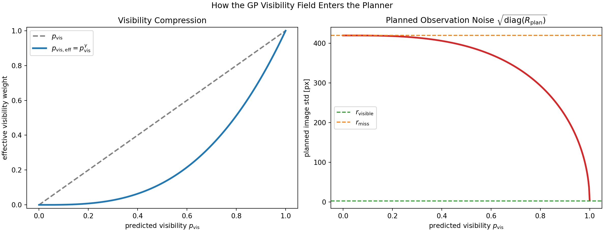
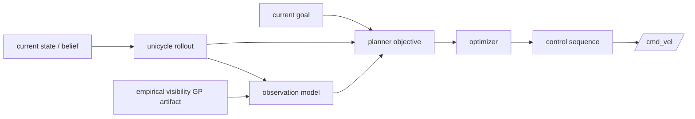
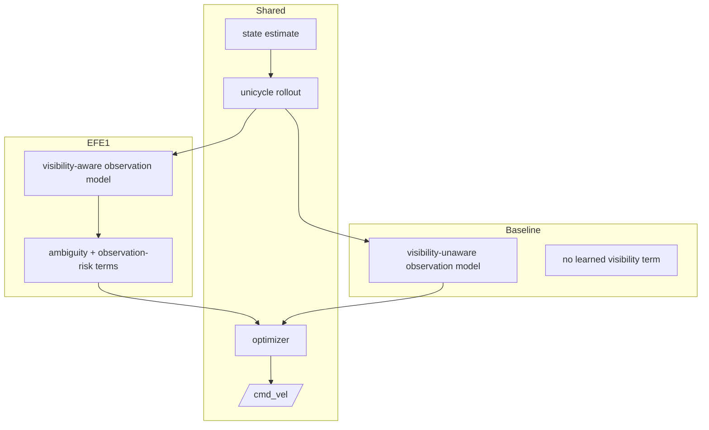

# Planner Method

This document explains where the main comparison actually enters the code.

The core mathematical story is:

\[
\hat s_t = [\hat x_t,\hat y_t]^\top \mapsto p_{\mathrm{vis}}(\hat x_t,\hat y_t),
\]

then

\[
p_{\mathrm{vis,eff}} = \mathrm{clip}(p_{\mathrm{vis}}^\gamma,\varepsilon,1-\varepsilon),
\qquad
R_{\mathrm{plan}} = p_{\mathrm{vis,eff}}R_{\mathrm{visible}} + (1-p_{\mathrm{vis,eff}})R_{\mathrm{miss}}.
\]

That is the main thesis-facing mechanism: visibility changes planned observation quality, which changes risk and ambiguity in the EFE objective.

## The Controlled Comparison

The current milestone changes one thing in the planner:

- `efe1`: uses a learned state-dependent visibility / detection-success model
- `visibility_unaware_baseline`: does not use that learned state-dependent model

Everything else should be described as shared:

- simulator
- robot dynamics
- detector
- pixel-to-BEV state-estimation path
- planner node wrapper
- control bounds
- horizon and replanning interface

## Planner-Internal Block Diagram

Caption: the GP artifact influences the planner indirectly by changing the observation model and therefore the objective. It does not directly prescribe a trajectory.

## What Changes Between Methods

Caption: the primary thesis comparison is a planner-side observation-model change, not a change in simulator, detector, or state-estimator topology.

## Main Planning Files

| File | Role | Why it matters |
| --- | --- | --- |
| [`../src/planning/planning/nodes/unicycle_planner_node.py`](../src/planning/planning/nodes/unicycle_planner_node.py) | ROS wrapper around the planner loop | connects state, goal, observation correction, and control publishing |
| [`../src/planning/planning/nodes/efe_agent_node.py`](../src/planning/planning/nodes/efe_agent_node.py) | thin command-publishing wrapper | runtime entry point used by launches |
| [`../src/planning/planning/planners/base_planner.py`](../src/planning/planning/planners/base_planner.py) | core planning logic | where rollout, observation modeling, and objective computation come together |
| [`../src/planning/planning/core/casadi_efe.py`](../src/planning/planning/core/casadi_efe.py) | symbolic ET1/ET2 objective builder | creates the CasADi value/gradient function used by the optimizer |
| [`../src/planning/planning/core/visibility_gp_map.py`](../src/planning/planning/core/visibility_gp_map.py) | loads the empirical visibility field | central to the GP-aware method |
| [`../src/planning/planning/core/dynamics.py`](../src/planning/planning/core/dynamics.py) | unicycle dynamics helpers | supports rollout |
| [`../src/planning/planning/core/rollout.py`](../src/planning/planning/core/rollout.py) | rollout helpers | supports trajectory prediction |
| [`../src/planning/planning/core/efe_utils.py`](../src/planning/planning/core/efe_utils.py) | EFE-related utility math | shared helper layer |

## Minimum Planner Reading Order

1. `nodes/unicycle_planner_node.py`
2. `planners/base_planner.py`
3. `core/casadi_efe.py`
4. `core/visibility_gp_map.py`
5. `core/dynamics.py`
6. `core/rollout.py`
7. `core/efe_utils.py`

## Honest Caveats

- The baseline is **not** true dead reckoning.
- The GP is an empirical detection-success field, not a general geometric occlusion theory.
- The v1 GP artifact is trained on `/state/bev` x-y only and uses binary usable detection as its target.
- Blob area is logged during capture, but it is not the fitted target in v1.
- ET1 is the primary validated planner implementation for the thesis-facing comparison.
- `efe2` and `efer` now reuse the same cleaned symbolic CasADi planner path with `ET2`.
- The optimized planner path is symbolic CasADi objective construction plus SciPy `L-BFGS-B`, not finite-difference optimization.
- `mpc` remains runnable as a retained secondary mode.
- `base_planner.py` is still monolithic. The method is present, but the implementation is not yet as decomposed as a final polished research codebase.
