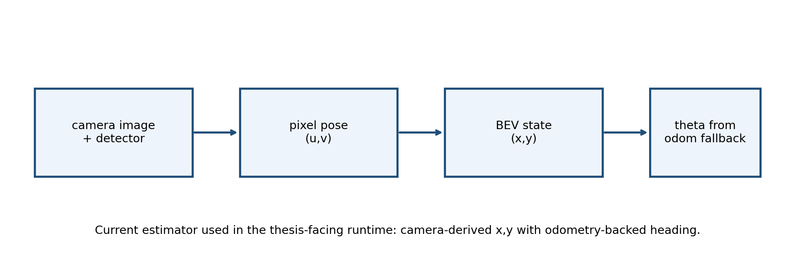
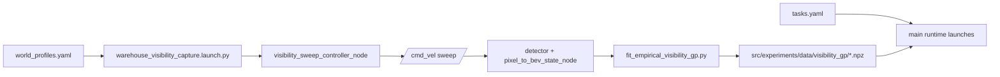
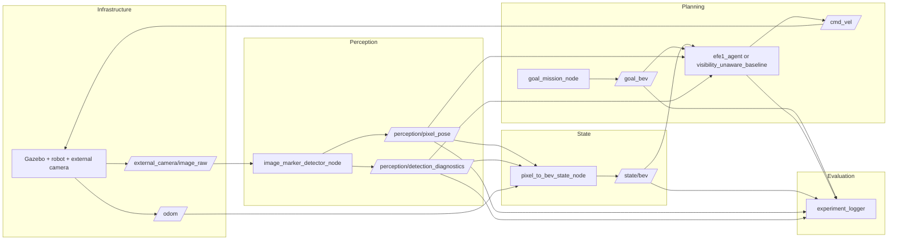

# Runtime Dataflow

This document explains how offline preparation connects to the online ROS/Gazebo runtime.

The offline and online stories are connected by one planner-facing state:

\[
\hat s_t = [\hat x_t,\hat y_t]^\top
\]

for the current GP input, with `theta` still handled separately by the runtime estimator.

## Offline Preparation

Caption: the GP visibility artifact is generated before online planning. The capture launch drives a deterministic sweep, the fitting script logs `/state/bev` x-y plus detection diagnostics, and the runtime later loads the fitted artifact without learning online.

For the current v1 artifact:

- GP input: `/state/bev` x-y only
- fitted target: binary usable visual detection
- blob area: logged as an auxiliary diagnostic, not the fitted target

## Runtime ROS Path

Caption: this is the main online control loop. It omits TF, `ros_gz_bridge`, and robot-state publishing on purpose because those are infrastructure rather than the main method story.

## State-Estimator Provenance

The main runtime path is **not** fully visual state estimation.

- `x, y`: camera-derived via image detection and homography to the ground plane
- `theta`: odometry-backed in the main image-detector path

That means the current estimator is best described as:

`camera x,y + odometry theta`

This caveat should appear in presentations and in any method figure.

## Main Runtime Entry Points

### Primary comparison

- [`../src/experiments/launch/warehouse_primary_comparison.launch.py`](../src/experiments/launch/warehouse_primary_comparison.launch.py)

This launch is the thesis-facing entry point for:

- `planner:=efe1`
- `planner:=visibility_unaware_baseline`

### Retained secondary planners

- [`../src/experiments/launch/warehouse_visibility_agent.launch.py`](../src/experiments/launch/warehouse_visibility_agent.launch.py)

This launch keeps `efe2`, `efer`, and `mpc` runnable as retained secondary modes, but it is not the main comparison surface.

## Main Topics

| Topic | Produced by | Consumed by | Role |
| --- | --- | --- | --- |
| `/external_camera/image_raw` | simulator/bridge | detector | external camera image |
| `/perception/pixel_pose` | detector | state node, planner, logger | image-space robot observation |
| `/perception/detection_diagnostics` | detector | state node, planner, logger | observation diagnostics |
| `/state/bev` | state node | planner, logger | planner-facing state estimate |
| `/goal_bev` | goal node | planner, logger | experiment goal |
| `/cmd_vel` | planner | simulator | control command |
| `/planner_belief`, `/efe/metrics`, `/planner/diagnostics` | planner | logger | planner introspection |

## Optional Logging

The main launches expose:

- `enable_logging:=true|false`

Use `enable_logging:=false` when you want a cleaner `rqt_graph` focused on the method-facing nodes rather than the logger sink.

## What This Diagram Omits

- TF and robot-state publishing infrastructure
- internal planner math
- the offline GP-fitting procedure
- evaluation scripts that operate after runtime

Those are covered in the other docs:

- planner internals: [`planner_method.md`](planner_method.md)
- evaluation outputs: [`evaluation_and_plots.md`](evaluation_and_plots.md)
