# Runtime integrity audit

2026-09-06. Technical audit supporting [ICRA_STATUS.md](ICRA_STATUS.md), the single
current research account. Baselines, failed attempts and source snapshots are retained.
This audit concerns software correctness and filtering policy; repairs are not evidence
that a learned camera field improves navigation.

## Verdict

The runtime had correctness defects capable of overwhelming the camera-model comparison.
The clearest measured case is the P0 tracking follow-up: a camera returns after 26.4 s
with a 0.41 cm capture-aligned reading error, but the filter's outage handler discards
most of the available odometry, including a turn. Heading error then rises to about
90 degrees. The camera's returning reading did not cause that turn estimate.

The exact event selection and figure are in
[`network_navigation_tracking_evidence/diagnostics`](../logs/studies/icra_commissioning_20260905/network_navigation_tracking_evidence/diagnostics).
The separate 10 Hz logged-motion mechanism check compares predictions at that one
capture time; it is not a counterfactual navigation trial. A deterministic regression
also reproduces the missing 90-degree turn without any camera-error assumptions.

The original three-field pilot stopped at the first northern corner in all three runs.
Reducing waypoint spacing/arrival radius from 1.0/0.35 m to 0.2/0.1 m passed that corner;
the follow-up then produced one stuck run and two contact-collision runs. Those failures
remain in the frozen selections. The corrected-runtime campaign is a new baseline.

Its completed P0 run passes the blind turns and stops near the final waypoint because
the local clearance gate refuses further translation. The final offline goal gap is
56.7 cm; the operational goal decision uses belief, not that reference. Its 1,891 unique
belief timestamps have 6.50 cm median and 17.43 cm p95 position error, 1.85 degrees p95
heading error, and 99.95% planar 95%-ellipse coverage. These are one-run diagnostics
against timestamp-aligned `gt_stamp`, not a field-effect estimate. The exact selection is
in the corrected evidence's `diagnostics/P0_selection.json`. P1 and P2 subsequently reached
the goal without recorded contact. Their 1,818/1,895 unique belief timestamps have position
p95 errors of 15.91/57.32 cm respectively. The
[full table](../logs/studies/icra_commissioning_20260905/network_navigation_runtime_evidence/runtime_results.md)
reports all nine original/tracking/corrected runs, heading, uncertainty and correction gaps.

P2 has a 73.195 s gap between accepted updates. An isolated candidate at capture 187.0 s
is refused by the total-camera-gap gate; the next candidate appears at 231.4 s and is stale,
followed by another gap refusal at 231.8 s and acceptance at 232.0 s. There are 319 complete
logged opportunity batches in the interval, including 260 C, 216 D and 23 E detection-valid
camera records. Detection validity does not establish localization usability. Per-camera
terminal manager-admission reasons are absent, so these logs cannot uniquely assign the
missing fused candidates to admission, supersession or fusion scheduling. The
[`gap_diagnostic`](../logs/studies/icra_commissioning_20260905/network_navigation_runtime_evidence/diagnostics/gap_diagnostic.json)
preserves the exact selection and event list. No counterfactual acceptance is asserted.

## Confirmed defects and repairs

| Problem | Evidence | Repair and scope |
|---|---|---|
| Camera gap confused with missing motion | Live P0 event at capture 159.0 s; full odometry history spans the 26.4 s interval. The old handler applies only the last 1.5 s to an old state, then assigns the new timestamp. | Preserve the full timestamped motion when input coverage is verified. Keep Q, camera R and the measurement gate unchanged. Unsupported-history fallback remains a stated recovery heuristic. |
| Belief publication uses three different clock reads | `_belief_publish_tick` computes age, predicts to another clock reading, then stamps publication time. Regression advances the clock during calculation. | Use one prediction target for age, integration and message header. Discard the result if its committed anchor was superseded during calculation. |
| Correction callbacks can overwrite each other | Reentrant ROS callbacks and a two-thread executor; locks previously protected individual reads/writes, not the recursion. Two-thread regression enters two updates from the same prior. | Serialize correction transactions separately from odometry/command I/O. Envelope duplicate checking and commit are in the same transaction; a per-camera batch also has one writer. |
| Old command timer can undo a stop or erase a new tape | Deterministic interleaving tests reproduce nonzero publication after a stop and expiry of an obsolete tape clearing its replacement. | Serialize tape installation, expiry, stop and publication. Check tape identity before using a snapshot. |
| Controller and actuator disagree on angular limits | Simple tracker hard-codes ±1.5 rad/s; the node and actuation stage declare ±1.0 rad/s. Both turning directions fail a bounds test. | Predict and execute using declared `w_min/w_max`. Same controller algorithm. Updated ideal-motion checks complete all three saved routes. |
| Simultaneous per-camera observations lose information | The optional direct path advances the timestamp on camera A, then rejects camera B at the same timestamp as old. | Distinct deduplicated cameras may update the same instant with zero additional motion prediction. Repeated camera/timestamp delivery adds no information or covariance inflation. This path remains an optional comparison. |
| Fused envelope checks shape but not meaning or SPD | The receiver accepted arbitrary schema/frame and finite indefinite/asymmetric covariance. | Validate schema, belief frame, symmetry and Cholesky factorization before filtering. Malformed inputs trigger the existing integrity stop. |
| Planner silence has no independent stop in the actuation adapter | The adapter only reacts to incoming commands; no watchdog was configured in the robot description. | Separate-process watchdog stops after 0.5 simulated seconds without input, with latest-value command queues. This bounds silence after receipt; unstamped Twist cannot expose arbitrary transport delay. |

The focused verification passed **150 tests**, with three archived pixel-trace tests
skipped because their locked campaign is absent. The seven new state/command transaction
cases were first recorded failing, then passing. The simultaneous-camera test and blind-turn
regression also have retained failing transcripts. See the corrected campaign's
[`tests.txt`](../logs/studies/icra_commissioning_20260905/network_navigation_runtime_evidence/tests.txt).
These checks establish the stated software properties, not stochastic calibration.

A further shutdown interleaving was reproduced separately: `_after_plan_result` could
publish a newly completed nonzero tape after `_fatal_stop_triggered` was set. The follow-up
source now latches zero at publication, refuses negative tape age after clock rewind, and
clears the held execution diagnostic on stop. Failing transcripts and the **159 passed,
three skipped** verification packet are preserved in `network_navigation_recovery_evidence`.
The independent command audit confirms these repairs. Ordinary stop-generation cancellation,
in-flight reset/revision changes, and actuator-process failure remain distinct open issues;
see [03_command_execution.md](module_audits/03_command_execution.md). No fatal event or reset
was observed in the baseline pilot; these are software findings, not its failure causes.

## Runtime that should own the experiment

```mermaid
flowchart LR
  Image[Timestamped camera frame] --> Detect[Detector bbox and score]
  Detect --> Mean[Ground projection and frozen NN minus camera offset]
  Mean --> Camera[Camera observation: ID, capture time, z, full R, reason]
  Camera --> Fusion[Current prior-free robust camera aggregation]
  Fusion --> Event[Fused event with physical batch ID]
  Odom[Measured noisy odometry with timestamps] --> History[Motion history]
  History --> Filter[One serialized robot-filter recursion]
  Event --> Filter
  Filter --> Belief[Read-only prediction at one declared target time]
  Belief --> Planner[Global EFE route and local waypoint tracker]
  Field[Commissioned future score field] --> Planner
  Planner --> Tape[Atomic command tape with expiry]
  Tape --> Actuator[Actuation adapter and independent watchdog]
  Actuator --> Robot[Robot motion]
  Robot --> Odom
  Robot --> Image
```

The current camera manager combines measurements without a robot-state prior. It is
not a perception-KF posterior cascade. Its robust covariance is nevertheless a heuristic
network model, distinct from independent Gaussian precision addition. The robot's
recursive estimate belongs to one filter. Planning and monitoring read predictions;
they must not commit a newer state that makes a delayed camera event appear old.

## Filtering policies I would change next

1. **Gate missing input history, not time since the last camera.** The repaired outage
   handler preserves supported motion but deliberately retains the first-return refusal
   in this corrected baseline. Replace that total-duration rule with a checked replay
   support rule in a separately measured policy ablation. A fresh camera after a long
   blind drive can have a valid innovation when measured motion covers the interval.
   Do not solve this by globally increasing the timestamp limit or snapping to the camera.
2. **Separate transport validity, measurement support, statistical rejection and recovery.**
   Invalid identity/frame/covariance is an integrity failure. A miss is no update. Image/
   geometry support is a sensor decision. NIS tests disagreement with a predicted belief.
   Persistent rejection is a recovery condition to diagnose, not proof the sensor is bad.
3. **Replace repeated ad hoc rejection inflation with an explicit recovery policy.**
   Adding 0.05 m² after each rejection can eventually admit a persistent outlier. It can
   also help a lost estimate recover; neither effect identifies camera R. Freeze it for
   the baseline, log the sequence, and compare a bounded recovery/relocalization mode
   using fresh mutually compatible cameras. Retain honest heading uncertainty.
4. **Make the camera admission gate account for uncertain belief.** It currently checks
   bbox plausibility at a single predicted pose. An erroneous prior can reject the very
   reading needed for recovery. Test support over a bounded pose region, or use sensor-only
   image/geometry support and the robot innovation gate. Keep rejected opportunities in
   the dataset. A static detection-probability GP does not represent this dynamic gate.
5. **Choose one explicit fusion model before calling the future model calibrated.**
   `joint_network` uses Huber weighting and a sandwich covariance multiplied by effective
   camera count. Identical equal-quality cameras retain one camera's covariance. The
   planner currently adds precision proxies. Compare the repaired direct-camera path
   with robust aggregation on identical arrival events, fixed Q/mean/R and recorded gates.
   Use synchronized reference residuals to justify any shared-error correction. Retain
   robust aggregation as a practical baseline, with its actual semantics stated.
6. **Handle persistence across frames explicitly when the evidence requires it.**
   Enlarging a camera's R or avoiding 1/N contraction across cameras does not model its
   temporal bias. Current within-run residual correlations are substantial. First compare
   common-rate subsampling and a small persistent-bias model on held-out drives. Do not
   infer temporal independence from a pooled histogram or average NIS.

## Command and state architecture after the repair baseline

**Global/local clearance semantics must agree.** The global route validator treats the
55 cm lane standoff as a soft preference and checks physical collision plus mean membership
of the lane union. The simple local tracker treats the standoff boundary as a hard refusal
except for a 5 mm recovery allowance. On the corrected P0 final approach, the requested
forward motion increases a small lateral deviation, so every local cycle stops. The exact
gate is reproduced from the final published belief; the actual planning snapshot is not
logged. A stationary turn toward the same waypoint passes the unchanged gate. The separate
`network_stop_diagnostic.py` figure shows both tests; this probe is not a live recovery result.
`tracker_guard.py` implements the checked rotation option and six regressions pass. It is
connected only for `local_controller_type=turn_then_go_recovery` in the separate follow-up.
It preserves the target, actuator bounds
and clearance check; an aligned command into forbidden space remains refused. From the
final P0 published belief, the same-waypoint ideal-motion continuation reaches the existing
35 cm goal region after one rotation recovery and 1.75 s of nominal motion. The original
controller is immediately refused. This is a deterministic controller probe, not an
estimate of a live trajectory's improvement. A separate full-route P0 follow-up is configured
in `network_navigation_recovery_pilot.yaml` and is collecting under its own protocol/root.

The next useful extraction is a small ROS-free filter engine with one immutable input
event and one output record per update. Reuse `belief_correction.py` and existing dynamics.
The node should schedule events, keep the odometry buffer and publish results; sensor
mean/covariance code, gate/recovery policy and command ownership should be separately
testable. This is a focused extraction of the deployed path, not a repository rewrite.

The current committed anchor advances on camera events; planning repeatedly predicts
from it using up to 60 s of retained motion. The repaired full replay is supported within
that history. A camera absence longer than the buffer can still lose the old input interval;
the recovery inflation is not a valid replacement for its unknown heading and path.
A later event engine should advance on measured odometry and retain a bounded history of
state/covariance/input records for delayed camera corrections. Rewind to capture time,
apply each accepted frame once, then replay to the present. The buffer duration is a
declared supported *processing delay*, independent of time since the last detection.
Validate this recursion against recorded arrival order before switching the experiment.
Do not merely advance today's anchor to wall time and thereby discard delayed frames.

A command record should carry plan ID, belief revision, issue time, validity interval and
bounded `(v, omega)`. One publisher owns the current tape. A correction that invalidates
its starting belief should trigger revalidation before further nonzero commands. The
watchdog remains in the actuation process. Stamped commands and recorded received/applied
times are needed to distinguish solver latency, ROS queue latency and actuator response.
The present Twist boundary and command logger do not yet establish those distinctions.

There are also two publication triggers: the 10 Hz execution timer and an immediate
publication when a local plan is installed. The actuation-noise node samples its random
disturbance per incoming message. Consequently callback/publication count affects the
disturbance process, and equal seeds do not guarantee equal time-indexed perturbations.
The repair baseline preserves this policy. The cleaner next design has one periodic
command publisher and a disturbance process advanced on a fixed simulated-time grid;
test it as an execution-policy change before treating paired seeds as matched noise.

Belief validity should report motion-history support and correction freshness separately.
A long camera outage with dense odometry permits dead reckoning with growing uncertainty;
missing odometry does not support the same claim. A controller should reduce speed or
stop when a validated state/clearance bound is exceeded. Choosing that bound requires
the sequential calibration evidence; a nominal covariance ellipse alone is insufficient.

## Reproduction and remaining gates

Run the commands in
[`planner_implementation_plan.md`](../experiments/icra_commissioning/planner_implementation_plan.md).
The current corrected protocol is
[`network_navigation_runtime_evidence/protocol.json`](../logs/studies/icra_commissioning_20260905/network_navigation_runtime_evidence/protocol.json).
Its source snapshot freezes all code used by the repair baseline. The previous node and
controller are retained with the failure diagnosis; earlier metrics are not silently
reinterpreted as corrected-runtime results.

Before attributing any gain to commissioning: finish the corrected matched pilot, verify
event accounting and source/model identity, inspect failures, then collect independent
replications and a route-discriminating camera-loss/occlusion family. Before a calibrated
future-information claim: align runtime fusion, availability selection, motion support
and update cadence with the planner forecast, then validate against held-out drives.
