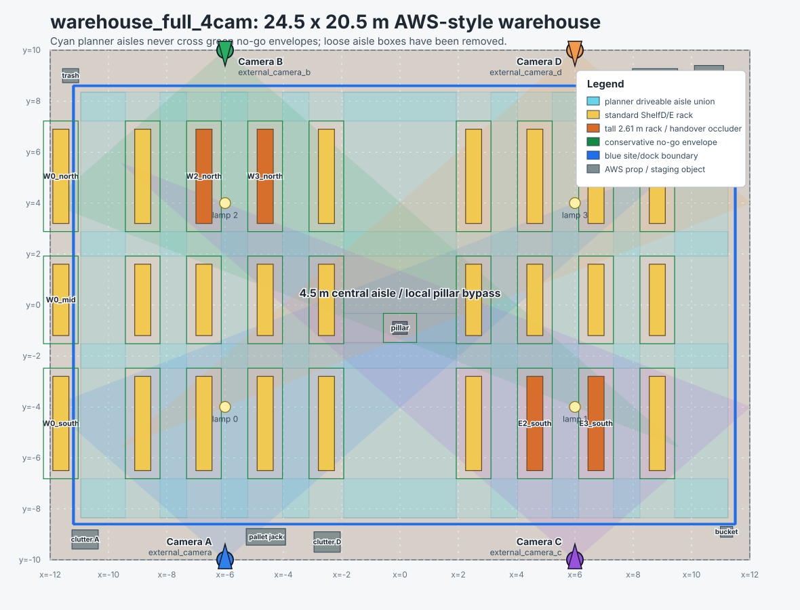

# warehouse_full_4cam Layout

Canonical world: `src/sim/gazebo_worlds/worlds/warehouse_full_4cam.world.sdf`



PNG preview: `docs/assets/warehouse_full_4cam_map.png`

## Map Decision

- Footprint: ground plane `24.5 x 20.5 m`, walls at `x = +/-12 m`, `y = +/-10 m`.
- Structure: two four-row rack blocks copied from the old warehouse style, spaced so the inner rack faces bound a `4.50 m` central aisle instead of a broad empty hall.
- One-sided shelf: an extra ShelfD/E row is backed directly against the west wall, so it can only be reached from the aisle side.
- Floor semantics: beige floor inside the blue site boundary is the open driveable field. Green markings are no-go/collision outlines around racks, wall-backed shelves, props, crates, and the pillar; crossing a green line means entering a crash-risk footprint.
- Camera placement: four high wall-mounted cameras sit at `(-6.0, -10)`, `(-6.0, 10)`, `(6.0, -10)`, and `(6.0, 10)` and look perpendicular to their wall. Bringing the columns closer to the central aisle widens adjacent-camera overlap for handover validation.
- Presentation overview: a separate top-down camera at `(0.0, 0.0, 26.0)` produces a full-facility Gazebo view for media only. It is not a fifth localization camera and is excluded from the GP/fusion/planner interfaces.
- Occlusion/handover: W-block inner north racks and E-block inner south racks are tall, creating different blind regions for the north/south camera pairs.
- Styling: box collision/contact sensors remain the operational geometry; ShelfD/E AWS meshes are visual overlays so rendered cameras see the same shelf footprint.
- Added AWS props: bucket, trash can, clutter piles, pallet jack, lamps, and a `DeskC_01` quality-control desk near the north-east wall.

## Cameras

- Camera A: include `external_camera`, mount `south wall, west dock column`, pose `-6.00 -10.00 6.10 0 0.92 1.5708`, RGB topic `/external_camera/image_raw`
- Camera B: include `external_camera_b`, mount `north wall, west dock column`, pose `-6.00 10.00 6.10 0 0.92 -1.5708`, RGB topic `/external_camera_b/image_raw`
- Camera C: include `external_camera_c`, mount `south wall, east dock column`, pose `6.00 -10.00 6.10 0 0.92 1.5708`, RGB topic `/external_camera_c/image_raw`
- Camera D: include `external_camera_d`, mount `north wall, east dock column`, pose `6.00 10.00 6.10 0 0.92 -1.5708`, RGB topic `/external_camera_d/image_raw`

Approximate FOV wedges in the SVG are visual planning aids only. Runtime projection still comes from the camera model and calibration.

## Open Floor

- `open_floor`: center `(+0.15, +0.00)`, size `22.70 x 17.20 m` - open operating floor inside the blue site boundary; green outlines mark no-go obstacles

## Green No-Go Outlines

- `central_support_pillar`: center `(+0.00, -0.90)`, footprint `0.50 x 0.50 m` - fixed building column inside the 4.5 m central aisle
- `dropped_stack_WA2`: center `(-5.67, -4.60)`, footprint `0.90 x 0.60 m` - temporary pallet stack narrowing west aisle 2
- `east_staging_pallet_island`: center `(+10.20, +0.80)`, footprint `0.90 x 0.70 m` - side staging island outside the main rack aisles
- `west_wall_backed_shelf`: center `(-11.63, +0.20)`, footprint `0.55 x 13.40 m` - ShelfD/E row backed directly against the west wall; reachable only from the east aisle side

## Tall Handover Segments

- `W2_north` at `(-6.72, +4.95)`, height `2.61 m`
- `W3_north` at `(-4.62, +4.95)`, height `2.61 m`
- `E2_south` at `(+4.62, -4.55)`, height `2.61 m`
- `E3_south` at `(+6.72, -4.55)`, height `2.61 m`

## AWS Props

- `bucket_dock`: AWS `Bucket_01` at `11.2 -8.9 0 0 0 0` (bucket)
- `trashcan_nw`: AWS `TrashCanC_01` at `-11.3 9.0 0 0 0 0.6` (trash)
- `clutterA_sw`: AWS `ClutteringA_01` at `-10.8 -9.2 0 0 0 0` (clutter A)
- `clutterC_ne`: AWS `ClutteringC_01` at `10.6 9.0 0 0 0 3.1416` (clutter C)
- `clutterD_dock`: AWS `ClutteringD_01` at `-2.5 -9.3 0 0 0 0` (clutter D)
- `palletjack_apron`: AWS `PalletJackB_01` at `-4.6 -9.1 0 0 0 1.2` (pallet jack)
- `desk_qc_ne`: AWS `DeskC_01` at `8.75 8.75 0 0 0 3.1416` (QC desk)

## Launch

```bash
ros2 launch sim bringup_sim.launch.py world:=warehouse_full_4cam.world.sdf bridge_camera_b:=true bridge_camera_c:=true bridge_camera_d:=true use_lidar:=false bridge_scan:=false
```

Generated by `scripts/geometry_visibility/make_warehouse_full.py`; edit the generator, not the SDF.
