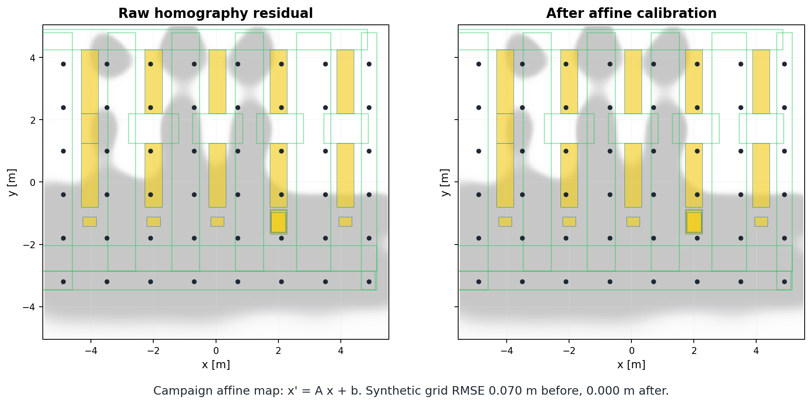

# External-Camera State Estimation

[Back to repository overview](../README.md)

This module shows how an image-space robot detection becomes a ground-plane
state estimate and planner correction.

## Contribution At A Glance

| Question | Answer |
| --- | --- |
| Problem | A detector box in the image is not yet a robot pose in the warehouse map. |
| Contribution | The state stack projects the selected pixel to BEV, applies a small affine calibration, and keeps heading/noise conventions explicit. |
| Implementation | Projection and runtime state publishing live in [`../src/state/state/core/pixel_to_bev.py`](../src/state/state/core/pixel_to_bev.py) and [`../src/state/state/nodes/pixel_to_bev_state_node.py`](../src/state/state/nodes/pixel_to_bev_state_node.py). |

## Visual Demonstration


The camera contributes image-space `x,y` evidence. Homography plus affine
calibration turns that evidence into a ground-plane point; heading remains
odometry-driven in the locked campaign.



Additional media is catalogued in [`demos/`](demos/).

## Inputs And Outputs

| Input | Output |
| --- | --- |
| `/perception/pixel_pose` | `/state/bev` |
| `/perception/detection_diagnostics` | `/state/heading_diagnostics` |
| `/odom` or `/odom_noisy` | planner belief prediction and correction inputs |

## Method

1. Convert the selected image pixel to a ground-plane `x,y` estimate with the
   calibrated camera model.
2. Apply the campaign affine correction that compensates residual
   position-dependent BEV projection bias.
3. Publish a BEV state message for the planner and logger.
4. Let odometry drive heading prediction under the locked `camera_xy_only`
   campaign setting.
5. Let camera `(x, y)` corrections influence heading only indirectly through the
   propagated belief cross-covariance.

## Performance And Diagnostics

The paper-facing runtime separates three noise families:

| Family | Meaning |
| --- | --- |
| Process/model noise | What the filter and planner assume during belief propagation. |
| Command/encoder noise | What Gazebo injects into executed motion and odometry. |
| Measurement noise | Camera observation covariance, constant in C1 and GP-blended in C2 planning. |

The canonical uncertainty description is
[`../docs/uncertainty_propagation.md`](../docs/uncertainty_propagation.md).

## Reproduce

Regenerate the localization-pathway preview:

```bash
python3 scripts/paper_figures/make_localization_pathway_figure.py
```

This command needs the local detector checkpoint if it re-runs detection rather
than using already packaged preview inputs.

## Relevant Implementation Files

| File | Role |
| --- | --- |
| [`../src/state/state/nodes/pixel_to_bev_state_node.py`](../src/state/state/nodes/pixel_to_bev_state_node.py) | Runtime pixel-to-BEV state node. |
| [`../src/state/state/core/pixel_to_bev.py`](../src/state/state/core/pixel_to_bev.py) | Projection helper. |
| [`../src/state/state/core/noise.py`](../src/state/state/core/noise.py) | State covariance helper. |
| [`../docs/runtime_dataflow.md`](../docs/runtime_dataflow.md) | Online topic path and runtime conventions. |

## Limitations

- A single ground-projected point does not directly observe robot heading.
- Heading is odometry-driven in the locked campaign, with indirect correction
  through cross-covariance only.
- Stale camera states must not be interpreted as fresh localization.

See available and planned media in [`demos/`](demos/).
