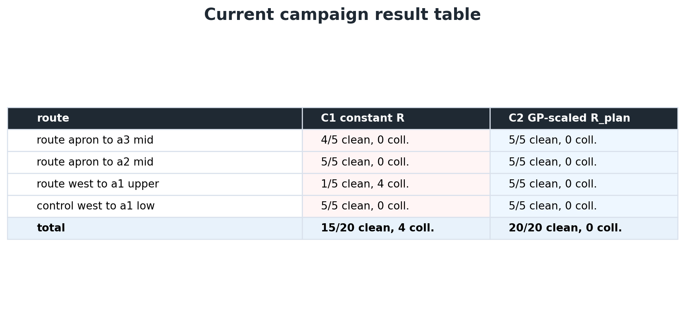

# Experiments And Campaign Results

[Back to repository overview](../README.md)

This module packages the benchmark surface: tasks, conditions, seeds, metrics,
representative figures, and reproduction commands.

## Contribution At A Glance

| Question | Answer |
| --- | --- |
| Problem | A single representative route is not enough evidence for a planner claim. |
| Contribution | The campaign runner evaluates matched C1/C2 conditions across four routes and five seeds, with result files and provenance kept together. |
| Implementation | Launch wiring and logging live in [`../src/experiments`](../src/experiments/README.md), with campaign orchestration in [`../scripts/visibility_comparison/run_visibility_campaign.py`](../scripts/visibility_comparison/run_visibility_campaign.py). |

## Visual Demonstration


The current honest campaign compares four routes, two conditions, and five
seeds per route/condition. C1 reaches 15/20 clean goals; C2 reaches 20/20.



Additional media is catalogued in [`demos/`](demos/).

## Inputs And Outputs

| Input | Output |
| --- | --- |
| `scripts/visibility_comparison/warehouse_visibility_campaign.yaml` | seeded run directories |
| local YOLO checkpoint | `experiment.csv`, `run_manifest.json`, `run_summary.json` |
| GP artifact `warehouse_visibility_gp_v1` | current comparison figures and provenance bundles |
| `warehouse_aws.world.sdf` | current result surface under `docs/paper_vs_current/current/` |

## Evidence Namespaces

| Namespace | Role |
| --- | --- |
| [`single_camera_current/`](single_camera_current/) | Frozen current thesis evidence: matched C1/C2, four tasks, five seeds, current 15/20 vs 20/20 result. |
| [`multicamera_fusion_extension/`](multicamera_fusion_extension/) | Planned extension surface for camera-specific reliability, replay, loss/recovery, and two-camera selection/fusion gates. |

## Method

The campaign compares two planner conditions across four tasks and five seeds
per condition:

- C1: `constant_R_efe`
- C2: `visibility_aware_efe`

The comparison keeps world geometry, route seeds, driveable/no-go layer, local
tracking, noise settings, and success/collision criteria fixed across
conditions.

## Performance And Diagnostics

Aggregate outcome:

| Condition | Clean reaches | Collisions | Near-success | Invalid |
| --- | ---: | ---: | ---: | ---: |
| C1 | 15/20 | 4/20 GT geometry breaches, 0/20 physics contacts | 0/20 | 0/20 |
| C2 | 20/20 | 0/20 | 0/20 | 0/20 |

Per-task outcome:

| Task | C1 | C2 |
| --- | --- | --- |
| `route_apron_to_a3_mid` | 4/5 clean, 0/5 geometry breaches, 0/5 physics contacts | 5/5 clean, 0 collisions |
| `route_apron_to_a2_mid` | 5/5 clean, 0/5 geometry breaches, 0/5 physics contacts | 5/5 clean, 0 collisions |
| `route_west_to_a1_upper` | 1/5 clean, 4/5 geometry breaches, 0/5 physics contacts | 5/5 clean, 0 collisions |
| `control_west_to_a1_low` | 5/5 clean, 0/5 geometry breaches, 0/5 physics contacts | 5/5 clean, 0 collisions |

Evidence files:

- [`../docs/current_runtime_contract.yaml`](../docs/current_runtime_contract.yaml)
- [`../docs/paper_vs_current/current/README.md`](../docs/paper_vs_current/current/README.md)
- [`../paper_artifacts/figures/current_surface/robustness_spread_current.png`](../paper_artifacts/figures/current_surface/robustness_spread_current.png)
- [`../research/registry.yaml`](../research/registry.yaml)
- Historical submitted-paper comparison: [`../docs/paper_vs_current/paper/README.md`](../docs/paper_vs_current/paper/README.md)

Additional archived campaign diagnostics from the submitted-paper era:

- [`../paper_artifacts/campaigns/archive/robustness_v2_partialoccl/localization_across_tasks.png`](../paper_artifacts/campaigns/archive/robustness_v2_partialoccl/localization_across_tasks.png)
- [`../paper_artifacts/campaigns/archive/robustness_v2_partialoccl/localization_error_map.png`](../paper_artifacts/campaigns/archive/robustness_v2_partialoccl/localization_error_map.png)
- [`../paper_artifacts/campaigns/archive/robustness_v2_partialoccl/localization_recovery_contrast.png`](../paper_artifacts/campaigns/archive/robustness_v2_partialoccl/localization_recovery_contrast.png)
- [`../paper_artifacts/campaigns/archive/robustness_v2_partialoccl/solve_diagnostics.png`](../paper_artifacts/campaigns/archive/robustness_v2_partialoccl/solve_diagnostics.png)

## Reproduce

Run the locked campaign:

```bash
python3 scripts/visibility_comparison/run_visibility_campaign.py \
  --config scripts/visibility_comparison/warehouse_visibility_campaign.yaml \
  --log-root logs/visibility_comparison/warehouse_visibility_campaign_v1
```

Compute metrics from a completed campaign:

```bash
python3 scripts/visibility_comparison/compute_paper_metrics.py \
  --campaign-log logs/visibility_comparison/warehouse_visibility_campaign_v1/campaign_log.json \
  --gp-artifact paper_artifacts/gp/warehouse_visibility_gp_v1/yolo_score_raw_gp.npz \
  --out logs/visibility_comparison/warehouse_visibility_campaign_v1/paper_metrics.csv \
  --summary-out logs/visibility_comparison/warehouse_visibility_campaign_v1/paper_summary.txt
```

## Relevant Implementation Files

| File | Role |
| --- | --- |
| [`../src/experiments/launch/warehouse_primary_comparison.launch.py`](../src/experiments/launch/warehouse_primary_comparison.launch.py) | Main comparison launch. |
| [`../src/experiments/config/tasks.yaml`](../src/experiments/config/tasks.yaml) | Benchmark task definitions. |
| [`../src/experiments/experiments/nodes/experiment_logger.py`](../src/experiments/experiments/nodes/experiment_logger.py) | Run logging and summaries. |
| [`../scripts/visibility_comparison/run_visibility_campaign.py`](../scripts/visibility_comparison/run_visibility_campaign.py) | Campaign runner. |

## Limitations

- Raw logs and model weights are local/private unless packaged under
  `paper_artifacts/` or released externally.
- The submitted-paper 12/20 vs 16/20 snapshot is historical and should not be
  mixed into the current 15/20 vs 20/20 result surface.
- New claims need a full evidence chain: world, detector, visibility data, GP,
  config, logs, metrics, figures, and wording.

See available and planned media in [`demos/`](demos/).
