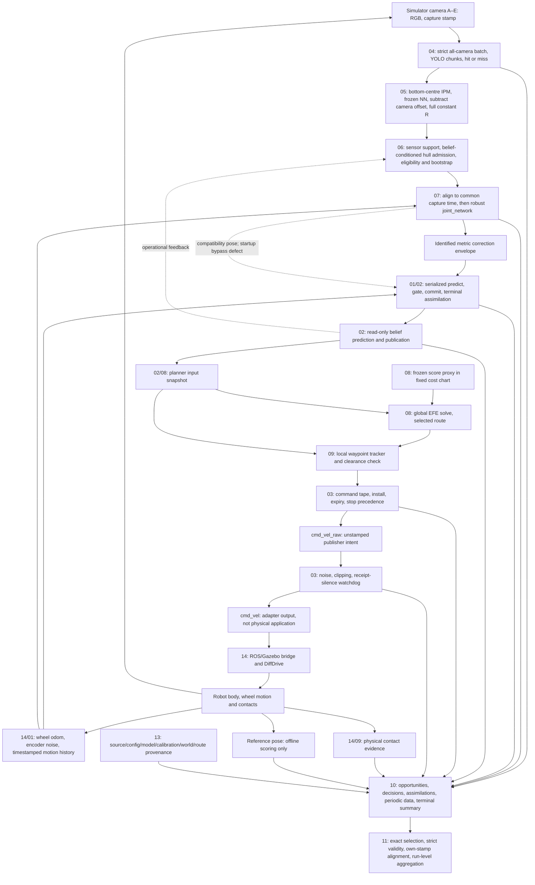

# 15 — End-to-end acceptance and repair integration

**Verdict: NOT ACCEPTED for a corrected matched navigation pilot.** The recent repairs establish useful local properties, but the complete capture-to-motion-to-evidence contract still fails. A new audit-15 simulator integration drive was **not run**, because the user explicitly made passing component contracts its prerequisite. Audit 14's bounded private physics probes instead provide direct failure evidence: a downstream drive target survives clock/adapter loss, `reset.all` does not create a fresh epoch, and a positive contact fixture works while clear-scene silence is ambiguous. These component results do not constitute an integrated goal-approach acceptance.

This investigation owns reconciliation, evidence and repair sequencing. It changed no shared runtime/configuration/model file, launched or killed no experiment, reset no simulator, and altered no frozen selection or source snapshot. Audit artifacts are under [`experiments/runtime_integrity/end_to_end_20260906`](../../experiments/runtime_integrity/end_to_end_20260906). Each repair below has an owning investigation. Historical failures remain visible.

## Scope and evidence identity

The baseline configuration is [`network_navigation_runtime_pilot.yaml`](../../experiments/icra_commissioning/network_navigation_runtime_pilot.yaml), selected explicitly by the registry. It configures the corrected three-arm diagnostic baseline, **not** an end-to-end accepted release. The later [`network_navigation_recovery_pilot.yaml`](../../experiments/icra_commissioning/network_navigation_recovery_pilot.yaml) is a separate controller follow-up. A report saying “current” means its own recorded bytes, not any subsequently edited working tree.

The first audit-15 harness records source hashes, resolved imports and an immutable source archive. It found no source changes during execution. The existing 290-test focused suite passed before the subsequent batching edits; some tests intentionally reproduce defects. Thirty-nine component probes also reproduced their asserted observations, including failures. These counts must never be summed into an acceptance score.

- [`identity_start.json`](../../experiments/runtime_integrity/end_to_end_20260906/identity_start.json), [`identity_end.json`](../../experiments/runtime_integrity/end_to_end_20260906/identity_end.json): exact inspected source/test identity and dirty checkout status.
- [`audited_sources.tar.gz`](../../experiments/runtime_integrity/end_to_end_20260906/audited_sources.tar.gz), [`audited_sources_manifest.json`](../../experiments/runtime_integrity/end_to_end_20260906/audited_sources_manifest.json): matching source/fixture bytes retained without reverting shared files. The manifest names unrecoverable unrelated audit-work files; those were not imported by audit 15. Model/data bytes remain separately hash-bound inputs.
- [`runtime_identity_comparison.json`](../../experiments/runtime_integrity/end_to_end_20260906/runtime_identity_comparison.json): manager, fusion, robot correction and adapter matched the frozen pilot protocol; the initial working EFE was already the newer fatal-stop/negative-age/idle-diagnostic version. The protocol does not enumerate the entire source closure.
- [`launch_wiring.json`](../../experiments/runtime_integrity/end_to_end_20260906/launch_wiring.json): actual launch declarations/parameter resolution without executing launch actions. Importing launch descriptions is not a live deployment check.
- [`source_drift_after_harness.json`](../../experiments/runtime_integrity/end_to_end_20260906/source_drift_after_harness.json), [`fusion_rerun_boundary.json`](../../experiments/runtime_integrity/end_to_end_20260906/fusion_rerun_boundary.json): later acquisition changes and failed old-fixture reruns kept explicitly separate. An AttributeError from an obsolete fake manager is not a proven runtime regression.

The full component-report inventory and any independently verified later repairs appear below. Completion of an investigation report is distinct from repair completion and integration acceptance.

## Exact chain and ownership

Dashed feedback is not a second recursive filter. Active camera mean/R and robust aggregation do not implement a perception-KF posterior cascade. The single robot filter owns recursive state. Admission and common-time motion can nevertheless depend on operational belief/motion and introduce dependence that the covariance interfaces do not represent.

| Boundary | Owner and authoritative value | What the next stage is entitled to assume / present gap |
|---|---|---|
| Capture → detector | 04/14: camera, epoch, capture sequence, exact nanosecond stamp, original 1280×720 image | Five-camera order is explicit; historical “four_camera” filenames do not define count. 960 is inference size. Physical model calls and logical batch cycles need distinct identities. |
| Detector → observation | 04/05: bbox, score, selected pixel, image/calibration identity, hit/miss, receipt/inference/publish clocks | A miss is evidence that inference ran; absent frame, unscheduled work, overload and abort are different outcomes. Metadata must validate geometric meaning. |
| Observation → fusion | 05/06/07: capture-time robot ground-reference XY in map_bev metres and full 2×2 R in m² | Active z=NN(IPM,bbox,score,camera)−b_camera. Frozen R replaces provisional pixel-projection R. Hull correction is off; hull admission remains on. |
| Fusion → filter | 07/01: immutable common-time z/R, original captures, source/member IDs and support | joint_network uses Huber-weighted covariance with residual scatter and effective-camera-count multiplier. It is a measurement; equal identical cameras retain one camera's R. |
| Motion → filter/publication | 01/02: finite ordered body v/ω, source/frame, covered interval, timestamped heading | Dense odometry through a blind turn supports dead reckoning. Missing motion is not supported merely because a camera returned or a covariance was inflated. |
| Filter transaction | 01: full m/P/frame/state time and input/output revision; terminal status/reason | Only this transaction may modify recursive state. The compatibility/planning bootstrap and commit-before-event publication break that authority today. |
| Belief → planning | 02/08: read-only projection of one revision at one target, with support/age | Prediction does not commit. Publication order, equal-time revisions and plan metadata need explicit tokens. |
| Global route → local controller | 08/09: validated complete route and waypoint progression | Active global EFE controls are not the executed tape. Local turn_then_go produces the actual controls; clearance and final-goal semantics must agree. |
| Tape → adapter → actuator | 03/14: one command owner, stop generation, epoch/sequence, source time, validity, bounded control | Selected bounds are v∈[0,.22] m/s, ω∈[−1,1] rad/s. Twist lacks age/ownership/application evidence. Adapter zero requests are not measured body stops. |
| Mission/contact → termination | 09/10/14: operational belief decision, physical contact event, infrastructure failure, stop request/confirmation | Goal, stuck, command silence, contact silence and actual collision are distinct. GT is never an online goal/stuck criterion. |
| Logging → offline | 10/11/13: durable source-bound event set plus terminal summary | Complete identity reconciliation precedes scoring. Periodic predictions cannot be relabelled immediate posteriors. Failures and reasoned refusals remain selected. |

Resolved baseline limits: strict native YOLO CPU, A–E, confidence .25, NMS .45, max capture spread .05 s; manager 5 Hz; manager eligibility age 1.25 s versus filter age .5 s; metric correction-gap cap 1.5 s; NIS 9.21; XY rejection inflation .05 m²; no hard reanchor; coupled heading; measured /odom_noisy; Q parameters .01/.02; local step .25 s, local planning 4 Hz, belief and command publication 10 Hz. The 60 s retained motion horizon is not a guarantee of supported arbitrary camera absence. The newer rotation-recovery controller remains a separate configuration.

## Bounded scenario and acceptance interpretation

This is one bounded scenario specification with isolated fault branches and actual-method/component harnesses. It is **not** a claim that one continuous simulated drive exercised every branch. Online methods receive operational odometry and camera data only. Scripted reference geometry/poses are test oracles and offline references.

| Scenario | Bounded stimulus and evidence | Integration verdict |
|---|---|---|
| S1 normal motion | Five named camera inputs, recorded-box projection/NN/R equality, exact registered B/C fusion, full Joseph trace and read-only prediction; tape timer connected to actual adapter callback | Local algebra/wiring passes. Invocation identity, startup ownership and event reconstruction prevent complete-chain acceptance. |
| S2 camera outage, complete odometry, turn | 0–2 s east at .2 m/s, 2–4 s stationary π/4 rad/s turn, 4–10 s north; .1 s odometry; valid returns at capture 10 and 10.2 | Actual filter preserves (.4,1.2,π/2) at 10 s, reasonedly refuses first return, accepts next. Buffer-eviction race and explicit policy limit remain. |
| S3 camera outage with missing motion | Same stream independently removes prefix, turn interval or tail | All three support checks fail; fallback still advances full stamp and a later XY update accepts with the missing turn nearly absent. Not accepted as a supported current belief. |
| S4 delay, duplicate, reorder, simultaneity | Distinct simultaneous cameras, identical envelope redelivery, 0.5 ms newer direct camera, staggered .04 s captures, accepted 10.2 followed by 10.1 then 10.4 | Normal dedup/serialization and reasoned old-frame refusal pass. Common-time support, invocation epochs, direct-mode semantics and ledger pairing fail or require later-repair verification. |
| S5 correction during solve/execution | Barrier-controlled correction/publication races; LOCAL/direct computation changes belief/goal/stops or takes 1 s; GLOBAL computation crosses the same changes; timer crosses tape replacement | Old-timer, fatal latch, ordinary-stop generation and direct/LOCAL safe-prefix age-gate regressions pass. GLOBAL route installation bypasses that transaction and still mutates phase/route after stop, backward clock, belief, goal or config change; revision revalidation also remains open. |
| S6 detector and command silence | Incomplete five-camera batches; no subsequent offers; detector publication failure; adapter clock advances beyond receipt timeout, then delayed Twist arrives; audit 14 suspends the clock bridge and restarts the adapter | Bounded batching/fail-fast repair and ordinary adapter timeout pass locally. Physical probe fails: the robot moves 0.17997 m during clock loss and 0.25122 m after adapter restart without a new command. |
| S7 refusal followed by recovery | Four rejected outliers then valid camera; complete blind return then fresh successor; perfect bbox under wrong position/heading prior | Valid downstream recovery exists. Repeated inflation also admits persistent outlier; upstream point-prior gate can suppress recovery altogether. |
| S8 final approach, safe stop, physical contact | Existing ideal tracker/clearance regressions, selected terminal traces, explicit stop through actual adapter, and audit 14's isolated clear/forced-contact physics fixtures | Forced contact produces exact named collisions and points; explicit zero stops the private robot. The combined final approach → acknowledged zero → settled body → contact/status → drained summary chain is NOT RUN and fails its deterministic prerequisites. Selected no-contact outcomes do not close this gate. |
| S9 controlled restart/reset | Clock 100.1→1 s with live callback state; new producer at repeated stamps; tape/adapter reset orderings; native moving `reset.all` probe | FAIL: acknowledged reset rewinds time but retains robot pose, wheel-odometry integral and DiffDrive target, so motion continues. A coordinated all-process restart remains required and unverified. |
| S10 shutdown with terminal work pending | Actual logger destructor with six buffered handles; first close failure; owning logger summary/drain probes; synthetic missing/extra/duplicate terminal logs | Normal closes flush buffers. Failure isolation, summary ordering and queue drain are not accepted. No power-loss durability claim. |

For **each scenario**, assess all fourteen obligations: I1 invocation identity; I2 unique truthful terminal assimilation; I3 coherent state/P/frame/time; I4 authorized recursive writer; I5 snapshot and stale-work rejection; I6 command ownership/stop priority; I7 shared executed limits; I8 capture/arrival/belief clock distinction; I9 camera absence versus motion support; I10 contact/receipt/application/mission distinction; I11 exact provenance; I12 durable reconstruction; I13 loader acceptance/refusal; I14 documentation truthfulness. A scenario does not inherit a system-wide pass because its local mean equation passed. I1/I2/I5/I10/I11/I12/I13/I14 retain cross-cutting gaps; the matrix names the concrete evidence and owners. An obligation with no exercised physical channel is **not verified**, not “pass” or “no collision”.

The master acceptance matrix below consolidates duplicate findings by mechanism. `FAIL` means a reproduced current-at-that-snapshot defect; `OPTIONAL` identifies a disabled path; `POLICY LIMIT` preserves a declared choice without endorsing it; `NOT RUN` identifies absent evidence. P1 blocks reliance on that behavior, P2 is narrower/conditional, P3 is bounded numerical/diagnostic. A repaired row requires both its new source identity and a desired-invariant test, not merely a defect-asserting test exiting zero.

<!-- COMPONENT_INVENTORY -->

<!-- ACCEPTANCE_MATRIX -->

## Historical evidence stays historical

[`evidence_boundaries.json`](../../experiments/runtime_integrity/end_to_end_20260906/evidence_boundaries.json) records the registry snapshot, exact selections and file-hash checks. No run directory was selected by glob, age or a RESULTS.md. The old invalidated campaign is reviewed by its registry boundary and invalidation causes, not rescored into current evidence.

| Evidence family | Preserved status and permitted interpretation |
|---|---|
| Studies before 2026-08-25 | Superseded for new study claims. The separately attributed published IWAI record is not newly validated fusion evidence. |
| drives_full_20260829 fixed-route campaign | Invalidated/diagnostic: schema 3 and absent assimilation ledger, adjacent capture rounds, silent correction loss, timestamp-inferred updates and heading inconsistency. Paper selection remains null. Repairs never retroactively supply missing events or source identity. |
| Six-run commissioning/thesis selection | Separate capture-time replay/development evidence; three goal and three collision outcomes retained. No arrival-order equivalence, complete-route ranking or new navigation improvement claim. |
| Original three-arm navigation pilot | All three stuck; independent field-effect estimate not established. |
| Tracking follow-up | One stuck/two collisions; controller handoff change is separate, and the lost-outage-turn defect belongs to its historical runtime. |
| Corrected-runtime three-arm pilot | One stuck/two goal outcomes; schema 7. Source-bound diagnostic baseline with known remaining contracts, not an accepted corrected release. |
| Recovery follow-up | Separate one-run controller experiment. At audit inspection its exact selected summary was goal_reached while registry still said collecting; hash-valid selection does not turn it into a matched multi-arm field test. |

Audit 15 independently loaded the three corrected-runtime runs through `aligned.rows`, `aligned.observations` and `aligned.assimilations`, after verifying every listed file hash. Counts were P0 813 fused IDs/813 terminal rows, P1 779/779, P2 598/598; no missing/extra/duplicate/unknown/unreasoned terminal IDs under the explicit accounting oracle. These are ledger counts, **not independent statistical samples**. All three summaries report 46 contact publishers and zero contact messages. That proves neither healthy contact sensing nor collision-free physical execution. This audit reports no new run accuracy/coverage comparison.

## What aligned.py actually accepts and refuses

The synthetic logs under `synthetic_runs/` deliberately have known source IDs, capture 1.0, apply 1.5, periodic belief 1.1 and offline reference stamps. They are test fixtures, not frozen scientific runs. `alignment.json` records both production helper behavior and a separately labelled audit oracle of the documented accounting rule.

- Duplicate assimilation: parser and event helper reject with the duplicate-ID reason.
- Empty/missing ledger: parser returns an empty list; schema≥4 event helper rejects it.
- Extra assimilation, unknown status or unreasoned rejection: parser accepts them; event helper silently emits a subset or nothing instead of rejecting the invalid run.
- Reasoned drop: valid accounting; retained as refusal, omitted from accepted-update belief events. This is correct policy.
- Accepted delayed event: event helper can choose the 1.1 prediction although application is 1.5. Capture-time thresholding is not a causal commit association.
- Reference gaps and epoch overlap: interpolation produces finite values without a maximum-gap/epoch validity decision. Own-stamp lookup alone is insufficient.

Consequently **there is no single complete “aligned.py accepted the run” certificate**. Loading rows/observations is not campaign validation. A run may have valid ID counts and still lack a truthful full posterior, a calibrated reference clock or a complete command/contact record. Fix the shared validator and event schema before event-posterior claims. Preserve correctly aligned periodic beliefs as their own quantity; never compare camera-reading error, fused-correction error and belief error as though interchangeable.

## Confirmed blockers to a corrected matched navigation pilot

1. **The physical scene used by planning is incomplete (M50, M59).** Five collision-bearing included props are absent from planner/contact geometry. The omitted pallet jack gives `−0.02846 m` conservative circular clearance on the selected plan and intersects the exact robot rectangle for some start headings.
2. **A command can remain physically active after its safety process loses authority (M52, M62).** Clock-bridge loss and adapter restart moved the private robot without a new command. Mission success is not sequenced after acknowledged zero and physical rest.
3. **Reset is not an epoch boundary (M27, M60–M61).** `reset.all` rewinds time while preserving robot pose, odometry integration and the DiffDrive target; filter, detector, planner, noise and logging states are not cleared together.
4. **Consumed correction and terminal outcome are not one durable state transaction (M06,M08,M20–M21,M36).** Common-time motion can be unsupported; state can commit before its outcome is safely recorded; exact posterior revision/frame/time is unavailable to the logger and offline scorer.
5. **Missing motion can still be published and planned as current (M09,M11,M23).** Chronological refusal and immutable replay snapshots now pass, but prefix/interior/tail gaps do not propagate an invalid/unsupported state through belief, planning and logging.
6. **Snapshot/install ownership is incomplete (M13–M16,M30,M51).** Publication identity can regress or mix metadata; belief/goal/epoch revisions are not revalidated; GLOBAL results bypass the repaired direct/LOCAL tape gate and can install stale, incomplete, invalid or non-finite routes.
7. **Evidence finalization and offline admission are not fail-closed (M29,M36–M45,M54,M58,M63).** Terminal queues need a defined cutoff/drain, contact/application events lack durable identities, and `aligned.py` accepts several invalid ledgers or associates a pre-apply belief with a correction.
8. **Deployment identity is incomplete and attempts are not isolated transactions (M01,M54–M60).** The detector's `source_batch_id` does not follow the repository's per-physical-invocation definition; resolved config/source/assets, world freeze/engine, route and run attempt are not bound by one strict manifest and exclusive lease.

Any one of these blocks a pilot acceptance. Their combination also prevents a simulator pass from being interpreted as a camera, planner or navigation gain.

## Repairs safe to combine, with module ownership

These are sequenced proposals, not unilateral changes. Each completed tranche creates a new source/config/schema identity. Preserve all old runs and snapshots. Assign one editor at a time to `unicycle_planner_node.py` (01 leading, 02/06/10 review), `camera_manager_node.py` (04/05/06/07 by boundary), and `efe_agent_node.py` (03 leading for command ownership, 08/09 review).

1. **13 with 04/05/14: freeze and validate deployment identity.** Strict keys/types/precedence, collision-free config snapshots, full imported source and model/calibration/world/robot/route closure, namespace/process ownership, explicit epochs. Retain exact current scientific model and task. Close config ambiguity before interpreting a rerun.
2. **04/05/07: close sensor transaction integrity.** Per-invocation/member identities, bounded batches, explicit terminal abort/drop reasons, geometry/reference validation, immutable fusion event; supported frame-correct displacement for staggered captures. Keep all-camera scheduling, NN, residual offset, R, robust formula and gate numbers fixed. Validate producer/receiver/schema together.
3. **01 then 02: close recursive and snapshot ownership.** One checked ordered motion snapshot; exclusive identified bootstrap; timestamped heading validity; atomic committed state plus immutable terminal outcome/seen ID; authoritative frame/epoch/revision; publication watermark and planner-input tokens; correction callback scheduling that does not dispatch lock waiters into both I/O workers. Preserve verified Joseph algebra and Q/R.
4. **10 with 01/07/11: close the evidence transaction.** Log actual correction publication and the stored terminal record, complete refusal/no-fusion reasons, full prior/posterior/support/revision, command stage IDs and times. Drain producers/queues, flush independently, then atomically publish a terminal summary. Central strict loader validation and commit-state scoring must ship with the schema, not later.
5. **03 with 02/08/09: close command authority.** Stop-generation cancellation, fatal dominance, real age gate on LOCAL and direct paths, shared limits and typed result evidence, goal/epoch/revision validation at install and execution, explicit stop/expiry diagnostics. Start from one supported belief; do not silently date stale work anew.
6. **14/13 with 03/09/10: repair and prove the physical scene, termination and restart.** Include every collision-bearing world prop in planner/contact contracts; add a final actuator-side timeout independent of adapter/bridge, confirmed startup/shutdown zero, contact health with a positive probe, epoch-complete restart and terminal drain. Define which component owns safe stop and when a mission outcome becomes final.

Unit-level desired invariants and the complete deterministic matrix must pass after integration. Then use one reserved ROS domain and Gazebo partition, unique output root/process group, no global cleanup, frozen source/assets, bounded simulator duration and predeclared failure injection. Record capture, receipt, commits, plan revisions, commands, actual wheel/body response, contacts and shutdown drain. Begin with ordinary motion and verified stop, then the blind turn, missing motion, delayed/duplicate evidence and reset branches. A failed prerequisite remains visible; do not widen to a campaign to obtain an apparently successful drive.

## Policy/model experiments that must stay separate

- Support-based first-return acceptance versus the retained total-camera-gap refusal; explicit bounded relocalization/recovery versus per-rejection inflation. Fix bookkeeping/chronology first and freeze mean/R/Q throughout.
- Point-prior versus uncertainty-aware admission; bootstrap quorum/tie rules; handling unsupported heading/motion and stop/slow thresholds. Include valid recovery and plausible false evidence, not only never-accept tests.
- Robust joint covariance versus independent/direct aggregation, common-error floor versus persistent bias state, and optional quality-provider R. Match admitted events, source times/arrival order and Q applications before comparing.
- IWAI detector-score proxy versus calibrated usable-hit q plus conditional R; runtime robust fusion, gates, latency, cadence and dependence must match the claimed forecast. Do not repair equations by a blanket N multiplier/divisor.
- Rotation recovery, global/local clearance authority, waypoint/goal tolerances, acceleration/deadband limits and any controller change. A safe combined software patch does not make these scientific controls unchanged.
- One periodic command publisher and a fixed simulated-time disturbance process. Message-count noise is part of the current experiment; same seed does not ensure matched time-indexed disturbances.
- New mean network, keypoints/hull interpretation, covariance fit, q target, camera subset, installation or dataset split. Keep these separate from transport, state and logger corrections.

## Evidence still required for claims

A corrected matched pilot first needs truthful event accounting, supported coherent belief and plan/command ownership, source closure, contact/stop liveness and successful bounded integration. This is a software acceptance gate, not calibration evidence.

A **calibrated future-information** claim additionally requires held-out conditional mean/R and probability calibration for the deployed usability target; cross-camera and temporal dependence assessment; motion/reference-time support; arrival-order replay that reproduces baseline commits/gates; runtime-compatible hit/miss/fusion/cadence forecasts; full-state uncertainty, coverage and sharpness; prospective complete-route forecast magnitude and ranking. Learned detector score, q, R and robot P remain separate quantities. GP interpolation variance is not camera covariance.

A **navigation-improvement** claim additionally requires a prospective frozen route/scenario and arm set with the same estimator, objective, dynamics, limits and controller except for the declared factor; failure-aware matched nuisance handling; run-level aggregation before paired cross-seed analysis; independent replication justified by pilot variation; travel/time, contact, goal, heading, position, covariance and correction-gap outcomes. Repaired execution or one successful drive is insufficient. Route-prefix forecasts ending at collision do not validate complete-route ranking. Ground truth remains offline only.

<!-- DOCUMENTATION_CONTRADICTIONS -->

## Reproduction and limits

Commands are run from the repository root with `source install/setup.bash`, `PYTHONDONTWRITEBYTECODE=1`, `OPENBLAS_NUM_THREADS=1`, `OMP_NUM_THREADS=1`, and `ROS_LOG_DIR=/tmp/unav_audit15_ros` where needed. [`test_commands.txt`](../../experiments/runtime_integrity/end_to_end_20260906/test_commands.txt) is the command catalogue. `C1` is the initial source-bound 290-test transcript in `component_tests.txt`; its original shell argv was not retained, which is recorded as a reproducibility limitation. `C2` is the audit-15 harness. `C3` is audit 05 geometry/model evidence; `C4` is audit 07 numerical/node/registered-event evidence. `C5` is the archived 235-test later-owner packet. `C6` is the present-tree package 01/03 revalidation: 104 tests pass. Each component report and matrix row names its narrower probe.

Reproduce against the recorded source identity or an isolated checkout of the preserved source archive. Running defect-asserting fixtures blindly against a later repair is not an acceptance test. Audit 15 retains both prior observations and explicit later-fixture failures. Audit 14's native contact, reset and watchdog results are physical component probes; Python callbacks are not used as substitutes for them. No DDS delivery distribution, real-time latency guarantee or successful full-chain reset/termination is inferred. No broad campaign was started.
