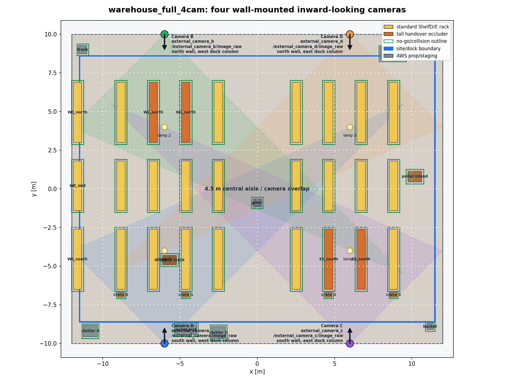

# Shared setup and visual vocabulary

## Begin state

The robot navigates a warehouse using fixed infrastructure cameras. The common world view
and four-camera geometry should be the first two slides:

Before comparing sources, the audience should understand that every method predicts the
same future quantity, `p_use,c(s)`. It does not directly output a route, covariance or camera
measurement.

## The map used in planning

For every candidate state and camera, the source supplies `p_use`. The common planner uses it
to interpolate between the expected posterior after a usable observation and the posterior
after a miss:

`E[P+] = p_use P_hit + (1 - p_use) P_miss`.

Thus, bright reliable cells promise frequent informative corrections; dark cells cause the
planner to propagate more uncertainty. Physical collision geometry is a separate map and is
identical for every source.

## What “updates” means

Two different updates must not be conflated:

1. **Belief update:** a runtime camera observation corrects the robot-state belief. This is
   common to all methods.
2. **Reliability-field update:** operational evidence changes the map of `p_use`. Constant,
   distance and FOV/range do not learn online; GP and hybrid do. A commissioned depth map
   changes only when rescanned unless live depth is explicitly selected.

The visual distinction should use two arrows: camera → state belief and observations/scan →
reliability field.

## Common routes

- R1: short poorly observed branch versus a modest visible detour.
- R2: equal-length north/south routes with different occlusion exposure.
- R3: central overlap/handover route.
- R6: uniformly well-observed negative control; no method should invent a detour.

The exact tasks and certification requirements live in
[`research/06_world_camera_design.md`](../../../../research/06_world_camera_design.md).
