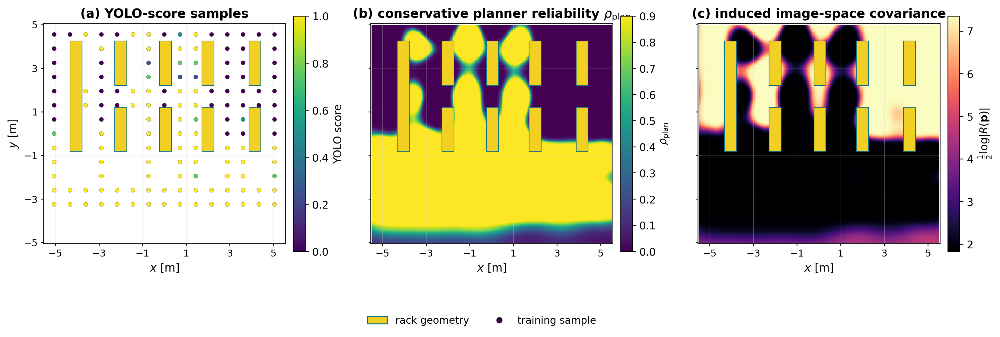

# Gaussian-process reliability

## What this method asks

Can operational detector experience learn where usable camera observations occur, including
effects not encoded in simple geometry? Each camera stores pose-labelled usable/miss
observations and fits a spatial reliability model with epistemic support.

## Begin state

The GP does not begin from omniscience. The figure must distinguish:

- the prior mean/fallback in unvisited space;
- commissioned sample locations and outcomes;
- posterior mean reliability; and
- posterior epistemic uncertainty/support.

An existing single-camera visual demonstrates the intended sample→map→covariance story:

It is a style/mechanism reference; the final supervisor panel needs the common four-camera
world and target definition.

## Map used in planning

The planner consumes a conservative transform of the GP prediction, not raw YOLO confidence.
Mean reliability and epistemic uncertainty must be shown separately. Unsupported cells fall
back to the declared prior rather than inheriting an unjustified smooth extrapolation.

## Updates

Each eligible operational opportunity becomes a labelled hit/miss update for its camera.
The update panel should animate or sequence:

`prior → sparse observations → local posterior change → uncertainty contracts → planner map`.

Repeated frames at one site do not count as new spatial support. Updates must preserve camera
identity; a miss under camera A cannot silently train camera B.

## Expected plans

- R1: detours only after the blind branch is learned or encoded by the fallback.
- R2: can learn asymmetric occlusion, but performance depends on route support and kernel
  boundary smoothing.
- R3: can represent installed-view handover reliability from experience.
- R6: should remain direct; an unnecessary detour suggests poor calibration or extrapolation.

## Failure mode to make visible

Sharp occlusion boundaries are difficult for a stationary smooth kernel. Show reliability
bleeding across a rack-shadow edge and show uncertainty in unvisited cells. This explains the
motivation for the hybrid method.
