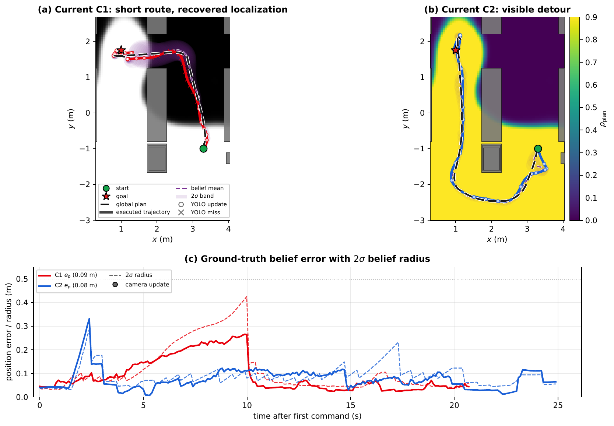
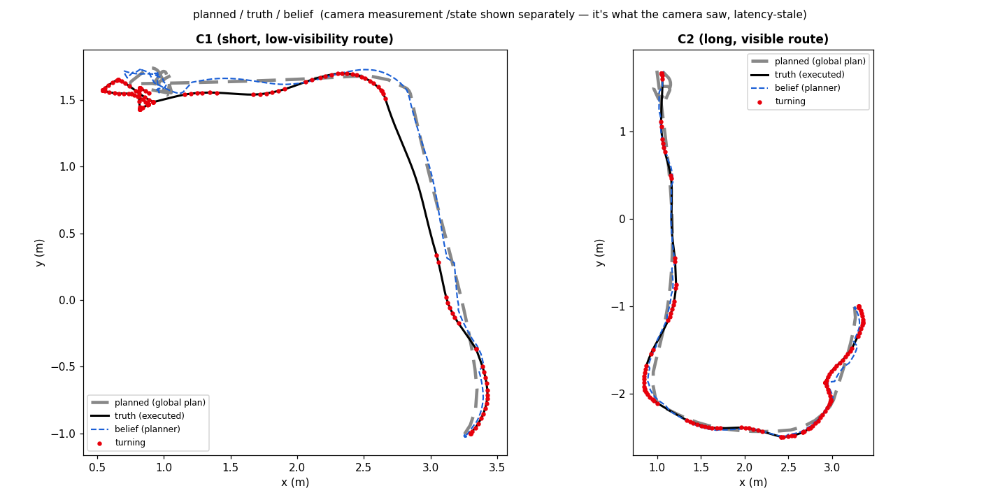

# Common route comparison

This folder owns the cross-method visual matrix. It does not refit or tune any method.

## Route questions

| Route | Visual question | Expected discrimination |
|---|---|---|
| R1 — short blind versus visible detour | Does the field make a longer observable route worthwhile? | FOV may miss the internal shadow; depth/hybrid can know it at cold start; GP needs support. |
| R2 — equal-length occlusion mirror | Does the source respond to occlusion rather than path length? | Distance and FOV may tie; occlusion-aware sources should separate the routes if certified. |
| R3 — overlap/handover | Which camera remains usable through the transition? | Geometry gives overlap; depth adds blocked sight lines; GP/hybrid add installed-view experience. |
| R6 — uniformly good control | Does complexity create an unnecessary detour? | Every calibrated method should retain the ordinary short plan. |

## Generated visual matrix

Create one figure per route with six aligned panels:

`constant/distance | FOV/range | depth/raycast | GP | hybrid | CAD reference`

Every panel uses the same world limits, start, goal, field scale and planner settings. It
overlays:

- the reliability field;
- physical collision geometry;
- the selected offline reliability-weighted route in the method color;
- start and goal markers;
- mean reliability along the selected route.

## Begin versus updated state

The route matrices intentionally show one commissioned/current field per method so the source
comparison remains readable. The `03_update_sequence.png` panel in every method folder shows
how that source reaches or changes that field. A future confirmatory navigation experiment can
add paired cold-start/updated route outcomes without relabelling these explanatory plots as
results.

## Existing style references

The following figures demonstrate useful visual elements but are not the final common matrix:

## Generated outputs

- `figures/R1_short_vs_visible.png`
- `figures/R2_equal_length_occlusion.png`
- `figures/R3_handover.png`
- `figures/R6_uniform_control.png`
- `figures/all_methods_contact_sheet.png`

The final contact sheet is the supervisor summary slide. All routes are deterministic offline
explanations, not closed-loop navigation evidence.
