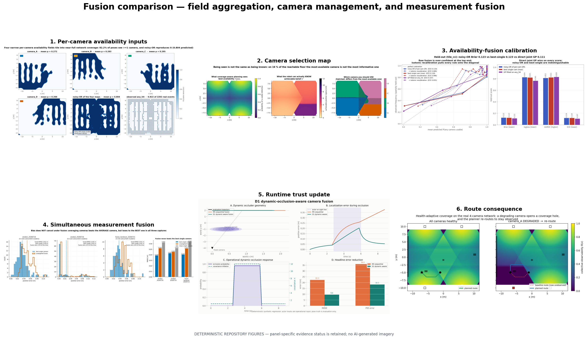

# Fusion comparison

This folder separates two operations that are often both called “fusion”:

1. **Availability-field fusion:** combine per-camera probabilities into the probability that
   at least one camera will provide a usable observation. Compared arms are best-single/max,
   noisy-OR and a directly learned joint GP, with held-out calibration shown explicitly.
2. **Measurement fusion:** combine camera pose measurements that have already arrived. The
   comparison includes best-camera selection, naive independent fusion and operational
   trust/health-aware suppression.

These are downstream of the reliability-source comparison. The per-camera fields stay fixed;
fusion is not allowed to refit them.

## Figure reading order

| Figure | What it answers | Evidence status |
|---|---|---|
| `01_camera_availability_inputs.png` | What four per-camera fields are being combined? | Actual locked GP maps and 2,202 synchronized events |
| `02_selection_policy_map.png` | Why is maximum availability not always maximum localization precision? | Deterministic composition of frozen fields and measured residual floors |
| `03_availability_fusion_calibration.png` | Do max, noisy-OR and joint GP predict `any_hit` out of sample? | Spatially held-out event comparison |
| `04_measurement_fusion_evidence.png` | Does averaging simultaneous cameras beat selecting the best one? | Recorded concurrent-camera clusters; offline evidence |
| `05_dynamic_occlusion_update.png` | How does runtime health alter fusion during a temporary occlusion? | Labelled deterministic synthetic regression |
| `06_route_consequence.png` | What happens to the planning field and route after a camera degrades? | Labelled deterministic mechanism demonstration |
| `07_selection_route_grid.png` | How do max-availability and min-achievable-sigma selection alter four common routes? | Exploratory deterministic route calculation |

## Interpretation guardrail

Noisy-OR is a probability rule; covariance-weighted measurement fusion is a state-estimation
rule. One cannot substitute for the other. The route panel uses a health-adjusted availability
field; it is not evidence that a localization fusion policy improves closed-loop navigation.
The route grid compares two single-camera selectors because runtime fuse-or-select decisions
depend on measurements that do not yet exist at planning time.

Run `../render_decision_layer_comparisons.py` to rebuild the stable copies, contact sheet and
hash manifest.
