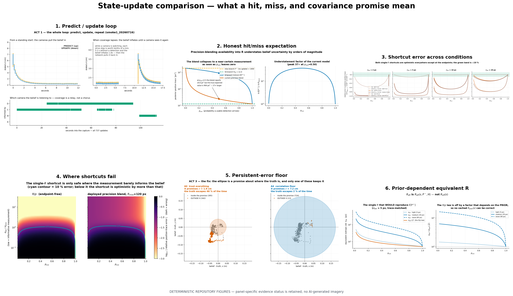

# State-update comparison

This folder compares what the planner does with a future observation probability after the
reliability source and camera-management policy have been fixed.

| Update arm | Planner calculation | Meaning of a miss |
|---|---|---|
| Deployed precision blend | Blend visible/miss precisions into one `R`, then update once | A weak Gaussian update |
| `R/p` shortcut | Inflate conditional covariance by `1/p`, then update once | The `R_miss → ∞` limit of the same single-`R` family |
| Explicit hit/miss branch | `E[P⁺] = pP_hit + (1-p)P⁻` | No measurement and therefore no update |
| Realized runtime update | Joseph-form update for a hit; prediction only for a miss | The event that actually occurred |

## Figure reading order

| Figure | What it answers | Evidence status |
|---|---|---|
| `01_predict_update_loop.png` | How does the recorded filter alternate prediction and camera updates? | Recorded replay explainer |
| `02_expected_hit_miss_vs_blend.png` | Why is a miss a branch rather than a large-`R` observation? | Locked analytic comparison |
| `03_single_R_error_sweep.png` | How optimistic are the two single-`R` shortcuts? | Locked deterministic parameter sweep |
| `04_failure_region.png` | In which prior/measurement regimes is the shortcut unacceptable? | Locked deterministic parameter sweep |
| `05_calibration_floor_update.png` | Why must persistent camera error stop covariance collapse? | Recorded-data belief-calibration comparison |
| `06_prior_dependent_equivalent_R.png` | Why can no pose-only cached `R_plan` reproduce the branch? | Locked analytic inversion |
| `07_exploratory_route_grid.png` | How can the three mappings change routes when the reliability source is frozen? | Exploratory deterministic route calculation |

## Route-status guardrail

The route grid is a mechanism probe with a declared prior, conditional covariance and miss
endpoint. It does **not** claim a navigation advantage: matched route-discrimination and
closed-loop comparisons remain separate gates.

Run `../render_decision_layer_comparisons.py` to rebuild the stable copies, contact sheet and
hash manifest.
