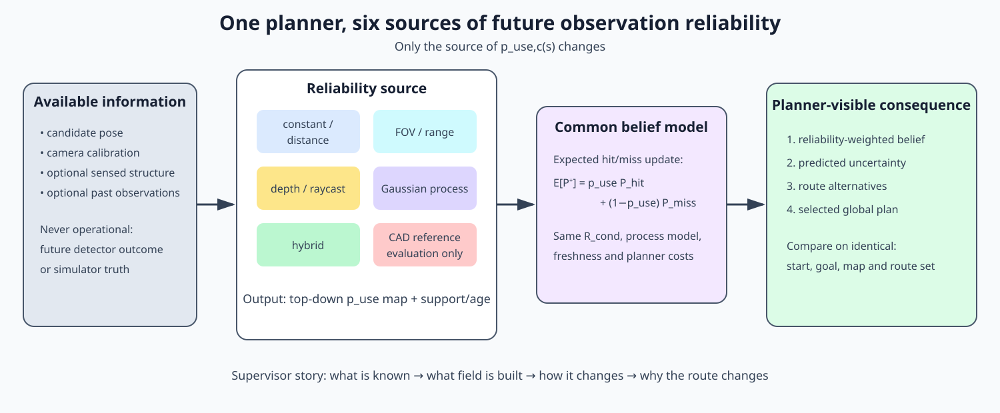
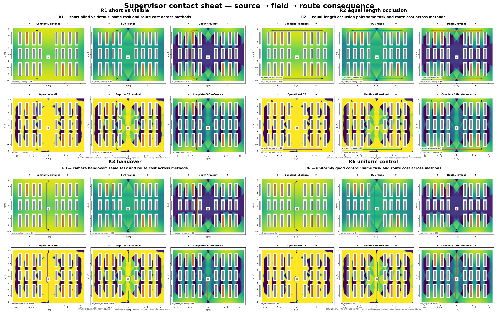

# Supervisor comparison — sources of usable-observation reliability

This folder is the visual-first explanation package for comparing how the planner obtains
the future usable-observation probability

\[
p_{\mathrm{use},c}(s)=P(\text{camera }c\text{ produces a usable observation at pose }s).
\]

The methods change only the source of this field. The observation representation, expected
hit/miss belief update, planner, robot, cameras, world and routes stay fixed. This makes a
route difference attributable to the information source rather than to a different planner.

## Supervisor slide deck

The presentation-ready, method-by-method deck is in
[`presentation/supervisor_methods_deck.pdf`](presentation/supervisor_methods_deck.pdf),
with editable Beamer source and build instructions in
[`presentation/`](presentation/README.md). Its figures are newly drawn schematics and use no
old runs, fitted artifacts or empirical plots. Quantitative evidence is deliberately kept
out until the fresh collection gates pass.

## Reading order

1. [`00_shared_setup/`](00_shared_setup/README.md) — Gazebo world, cameras, common planner
   interface, visual conventions and the meaning of an update.
2. [`01_constant_distance/`](01_constant_distance/README.md) — simple null and distance
   baselines.
3. [`02_fov_range/`](02_fov_range/README.md) — calibrated camera geometry without occlusion.
4. [`03_depth_raycast/`](03_depth_raycast/README.md) — sensed 3-D structure and line-of-sight
   raycasting.
5. [`04_gp/`](04_gp/README.md) — reliability learned from operational observations.
6. [`05_hybrid/`](05_hybrid/README.md) — depth-derived shadow boundaries plus learned
   residual corrections.
7. [`06_cad_reference/`](06_cad_reference/README.md) — complete-map evaluation reference;
   never presented as the deployable method.
8. [`07_route_comparison/`](07_route_comparison/README.md) — the same route questions and
   figure grid for every source.
9. [`08_fusion_comparison/`](08_fusion_comparison/README.md) — per-camera availability
   aggregation, camera selection and simultaneous measurement fusion.
10. [`09_state_update_comparison/`](09_state_update_comparison/README.md) — precision blend,
    `R/p`, explicit hit/miss branching and realized filter updates.
11. [`10_monocular_depth_results/`](10_monocular_depth_results/README.md) — measured
    monocular-depth outputs, floor-anchored accuracy and compute cost; kept separate from the
    exploratory depth/raycast planner figures.
12. [`11_static_probability_planning/`](11_static_probability_planning/README.md) — executable
    four-camera static-availability experiment comparing an availability-blind route, the
    `R/p` shortcut and explicit hit/miss belief propagation; results and PNG figures only.

## The supervisor figure set

Each method gets the same four primary panels. A reader should be able to hide the caption
and still understand the information flow.

| Panel | Required visual | Question answered |
|---|---|---|
| A — begin state | Gazebo/camera view plus the information available before driving | What does the method know initially? |
| B — planning field | Top-down `p_use` map on the common warehouse geometry | What map does the planner consume? |
| C — update | Before/after field with new observations or a clear “no online update” badge | How does the representation change? |
| D — routes | Identical start/goal alternatives overlaid on the field | Why does this method choose this plan? |

The cross-method summary is a matrix: rows are methods and columns are the four panels.
Method-specific diagnostics belong inside each folder; the summary matrix contains only
comparable views.

All 32 figures are rendered deterministically by [`render_all.py`](render_all.py). The
images combine recorded Gazebo views with maps and route overlays computed from repository
artifacts; no generative image model is used.

The additional fusion and state-update panels are assembled from existing deterministic
study outputs by
[`render_decision_layer_comparisons.py`](render_decision_layer_comparisons.py). They preserve
the original evidence labels and hashes. **The achievable-precision/selection panel is a
historical-v2 sensitivity figure, not a current A–D ranking; its hard-coded residual floors
must not enter a fresh comparison.** Together the package contains 48 PNG figures.

## Existing visual anchors

These are useful now but are not automatically evidence for the new comparison:

- [Gazebo warehouse view](../../../paper_artifacts/figures/problem_setup_camera.png)
- [Four-camera top-down layout](../../../docs/assets/warehouse_full_4cam_map.png)
- [Existing GP samples → planner reliability → covariance](../../../paper_artifacts/figures/current_surface/gp_pipeline_current.png)
- [Existing reliability-aware route example](../../../paper_artifacts/figures/current_surface/paired_mechanism_taskA_current.png)
- [Existing initial-rollout/update explanation](../../../paper_artifacts/figures/problem_setup_snapshots.png)

The exact generation status is tracked in [`figure_manifest.yaml`](figure_manifest.yaml),
and input/output hashes are recorded in
[`generated_data/render_manifest.json`](generated_data/render_manifest.json).
Visual rules and filenames are frozen in [`FIGURE_CONTRACT.md`](FIGURE_CONTRACT.md).

## Scope discipline

- “Initial” means before route-specific detector outcomes are used.
- Detector outcome, simulator truth and future rendered images are evaluation-only.
- Every operational field declares its age, support and fallback.
- CAD is shown to explain the geometric ceiling, not to imply free deployment knowledge.
- Exploratory figures are labelled `EXPLORATORY`; confirmatory figures later bind hashes,
  splits and route manifests.
