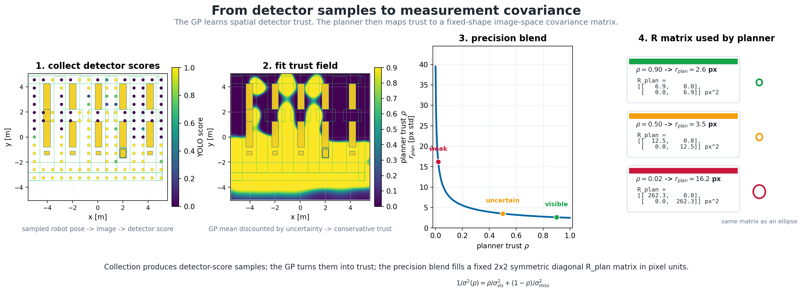
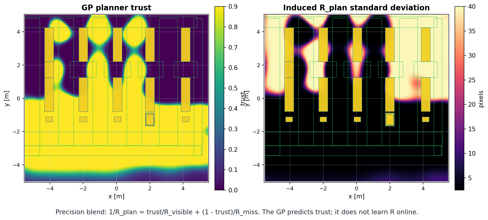

# GP-Derived Predictive Camera Covariance

[Back to repository overview](../README.md)

This module turns empirical detector reliability into the state-dependent camera
covariance used by the visibility-aware planner.

## Contribution At A Glance

| Question | Answer |
| --- | --- |
| Problem | A fixed warehouse camera is not equally reliable everywhere, but the planner needs that unevenness in a usable form. |
| Contribution | Detector scores are fit with a spatial GP, discounted into a conservative trust field, and converted into planner-facing `R_plan`. |
| Implementation | GP fitting lives in [`../scripts/visibility_comparison/fit_visibility_gps.py`](../scripts/visibility_comparison/fit_visibility_gps.py); planner loading lives in [`../src/planning/planning/core/visibility_gp_map.py`](../src/planning/planning/core/visibility_gp_map.py). |

## Visual Demonstration



Read this left to right: sample robot poses, record detector scores, fit a
spatial trust field, convert trust into a measurement standard deviation, and
put that variance into the planner's `R_plan` matrix.



The GP predicts spatial detector trust. It does not learn `R` online. The
planner maps trust to observation covariance through a precision blend between a
sharp visible-camera covariance and a broad missed-camera covariance.


## Shape Of `R_plan`

For a future robot position `(x, y)`, the GP gives a planner trust value
`rho(x, y)`. The planner converts that trust into one image-space variance:

```text
sigma_plan^2(rho) =
    1 / (rho / sigma_visible^2 + (1 - rho) / sigma_miss^2)
```

In the locked setup:

```text
sigma_visible = 2.5 px
sigma_miss    = 40.0 px
```

That scalar variance is inserted into a 2x2 image-space measurement covariance:

```text
R_plan(x, y) =
[ sigma_plan^2(rho(x, y))      0                         ]
[ 0                            sigma_plan^2(rho(x, y))   ]  px^2
```

So `R_plan` is symmetric and diagonal. In this campaign the `u` and `v`
variances are equal, which is why the drawn covariance ellipses are circular. If
a future model used different `u/v` variances or non-zero off-diagonal terms,
the ellipses would become stretched or tilted.

Additional media is catalogued in [`demos/`](demos/).

## Inputs And Outputs

| Input | Output |
| --- | --- |
| Detector score targets over warehouse `(x, y)` | `paper_artifacts/gp/warehouse_visibility_gp_v1/yolo_score_raw_gp.npz` |
| Fixed-camera depth frame plus camera calibration | `logs/visibility_comparison/depth_sensed_initial_gp_v1/depth_sensed_initial_gp.npz` |
| Trajectory detector events with belief covariance | `logs/visibility_comparison/depth_sensed_trajectory_gp_score_v1/yolo_score_raw_<mode>_gp.npz` |
| Locked world/camera geometry | `P_conservative_plan_map` |
| GP fit parameters | planner-facing reliability and covariance lookup grid |

## Method

1. Place the robot at sampled warehouse poses and record the detector score
   from the fixed camera.
2. Aggregate those scores by planar robot position `(x, y)`.
3. Fit a logit-space GP so unsampled positions also receive a predicted trust
   value and uncertainty.
4. Discount the GP mean by its uncertainty to create a conservative planner
   trust map.
5. Convert trust to `sigma_plan^2` with the precision blend.
6. Fill the fixed-shape `R_plan` matrix with that variance.

The locked blend is:

```text
1 / R_plan = trust / R_visible + (1 - trust) / R_miss
```

`R_visible` and `R_miss` are fixed covariance settings. The GP supplies the
trust value that scales between them; it does not directly learn the entries of
`R_plan`.

## Performance And Diagnostics

Fit summary:

| Method | Train points | Target mean | Target min | Target max |
| --- | ---: | ---: | ---: | ---: |
| `yolo_score_raw` | 139 | 0.597 | 0.0001 | 0.9999 |

Artifact metadata:

- [`../paper_artifacts/gp/warehouse_visibility_gp_v1/gp_manifest.json`](../paper_artifacts/gp/warehouse_visibility_gp_v1/gp_manifest.json)
- [`../paper_artifacts/figures/gp_pipeline_aws_provenance.json`](../paper_artifacts/figures/gp_pipeline_aws_provenance.json)

Current status:

- `paper_artifacts/gp/warehouse_visibility_gp_v1/yolo_score_raw_gp.npz` is the locked current artifact.
- `logs/visibility_comparison/warehouse_visibility_gp_v1/` is a generated mirror of that locked artifact.
- `logs/visibility_comparison/archive/mismatched_warehouse_visibility_gp_v1_20260709/` contains an archived mismatched generated artifact and should not be used for planning or reporting.
- `paper_artifacts/gp/archive/aws_gp_v7b_superseded/` contains the older 238-point artifact.

## Reproduce

Fit a GP from local capture/target artifacts:

```bash
python3 scripts/visibility_comparison/fit_visibility_gps.py \
  --gp-targets logs/visibility_comparison/warehouse_visibility_targets_v1/gp_targets_xy_aggregated.csv \
  --capture-manifest logs/visibility_comparison/warehouse_visibility_capture_v1/capture_manifest.json \
  --out logs/visibility_comparison/warehouse_visibility_gp_v1 \
  --grid-nx 220 \
  --grid-ny 200 \
  --gp-length-scale 0.90 \
  --gp-noise-var 0.05 \
  --beta 0.5
```

Regenerate the public GP pipeline figure:

```bash
python3 scripts/paper_figures/make_aws_gp_pipeline_figure.py
```

## Relevant Implementation Files

| File | Role |
| --- | --- |
| [`../scripts/visibility_comparison/capture_visibility_samples.py`](../scripts/visibility_comparison/capture_visibility_samples.py) | Visibility sample capture. |
| [`../scripts/visibility_comparison/build_gp_targets.py`](../scripts/visibility_comparison/build_gp_targets.py) | Target table construction. |
| [`../scripts/visibility_comparison/fit_visibility_gps.py`](../scripts/visibility_comparison/fit_visibility_gps.py) | GP fitting and artifact writing. |
| [`../scripts/visibility_comparison/audit_visibility_gp_artifacts.py`](../scripts/visibility_comparison/audit_visibility_gp_artifacts.py) | Locked artifact provenance audit. |
| [`../scripts/visibility_comparison/build_belief_gp_events.py`](../scripts/visibility_comparison/build_belief_gp_events.py) | Belief/covariance detector-event extraction. |
| [`../scripts/visibility_comparison/build_depth_sensed_initial_gp.py`](../scripts/visibility_comparison/build_depth_sensed_initial_gp.py) | Initial planner-compatible GP built from a depth-sensed height map. |
| [`../scripts/visibility_comparison/fit_belief_aware_gp.py`](../scripts/visibility_comparison/fit_belief_aware_gp.py) | Expected-kernel uncertain-input GP plus ablation baselines. |
| [`../scripts/visibility_comparison/showcase_belief_aware_update.py`](../scripts/visibility_comparison/showcase_belief_aware_update.py) | Visual explanation of uncertainty-aware updating. |
| [`../scripts/visibility_comparison/showcase_gp_before_after_updates.py`](../scripts/visibility_comparison/showcase_gp_before_after_updates.py) | Before/after GP map comparison across update types. |
| [`../src/planning/planning/core/visibility_gp_map.py`](../src/planning/planning/core/visibility_gp_map.py) | Planner-side artifact loader. |

## Limitations

- The fitted field is setup-specific: world, camera pose, detector, and robot
  appearance all matter.
- Detector confidence is used as an empirical proxy, not as a calibrated
  probability.
- The GP changes camera `(x, y)` measurement covariance only. It is not a direct
  route reward and it does not model heading.

See available and planned media in [`demos/`](demos/).
