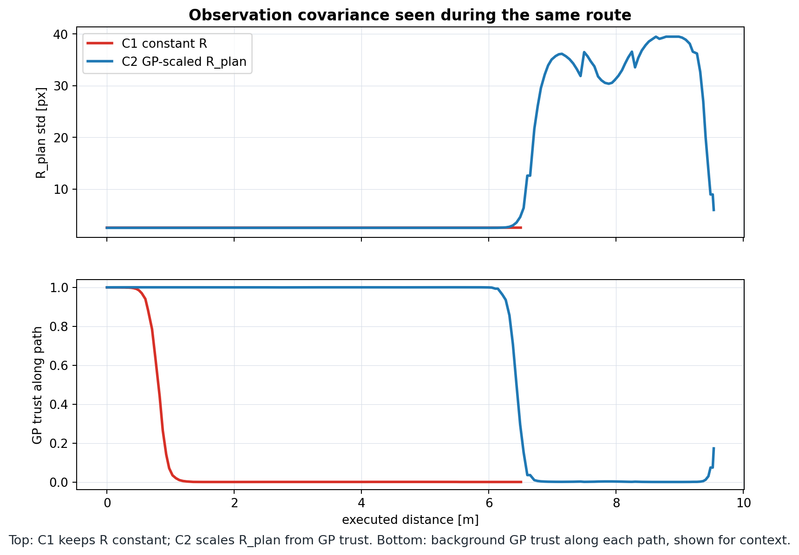

# Visibility-Aware Route Planning

[Back to repository overview](../README.md)

This module shows how constant and learned predictive camera covariance change
route planning under the same warehouse geometry and task seeds.

## Contribution At A Glance

| Question | Answer |
| --- | --- |
| Problem | The shortest route can pass through camera-poor regions where future localization becomes ambiguous. |
| Contribution | The planner compares a constant camera covariance baseline against GP-scaled `R_plan` while keeping the map, seeds, tracker, and no-go geometry fixed. |
| Implementation | Planner behavior is in [`../src/planning/planning/planners/base_planner.py`](../src/planning/planning/planners/base_planner.py), with symbolic EFE terms in [`../src/planning/planning/core/casadi_efe.py`](../src/planning/planning/core/casadi_efe.py). |

## Visual Demonstration


The figure shows a matched west-route pair. C1 uses constant camera covariance;
C2 uses GP-scaled `R_plan`. Everything else is held fixed, so the changed route
comes from how expected future observations shape belief growth and ambiguity.



Additional media is catalogued in [`demos/`](demos/).

## Inputs And Outputs

| Input | Output |
| --- | --- |
| `/state/bev` and planner belief | `/cmd_vel_raw` and `/cmd_vel` |
| `/goal_bev` | planner preview and diagnostics |
| GP artifact for C2 | global route, waypoint tracker targets, run metrics |
| Shared driveable/no-go geometry | collision, reach, path, and localization outcomes |

## Method

C1 and C2 share the same world, route seeds, driveable layer, no-go geometry,
execution tracker, and optimizer budget. They differ in predictive camera
covariance:

```text
C1: R_plan = constant camera covariance
C2: R_plan = GP-scaled state-dependent camera covariance
```

The GP is not a direct visibility reward. It changes the predicted observation
covariance used in the risk/ambiguity terms and in belief-tube keep-in
feasibility. Ambiguity here means "how uncertain future observations are
expected to be"; obstacle/no-go costs are a separate map constraint.

## Performance And Diagnostics

Current packaged honest-campaign outcome:

| Condition | Clean reaches | Safety breaches | Other outcomes |
| --- | ---: | ---: | --- |
| C1 `constant_R_efe` | 15/20 | 4/20 GT-geometry breaches, 0/20 physics contacts | none |
| C2 `visibility_aware_efe` | 20/20 | 0/20 | none |

Single-run mechanism figure:

- [`../docs/paper_vs_current/current/figures/paired_mechanism_west_current.png`](../docs/paper_vs_current/current/figures/paired_mechanism_west_current.png)
- [`../paper_artifacts/figures/paired_mechanism_west_current_data/`](../paper_artifacts/figures/paired_mechanism_west_current_data/)

## Reproduce

Regenerate the robustness spread visualization from the packaged campaign data:

```bash
python3 scripts/paper_figures/make_robustness_spread.py
```

Regenerate the paired mechanism figure:

```bash
PAIRED_CAMP=_paper_runs/paired_mechanism_clean_verify \
PAIRED_TASK=F31_b1_apron_a3_mid \
PAIRED_SEED=0 \
python3 scripts/paper_figures/make_paired_mechanism.py
```

## Relevant Implementation Files

| File | Role |
| --- | --- |
| [`../src/planning/planning/planners/base_planner.py`](../src/planning/planning/planners/base_planner.py) | Main planner logic. |
| [`../src/planning/planning/core/casadi_efe.py`](../src/planning/planning/core/casadi_efe.py) | Symbolic EFE objective. |
| [`../src/planning/planning/core/visibility_gp_map.py`](../src/planning/planning/core/visibility_gp_map.py) | GP map loading and querying. |
| [`../src/planning/planning/core/nogo_cost.py`](../src/planning/planning/core/nogo_cost.py) | Keep-in/no-go cost support. |

## Limitations

- The baseline is not true dead reckoning; it is an EFE planner with constant
  detector-observation covariance.
- The GP field is setup-specific.
- The optimizer is route-seed sensitive, so claims are tied to the locked
  matched-seed campaign protocol.

See available and planned media in [`demos/`](demos/).
