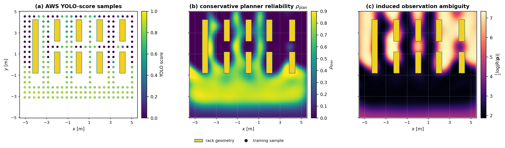

# Scripts

This folder contains offline tooling around the ROS/Gazebo runtime.

It is the reproducibility workshop for the demo: capture data, train the
detector, build GP targets, fit the planner-facing artifact, run campaigns, and
generate figures.

## Paper-Facing Pipeline

| Purpose | File |
| --- | --- |
| Run locked robustness campaign | `visibility_comparison/run_visibility_campaign.py` |
| Locked campaign config | `visibility_comparison/warehouse_visibility_campaign.yaml` |
| Compute campaign metrics | `visibility_comparison/compute_paper_metrics.py` |
| Fit GP artifacts | `visibility_comparison/fit_visibility_gps.py` |
| Build GP targets | `visibility_comparison/build_gp_targets.py` |
| Capture visibility samples | `visibility_comparison/capture_visibility_samples.py` |
| Extract perception targets | `visibility_comparison/extract_perception_targets.py` |
| Generate paper figures | `paper_figures/` |

## Perception Support

Detector dataset capture, pseudo-labeling, and training utilities live in
`perception/`. These scripts support detector provenance; trained YOLO weights
are local artifacts and are not tracked in git.

Representative output:


## GP And Figure Support

The visibility-comparison scripts produce the artifact consumed by the planner:

```text
capture_visibility_samples.py
-> extract_perception_targets.py
-> build_gp_targets.py
-> fit_visibility_gps.py
-> run_visibility_campaign.py
-> compute_paper_metrics.py
```

The paper figure scripts turn the curated outputs into the public visual story:



## Diagnostic Material

Older route probes, decomposition studies, and pre-Gazebo diagnostics are kept
only when they are useful for reproducing a final figure or explaining a method
choice. They are not paper evidence unless `docs/experiment_registry.md` lists
their generated artifact.
