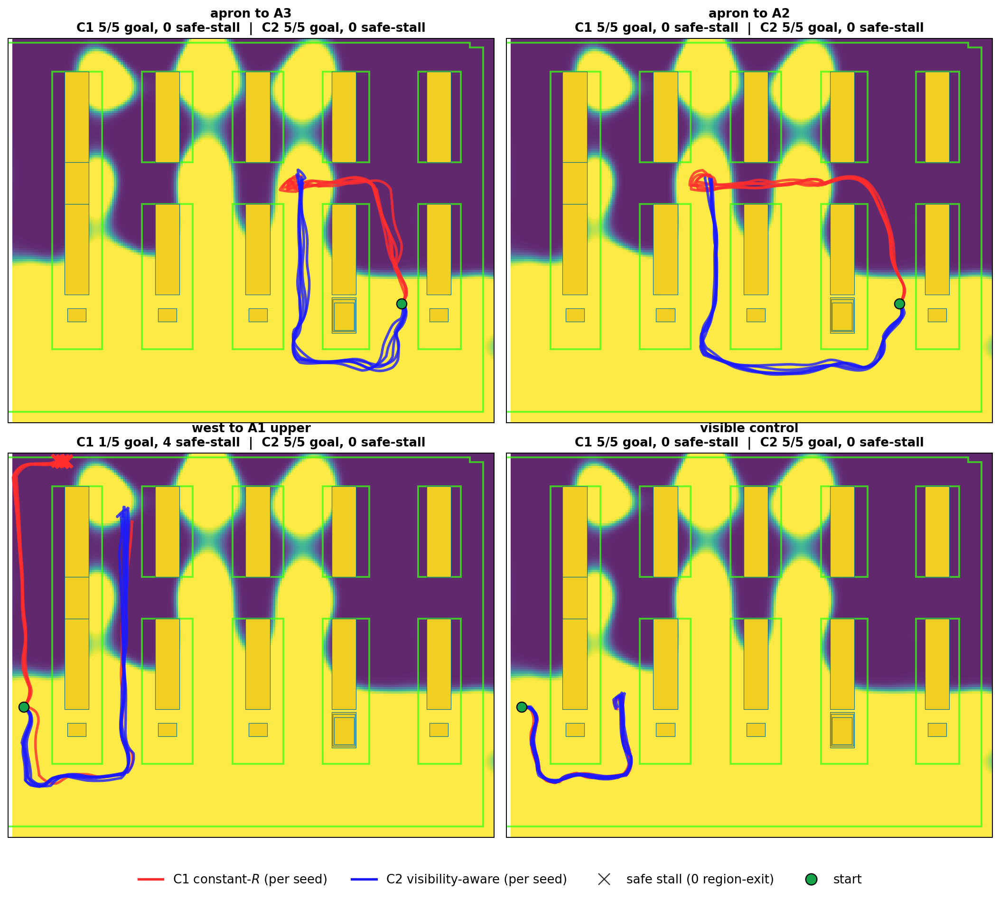

# `experiments`

This package defines the experiment surface: world, task, planner condition, launch wiring, logging, and campaign reproducibility.

It is the folder that turns the method into a repeatable benchmark: same world,
same route tasks, same seeds, same local detector checkpoint path, and explicit
GP artifact paths.

## Central Files

| File | Role |
| --- | --- |
| [`launch/warehouse_primary_comparison.launch.py`](launch/warehouse_primary_comparison.launch.py) | active launch for `constant_R_efe` and `visibility_aware_efe` |
| [`launch/warehouse_visibility_capture.launch.py`](launch/warehouse_visibility_capture.launch.py) | offline capture launch for GP fitting |
| [`config/world_profiles.yaml`](config/world_profiles.yaml) | world registry and camera/profile metadata |
| [`config/tasks.yaml`](config/tasks.yaml) | benchmark, support, exploratory, and legacy task definitions |
| [`experiments/core/visibility_launch_common.py`](experiments/core/visibility_launch_common.py) | shared runtime assembly |
| [`experiments/nodes/experiment_logger.py`](experiments/nodes/experiment_logger.py) | run manifest, CSV logging, and summary writing |

## Current Use

The current AWS robustness campaign is configured by
`scripts/visibility_comparison/warehouse_visibility_campaign.yaml` and run through
`scripts/visibility_comparison/run_visibility_campaign.py`.

The primary launch enforces the important paper assumptions:

- YOLO perception path
- explicit trained YOLO model path
- explicit GP artifact path for GP-using planner conditions
- shared world/task/obstacle geometry across compared planners
- run manifests that record planner, artifact, estimator, noise, and safety settings

## Current Benchmark

The AWS-style warehouse is the current benchmark. It uses the
curated artifacts under `paper_artifacts/` plus a local YOLO checkpoint under
`logs/perception_models/warehouse_yolo_detector_v1/model.pt`.

Current packaged outcome across four tasks and five seeds per condition:

| Condition | Planner | Clean reaches | Collisions | Other outcomes |
| --- | --- | ---: | ---: | --- |
| C1 | `constant_R_efe` | 15/20 | 4/20 GT geometry breaches, 0/20 physics contacts | west-route failures only |
| C2 | `visibility_aware_efe` | 20/20 | 0/20 | none |

See also:

- [`../../research/registry.yaml`](../../research/registry.yaml)
- [`../../docs/current_runtime_contract.yaml`](../../docs/current_runtime_contract.yaml)
- [`../../docs/runtime_dataflow.md`](../../docs/runtime_dataflow.md)
- [`config/README.md`](config/README.md)
