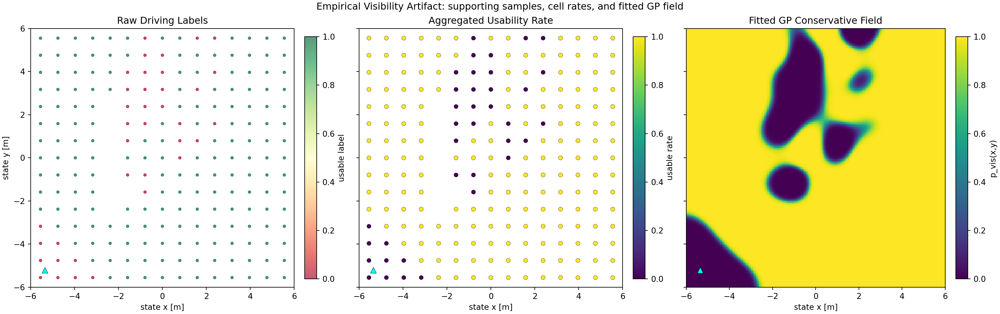

# `experiments`

This package defines the experiment surface for the current thesis milestone. It exists to make the comparison reproducible: it chooses the world, task, planner label, logging mode, and shared runtime wiring.

This package owns both ends of the experimental story:

- the offline capture launch that produces the visibility artifact
- the online comparison launch that consumes that artifact

## Why This Folder Exists

The planner is only one part of the experiment. This package answers:

- which world is used
- which goal task is run
- which planner is launched
- whether logging is enabled
- where run outputs are written

## Inputs And Outputs

- **Inputs**
  - world/task configuration
  - planner label
  - launch arguments
- **Outputs**
  - composed ROS runtime
  - goal publication
  - run logs and manifests when logging is enabled

## Central Files

| File | Role |
| --- | --- |
| [`launch/warehouse_primary_comparison.launch.py`](launch/warehouse_primary_comparison.launch.py) | main entry point for `efe1` vs `visibility_unaware_baseline` |
| [`launch/warehouse_visibility_agent.launch.py`](launch/warehouse_visibility_agent.launch.py) | retained secondary-planner launch |
| [`launch/warehouse_visibility_capture.launch.py`](launch/warehouse_visibility_capture.launch.py) | driving-based offline capture launch for GP fitting |
| [`config/world_profiles.yaml`](config/world_profiles.yaml) | world registry, camera setup, and matched visibility artifact paths |
| [`config/tasks.yaml`](config/tasks.yaml) | benchmark and exploratory tasks |
| [`experiments/core/visibility_launch_common.py`](experiments/core/visibility_launch_common.py) | shared runtime assembly |
| [`experiments/nodes/experiment_logger.py`](experiments/nodes/experiment_logger.py) | experiment logging and manifests |

## Support Files

| File | Role |
| --- | --- |
| `experiments/core/world_profiles.py` | YAML loading and profile resolution |
| `experiments/core/tasks.py` | task loading and selection |
| `experiments/core/manifest.py` | run-directory and manifest helpers |
| `experiments/nodes/goal_mission_node.py` | publishes the active goal |
| `experiments/nodes/goal_marker_node.py` | visual marker for the goal |
| `experiments/nodes/visibility_sweep_controller_node.py` | direct `/cmd_vel` lawnmower sweep for offline visibility capture |

## What To Read First

1. `launch/warehouse_primary_comparison.launch.py`
2. `config/world_profiles.yaml`
3. `config/tasks.yaml`
4. `experiments/core/visibility_launch_common.py`
5. `experiments/nodes/experiment_logger.py`

## Implemented Now

- one primary comparison launch
- one retained-planner launch
- one driving-based visibility capture launch
- per-world matched visibility artifacts learned from scripted sweep data
- run logging with manifest metadata
- explicit state-estimator provenance in the manifest

## Provisional Or Peripheral

- `warehouse_visibility_agent.launch.py` keeps retained secondary planners `efe2`, `efer`, and `mpc` runnable, but it is not the main thesis-facing entry path
- the logger is useful and important, but the evaluation built on top of it is still milestone-grade
- `warehouse_open_shelves.world.sdf` is exploratory compared with the main warehouse benchmark

## Connection To The Rest Of The Repository

- launches `sim`, `perception`, `state`, and `planning`
- snapshots config files into run directories
- points the planner at the correct GP visibility artifact

See also:

- [`config/README.md`](config/README.md)
- [`data/visibility_gp/README.md`](data/visibility_gp/README.md)
