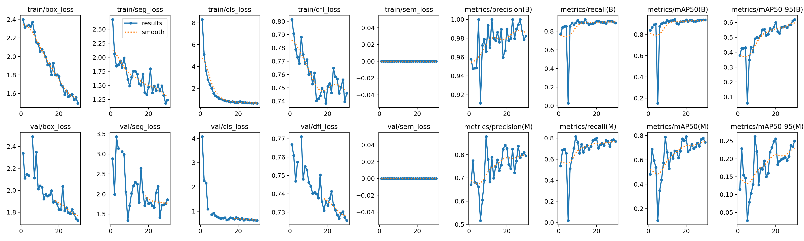

# `perception`

This package provides the external-camera image observation used by the runtime pipeline.

It is the first visible piece of the demo: a fixed warehouse camera detects the
TurtleBot and turns the selected detection into an image-space robot
observation.

## Active Runtime Node

- [`perception/nodes/yolo_robot_detector_node.py`](perception/nodes/yolo_robot_detector_node.py)

It publishes:

- `/perception/pixel_pose`
- `/perception/detection_diagnostics`

The node loads an Ultralytics YOLO model and detects the configured robot class.

## Detector Modes

| Mode | x, y source | theta source |
| --- | --- | --- |
| Seg/detect model | selected pixel via homography | no visual yaw; downstream uses odometry, displacement heading, or propagated heading depending on launch config |
| Pose model with `keypoint_marker_world_z > 0` | selected pixel via homography | front/rear keypoints back-projected to BEV |

The current paper-facing campaign uses the segmentation/detection path for
`x,y` and odometry-driven heading under `camera_xy_only`.

## Demonstrated Detector

The paper-facing detector is documented in
[`../../docs/perception_details.md`](../../docs/perception_details.md) and
summarized by [`../../paper_artifacts/perception/aws_yolo_simseg_v2/manifest.json`](../../paper_artifacts/perception/aws_yolo_simseg_v2/manifest.json).

| Item | Value |
| --- | --- |
| Base model | YOLOv11n-seg |
| Dataset | 852 simulator-labeled warehouse images, split 683 train / 169 validation |
| Runtime selected point | bounding-box bottom centre |
| Runtime masks | disabled in the locked campaign |
| Final box mAP50 | 0.938 |
| Final box mAP50-95 | 0.620 |
| Final mask mAP50 | 0.745 |

Training curves:

## Pose-Keypoint Support

Pose-keypoint support is implemented but optional. The keypoints are anchored to the TurtleBot3 Burger geometry: the red base mesh for the front anchor and the blue lidar for the rear anchor. The source of truth is [`perception/core/pose_keypoints.py`](perception/core/pose_keypoints.py), with geometry checked by `tests/perception/test_pose_keypoint_geometry.py`.

Enable the pose-heading path by using pose-model weights and setting `keypoint_marker_world_z` to the marker world height. The default `0.0` keeps pose-heading disabled.

## Training Scripts

Detector training and dataset generation live under `scripts/perception/`. They are support/provenance tooling, not the runtime method itself.

The trained checkpoint itself is local-only and expected at
`local_artifacts/perception_models/aws_yolo_simseg_v2/model.pt`.
