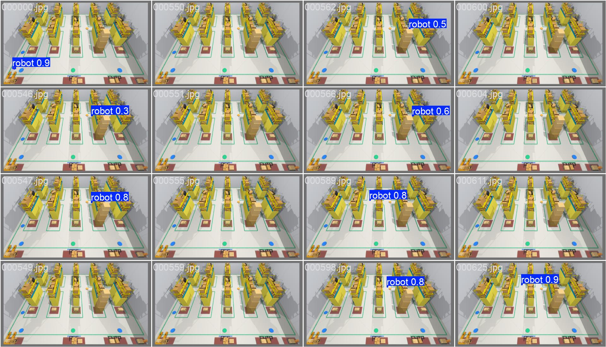

# YOLO External-Camera Detection

[Back to repository overview](../README.md)

This module detects the robot in the fixed external-camera RGB image and
exports the selected bottom-centre pixel as the runtime localization point.

## Story

The camera sees the robot, the detector selects one image-space point, and the
raw score becomes the empirical reliability signal used later by the GP page.

## Visual Demonstration



The trained detector is evaluated from the same external camera viewpoint used
by the warehouse campaign. Runtime localization uses the selected bounding-box
bottom centre as a ground-contact proxy.

Planned media is listed in [`demos/`](demos/): a short inference GIF, a 30-45s
warehouse-detection MP4, and a bottom-centre diagnostic still.

## Inputs And Outputs

| Input | Output |
| --- | --- |
| `/external_camera/image_raw` | `/perception/pixel_pose` |
| `logs/perception_models/warehouse_yolo_detector_v1/model.pt` | `/perception/detection_diagnostics` |
| YOLO confidence and class settings | selected pixel `(u, v)`, raw score, detection flag |

## Method

1. The Gazebo camera publishes RGB images from the locked warehouse camera pose.
2. A YOLOv11n-seg model selects the configured `robot` class.
3. The runtime uses the bounding-box bottom centre, not the mask, as the
   localization pixel.
4. The raw confidence score is recorded as an empirical reliability signal for
   the GP pipeline.

## Performance And Diagnostics

Detector metadata lives in
[`../paper_artifacts/perception/warehouse_yolo_detector_v1/manifest.json`](../paper_artifacts/perception/warehouse_yolo_detector_v1/manifest.json).
The packaged training run used 852 simulator-labeled images, split into 683
training images and 169 validation images.


| Metric | Box | Mask |
| --- | ---: | ---: |
| Precision | 0.982 | 0.795 |
| Recall | 0.889 | 0.769 |
| mAP50 | 0.938 | 0.745 |
| mAP50-95 | 0.620 | 0.250 |

Detector accuracy and metric localization accuracy are different quantities. A
high raw YOLO score does not guarantee a small projected position residual.
The detector score is an empirical signal, not a calibrated visibility
probability.

## Reproduce

Train a detector from a prepared dataset:

```bash
python3 scripts/perception/train_yolo_seg.py \
  --data logs/perception_datasets/warehouse_yolo_dataset_v1/data.yaml \
  --base-model local_artifacts/base_models/yolo11n-seg.pt \
  --epochs 30 \
  --imgsz 640 \
  --batch 8 \
  --device 0 \
  --out logs/perception_models/warehouse_yolo_detector_v1
```

Regenerate the detector-training clarification figure:

```bash
python3 scripts/paper_figures/make_yolo_training_clarification.py
```

## Relevant Implementation Files

| File | Role |
| --- | --- |
| [`../src/perception/perception/nodes/yolo_robot_detector_node.py`](../src/perception/perception/nodes/yolo_robot_detector_node.py) | Runtime ROS detector node. |
| [`../src/perception/perception/core/yolo_selection.py`](../src/perception/perception/core/yolo_selection.py) | Detection selection and class filtering. |
| [`../scripts/perception/train_yolo_seg.py`](../scripts/perception/train_yolo_seg.py) | YOLO fine-tuning wrapper. |
| [`../docs/perception_details.md`](../docs/perception_details.md) | Full detector configuration and dataset notes. |

## Limitations

- The YOLO checkpoint is local-only and not tracked in git.
- The raw detector score is uncalibrated.
- Runtime masks are disabled in the locked campaign.
- The detector supplies image-space `x,y` evidence only; heading is handled by
  the state/planning stack.

See planned visual media in [`demos/`](demos/).
